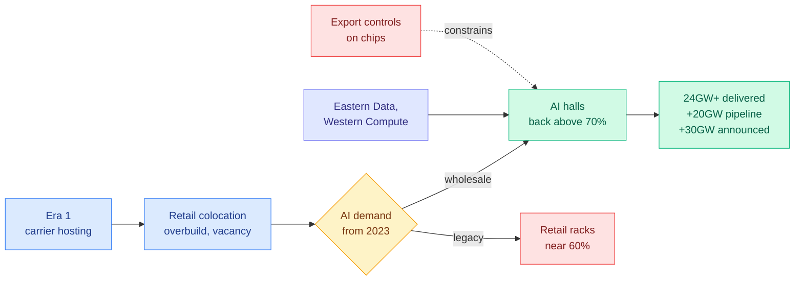

# SemiAnalysis: The Chinese AI Infrastructure Boom (China Datacenter Model)

**Source:** SemiAnalysis, 2026-09-25 ([post](https://newsletter.semianalysis.com/p/the-chinese-ai-infrastructure-boom)), free preview of a paid model
**Raw:** `raw/rss/2026-09-25-semianalysis-the-chinese-ai-infrastructure-boom-introducing-the-semi.md`

## TL;DR

SemiAnalysis extends its building-level datacenter model across China's border, tracking 1,000+ facilities across 60+ operators. The market had settled on two assumptions, "China is big" and "China is empty," with published capacity estimates differing by 15x. The model finds **over 24GW of Chinese datacenter capacity**, larger than EMEA (~14GW) and APAC ex-China (~15GW), against the US at 56GW by end of 2026. That excludes ~20GW of dated pipeline and ~30GW announced. High vacancy is real, but it is a **two-speed market**: legacy retail racks sit near 60% utilization while wholesale AI buildings refill above 70%. BAT (Alibaba, Tencent, Baidu) capex hit **$20B in 2Q26, more than double YoY, and all three posted negative free cash flow for the first time**. ByteDance, which files no public accounts, occupies about a fifth of delivered capacity and rents nearly all of it.

## Key claims

- **Scale.** China 24GW+ vs US 56GW, APAC ex-China ~15GW, EMEA ~14GW, LatAm ~2GW (2026YE).
- **Speed.** China routinely delivers 100MW facilities in under 12 months, largely free of power constraints, labor shortages and protests. Modular builds have been standard since Tencent's third-gen design in 2014.
- **Who builds.** State carriers still own a third of national capacity. GDS and VNET, the only US-listed Chinese landlords, signed 1.3GW of wholesale in 1H26 but captured barely a third of ByteDance and Alibaba orders from 2024 to 2026YTD.
- **Grid capex.** The 14th Five-Year Plan ended 24% over blueprint. The 15th (2026 to 2030) adds another 40%, to over ¥5T ($746B).
- **Offshore.** Chinese hyperscalers' overseas leasing doubles from 2026 to 2029 toward ~4GW, not counting hundreds of thousands of GPUs rented from Western clouds.

## How this relates to prior wiki pages

- **Complements [ClusterMAX 3.0 (09-24)](2026-09-24-semianalysis-clustermax-3.md)**, which opened with "GPU supply has gone to zero" for Western GPU clouds. China's constraint is the mirror image: power and buildings are abundant, chips are the bottleneck under export controls.
- **Feeds [compute-economics](compute-economics.md).** Negative free cash flow at all three of BAT is the Chinese version of the hyperscaler capex story the wiki has tracked on the US side.
- **Context for the open-weights cadence.** GLM 5.3 and Kimi K3, named in the opening, are the same models LLM Compressor v0.14 and Red Hat's NVFP4 checkpoints target this week. The infrastructure behind China's open-weight releases is larger than Western narratives assumed.

## Gaps

This is a paid-model preview. Tenant-by-tenant detail, AI-specific capacity and chip counts are behind the paywall. Capacity in GW is IT power, which says nothing about how much of it holds current-generation accelerators.
