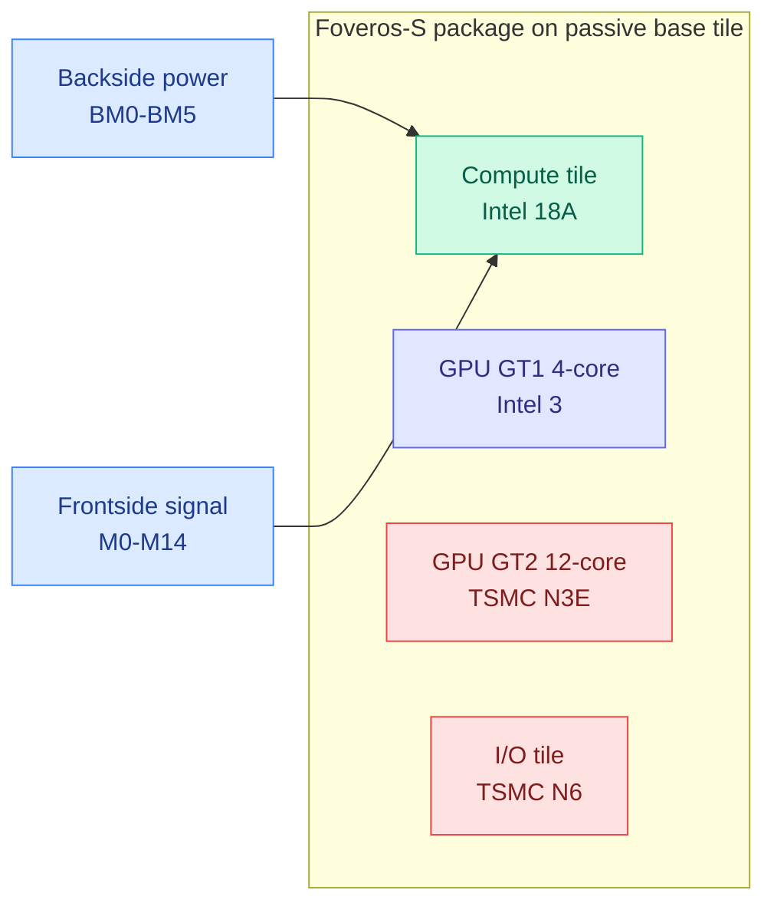

# Intel Panther Lake teardown: 18A ships, but does not lead on density

**Source:** SemiAnalysis, "Intel Panther Lake Teardown" (2026-09-26), via RSS and Gmail. [Post](https://newsletter.semianalysis.com/p/intel-panther-lake-teardown). Raw: `raw/rss/2026-09-26-semianalysis-intel-panther-lake-teardown.md`.

## TL;DR

SemiAnalysis's STEEL lab cross-sectioned Panther Lake, the first commercial chip with backside power delivery (PowerVia) and Intel's first gate-all-around transistors (RibbonFET, four stacked silicon nanosheets per device), assembled with Foveros-S packaging. The verdict is a real manufacturing milestone with a sober ceiling. Intel 18A compute logic measures at roughly the same density as TSMC N3E (the GPU tile's node) in a representative-cell model, and 18.6% denser than Intel 3. It does not lead TSMC N3P, N2 or Samsung SF2 on peak density. The CPU cores are incremental, and the high-end GPU tile is still made at TSMC on N3E.

## Key findings

- **Why backside power helps.** Normally power and signal wires share the same frontside metal stack, so power rails eat the scarce routing tracks next to the transistors. PowerVia moves power to a separate backside stack (BM0 to BM5) connected by nano-TSVs (tiny through-silicon vias), freeing the frontside for signals. That lets 18A use a compact five-track cell (N3E and Intel 3 use seven-track) while giving M0 wires 2.63x more cross-section than the N3E sample, which lowers resistance.
- **The cost of backside power.** The wafer is bonded to a carrier and thinned from the back; the carrier stays in the chip's thermal path. The approach adds capacitance, thermal resistance and process steps.
- **Materials detail.** Mo-lined W contacts replace resistive TiN liners; Co/Ru, Co and Nb liners vary by metal layer to trade resistance against process cost.
- **Density is set by cell height, not gate pitch.** Gate pitches are nearly identical across the compared sites.
- **SRAM.** On the TSMC-made GT2 tile, N3E L2 macros reach about 23.7 Mbit/mm² versus 18.3 on Intel 3, about 30% denser.
- **Packaging is node economics.** Splitting compute, GPU and I/O into tiles means only the compute tile burns leading-edge 18A wafer area; the cost is the passive base, die-to-die circuits, and bonding and test losses. Wildcat Lake (April 2026) shows the other path: same 18A, no base tile, more on one die.

## Relation to prior wiki pages

- **Hardware thread.** The wiki's semiconductor coverage has focused on memory supply and datacenter build-out: [SemiAnalysis China Datacenter Model (09-25)](2026-09-25-semianalysis-china-datacenter-model.md), which sized China's fleet at 24GW+, and the [CPU shortage (09-25)](2026-09-25-cpu-shortage-agents-and-rl.md) driven by RL and agent workloads. This is the first logic-process teardown on the page. Its relevance to AI compute: backside power and GAA are what TSMC's A16 and N2 generations bring to the accelerators that matter here, and Intel's parity-not-lead result says TSMC keeps the leading-edge AI accelerator business through at least this node.
- Concept page: [compute-economics](compute-economics.md).

## Gaps

- No yield or wafer-cost numbers; density parity says nothing about cost per good die.
- Client CPU silicon, not a datacenter or AI accelerator part. 18A's fit for large AI dies (where thermal path through the carrier matters more) is untested.
