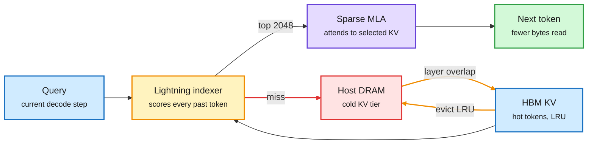

# How GLM-5.3 Sparse Attention Affects HBM Memory Usage (SemiAnalysis)

**Source:** SemiAnalysis (Kimbo Chen), 2026-09-28. [Post](https://newsletter.semianalysis.com/p/sparse-savings-persistent-demand-inside-glm53) · Raw: `raw/rss/2026-09-28-semianalysis-how-glm5-3-sparse-attention-affects-hbm-memory-usage.md`. Companion X thread on HBM stack height by [@not_ellington](https://x.com/not_ellington/status/2104744202290536695) (raw: `raw/twitter/feed/2026-09-29-morning-ranked.json`).
**Date:** 2026-09-29 (published 09-28)

## TL;DR

Sparse attention (each query attends only to the top-k most relevant past tokens) cuts how many KV-cache bytes each decode step reads. It does not cut how many bytes must be stored, because the selector that picks the top-k needs the whole context resident in HBM (high-bandwidth memory, the GPU's stacked DRAM). So sparse attention saves bandwidth, not capacity. SemiAnalysis walks through how GLM-5.3 (Z.ai, 744B total / 40B active MoE) is built and served around that fact: DeepSeek Sparse Attention (DSA) with a lightning indexer, IndexShare to amortize the indexer, and serving engines that spill KV to host DRAM. SGLang's HiSparse treats HBM as an LRU cache over host DRAM. On B200, as concurrency doubles from 8 to 16, prompt-cache reuse from GPU memory falls from 90.3% to 54.8% while reuse from host memory rises from 6.0% to 40.3%, and the overall hit rate stays above 95%. On cost, GB200 is about 12% cheaper than MI355X (ATOM engine) at 150 tok/s, but ATOM wins at 100 tok/s and wins again once a 2-second time-to-first-token cap is applied. The X thread makes the matching hardware point: decode is bandwidth-bound, HBM bandwidth does not grow with stack height, so Nvidia moved Rubin from 12-Hi to 8-Hi stacks.

Sparse attention reads less, but still has to keep everything

The indexer scans the full context, so capacity pressure moves to a host-DRAM tier instead of disappearing.

Blue is resident state, amber is the selection step, purple is attention, red is the slower spill tier, green is the output.

## Key points

**Sparse attention and memory**
- **Bandwidth, not capacity.** Top-k selection lowers bytes read per SDPA (scaled dot-product attention) call, but the indexer needs every token's indexer key in HBM, so the capacity bottleneck stays.
- **HiSparse (SGLang).** An LRU cache: on a top-k miss, load the token's KV from host DRAM; evict the least recently used entries back. Loads for layer N overlap with compute for layer N-1 (layer-wise overlap, inherited from HiCache). Big throughput gains at high concurrency and long context, paid for with miss I/O.
- **Host memory is a real KV tier now.** B200, 8 to 16 concurrent requests: GPU-memory reuse 90.3% to 54.8%, host-memory reuse 6.0% to 40.3%, total hit rate above 95% throughout.

**Serving cost (InferenceX, AgentX snapshot of Sept 28)**
- At 150 tok/s: GB200 about $0.044 per million total tokens vs MI355X ATOM $0.049, about 12% lower. GB300 (Dynamo-TRT-LLM) has the lowest modeled cost at that speed.
- GB300 serves about 13,950 total tok/s/GPU vs GB200's 11,873 (+17.5%) under Dynamo-SGLang, but at $2.31 vs $1.86 per GPU-hour, which more than cancels the lead at this target.
- At 100 tok/s ATOM is about 13% cheaper than GB200; GB200 is 5% cheaper at 125 and 12% at 150. No uniform winner.
- Output-only: GB200 $5.92 vs ATOM $6.68 per million output tokens at 150 tok/s.
- **The TTFT catch.** GB200's cheap points have p90 TTFT (time to first token) of about 14 to 19 s vs 1.1 to 1.2 s for ATOM. With a 2 s TTFT cap, MI355X ATOM is $0.0607 vs B200 $0.0666 (about 9% cheaper). Relax the cap to 10 s and GB300 qualifies at $0.0451.
- Engine work matters as much as silicon: a consistent CUDA-graph path for the first decode step cut vLLM TPOT from about 40 ms to 22 ms (NVFP4); chunked pipelined prefill in ATOM gave 98% more throughput and median TTFT 28.6 s to 8.7 s on 8x MI355X.
- **TileRT** compiles decode into one persistent kernel (fewer launches, overlapped compute, memory and communication). MI355X was supported first; FP8 TileRT on MI355X reports 2x the p90 interactivity of the best FP4 MI355X config and 40% over GB300 NVL72. TTFT is still weak.

**Architecture**
- GLM-5.x: 744B total, 40B active, 1 shared expert plus 8 of 256 routed experts per token.
- **DSA** = a lightning indexer (low-dimensional multi-head queries, single-head keys, dot product plus ReLU, no softmax, heads combined by a weighted sum so one top-k set is shared across heads) plus sparse MLA (multi-head latent attention). Queries with fewer than k=2048 tokens stay dense.
- **MLA modes.** MHA mode: fewer FLOPs, 42x more memory traffic. MQA mode: less memory, up to 3.4x more FLOPs. DSA uses MQA, but below a length threshold MHA is faster; vLLM picks MHA for 2K to about 5K tokens under data parallel and 2K to about 77K under tensor parallel.
- **Head count as a hardware fingerprint.** MQA-mode decode intensity is about 2H FLOP/byte. DeepSeek chose H=128 to hit the H800 ridge (258 FLOP/B). GLM-5 uses H=64, giving about 120.8 FLOP/B, close to the Moore Threads MTT S4000's roughly 128 FLOP/B. SemiAnalysis reads this as GLM-5 being tuned for Chinese silicon; Moore Threads' day-0 GLM-5.3-Flash support fits.
- GLM-5 raises QK NoPE dim 128 to 192 (head dim 192 to 256), still a 33% FLOP cut after halving heads.
- **IndexShare (IndexCache).** One indexer serves every 4 DSA layers, trained to match the averaged attention distribution of the shared layers; inference caches the top-k indices. Indexer cache and FLOPs drop 75%, throughput rises 1.5x to 1.8x.
- Post-training notes: SFT, then reasoning, agentic and general RL, then on-policy cross-stage distillation (GLM-5.2 moved to parallel MOPD, merging 10+ experts in about two days); SAO replaces GRPO's group advantage with single-rollout GAE for long-horizon RL; slime's rollout orchestrator handles 1,000 concurrent rollouts; teacher weights are swapped from pinned CPU memory.

**HBM stack height (X thread)**
- HBM-to-SRAM bandwidth is set by I/O lanes, base die and signaling rate, not by how many DRAM dies are stacked.
- 8-Hi HBM3e: 24 GB at about 1.2 TB/s, about 50 GB/s per GB. 12-Hi: 36 GB at the same 1.2 TB/s, about 33 GB/s per GB.
- Decode is bandwidth-bound, and DDR offload is viable for less latency-sensitive state, so taller stacks add BOM cost without adding speed. The thread's explanation for Nvidia moving Rubin to 8-Hi.

## How this relates to prior wiki pages

- **Confirms and extends [4-hi HBM wins (09-14)](2026-09-14-semianalysis-4hi-hbm-bandwidth-over-capacity.md)**, which argued inference wants bandwidth per GB over capacity and that Rubin Ultra's drop to 8-hi is a waypoint. Today the model side says the same thing: sparse attention reduces the bandwidth bill but leaves capacity to a cheaper tier.
- **Explains the "Rubin HBM despec" note** recorded in the [buildout financing cluster (09-28)](2026-09-28-ai-buildout-financing-risk.md), which flagged Dylan Patel's unexplained remark. The stack-height argument is a plausible mechanism.
- **Host DRAM as a KV tier** continues [Engram DRAM/SSD offloading (09-18)](2026-09-18-semianalysis-engram-dram-ssd-offloading.md) and [FreeToken (09-28)](../inference-efficiency/2026-09-28-freetoken-edge-moe-serving.md), which splits expert cache misses between PCIe copy and CPU compute. The [CPU shortage essay (09-25)](2026-09-25-cpu-shortage-agents-and-rl.md) is the caveat: host DRAM is getting scarcer as DRAM wafers go to HBM.
- **MLA MHA/MQA mode trade-off** was first laid out in the [Kimi K3 architecture primer (08-04)](../llms-foundation-models/2026-08-04-semianalysis-kimi-k3-architecture-primer.md). **Indexer-based sparse attention** has earlier wiki history in [MISA (05-11)](../inference-efficiency/2026-05-11-misa-mixture-of-indexer-sparse-attention.md), which mixed several indexers.
- **AgentX cost framing** follows [Vera Rubin NVL72 agentic inference (09-15)](2026-09-15-semianalysis-vera-rubin-agentic-inference.md), which introduced tokens per dollar of TCO on replayed agent traffic.
- Concept pages: [memory-hierarchy](memory-hierarchy.md), [kv-cache](../inference-efficiency/kv-cache.md).

## Gaps

- The cost numbers are read off fitted curves, not tests at exactly 150 tok/s.
- The Moore Threads inference is SemiAnalysis's hypothesis from arithmetic intensity, not a Z.ai statement.
- HiSparse throughput gains are shown without the miss-rate to latency curve at very long contexts.
- The stack-height numbers are a practitioner thread; per-stack bandwidth varies by HBM3e vendor and speed bin.
