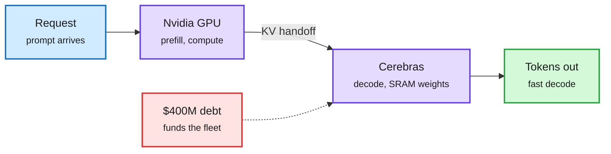

# General Compute Splits Inference Across Chips, HBM5 Qualifies Early, and GPUs Get Insured

**Source:** X home feed, 2026-09-29 ([@rohanpaul_ai](https://x.com/rohanpaul_ai/status/2104994347578224824), [@StockSavvyShay on General Compute](https://x.com/StockSavvyShay/status/2104969378878116070), [on SK hynix HBM5](https://x.com/StockSavvyShay/status/2104888318718874079), [on Nvidia GPU insurance](https://x.com/StockSavvyShay/status/2104881193019932977), [on Micron's 14-week quarter](https://x.com/StockSavvyShay/status/2104919521740165365)); The Information on [on-site power financing](https://www.theinformation.com/articles/investors-financing-on-site-power-break-ai-bottlenecks), [Samsung and Helix](https://www.theinformation.com/briefings/samsung-invests-1-billion-kkr-backed-ai-infrastructure-firm-helix) and [Nscale](https://www.theinformation.com/articles/nscales-unbuilt-data-centers-undercut-35-billion-ipo-pitch)
**Raw:** X feed captures (private) · [raw/rss/2026-09-29-the-information-how-investors-are-financing-on-site-power-to-break-ai-b.md](../../raw/rss/2026-09-29-the-information-how-investors-are-financing-on-site-power-to-break-ai-b.md)

## TL;DR

**General Compute** is building a neocloud for non-Nvidia chips (Cerebras, SambaNova, Etched). Its first move is a large Cerebras purchase funded by **$400M of debt**. Cerebras systems sit next to Nvidia GPUs and each request is split: **GPUs do prefill** (reading the prompt, compute-bound), **Cerebras does decode** (writing the answer, memory-bandwidth-bound), fast because the weights live in on-chip SRAM. This is prefill/decode disaggregation done across vendors, not just across pools of the same GPU.

Same day, from the same feed: **SK hynix has validated HBM5 with TSMC CoWoS packaging** while HBM4 is only now entering Vera Rubin systems. **Nvidia is reportedly working with insurers** to protect lenders if a small cloud defaults on GPU-backed loans, which would put GPU residual value into underwriting. The Information described investors financing **on-site power** (Blackstone-led $5.3B for 49% of five Williams gas projects; Brookfield's Bloom Energy fuel-cell facility up to $25B) and a timing mismatch: power assets last decades, GPUs age in a few years, so investors now want 10- to 15-year commitments.

Each phase goes to the chip that suits it

Prefill is compute-bound. Decode is bandwidth-bound. SRAM chips skip the HBM wall.

Blue is the request, purple is the two chip types, green is output, red is the financing cost.

## How this relates to prior wiki pages

- **Disaggregation keeps moving down the stack.** [Disaggregated Quantization (09-24)](../inference-efficiency/2026-09-24-disaggregated-quantization-prefill-decode.md) gave prefill and decode separate weight precisions; [Mooncake/DistServe (09-15)](../inference-efficiency/2026-09-15-disaggregated-serving-mooncake-distserve.md) separated them into GPU pools. General Compute separates them by silicon vendor. The open question is KV handoff cost between two chip families, which nobody has published.
- **Memory stays the priced resource.** Yesterday's SemiAnalysis chart had Rubin Ultra at 8-high HBM4 for more bandwidth per GB. HBM5 qualification this early says suppliers are being designed in two generations ahead.
- **Financing becomes an engineering variable.** The [compute-economics page (09-28)](compute-economics.md) logged GPU loans pricing at BBB spreads. Insurance on GPU residual value is the next instrument, and the [Nscale critique](https://www.theinformation.com/articles/nscales-unbuilt-data-centers-undercut-35-billion-ipo-pitch) (nearly all of its $103B backlog relies on unbuilt sites) is why lenders want it.
- **Not verified here:** the General Compute and Nvidia-insurance claims come from X posts summarizing reports; treat numbers as reported.

## Related

- [Compute economics](compute-economics.md)
- [Memory hierarchy](memory-hierarchy.md)
