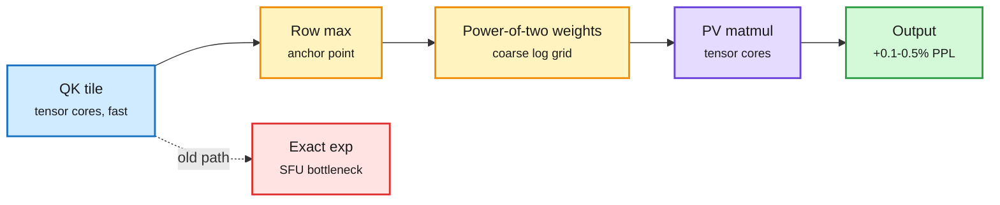

# Approximating Softmax in Pretrained LLMs: Rowmax-H15 in FlashAttention-4 on B200

**Source:** HuggingFace Daily Papers, listed 2026-09-29 · [arXiv 2609.33586](https://arxiv.org/abs/2609.33586)
**Raw:** [raw/huggingface/2026-09-29-approximating-softmax-in-pretrained-llms-model-sensitivity-a.md](../../raw/huggingface/2026-09-29-approximating-softmax-in-pretrained-llms-model-sensitivity-a.md)

## TL;DR

On Nvidia's B200, tensor cores do matrix math more than 100x faster than the special-function units compute exponentials. So in a fused attention kernel, the `exp()` inside softmax becomes a visible cost. The paper asks what a frozen, pretrained model actually needs from softmax, across ten decoder models from 0.5B to 72B. Answer: it does not need every probability computed precisely. You can cut how many positions get probability and how finely each row is resolved. But you cannot flatten them to uniform weights, and where you spend precision matters as much as how much: resolution near the row maximum is what models care about. The authors build **Rowmax-PoT**, a coarse power-of-two (logarithmic) weight representation anchored at each row's maximum, and **Rowmax-H15**, its hardware version inside FlashAttention-4. The patched FP8 attention forward is 12.4% faster at causal 8K and 25.8% faster non-causal; board energy per forward drops 8.4% at causal 16K; perplexity rises 0.09% to 0.49% across five models.

Spend exponent precision only near the row max

The matmuls are already fast. The exp unit is the new bottleneck, so approximate it where models do not look.

Blue is the score tile, amber is the new approximation, purple is tensor-core compute, red is the exact-exp path it replaces, green is output.

## Key findings

- **Precision near the max matters, uniform weighting kills.** The same "amount" of distortion can have opposite-sign effects on different models, so scalar error metrics are poor proxies.
- **Speed:** 12.4% (causal 8K) and 25.8% (non-causal 8K) faster FP8 attention forward, measured as host-side call latency.
- **Energy:** 8.4% less board energy per forward at causal 16K.
- **Quality:** Rowmax-H15 on the BF16 path raises perplexity 0.091% to 0.492% on five models from three families.

## How this relates to prior wiki pages

- **Third instance of the rule on the GPU kernels page:** every time you move work onto a specialized unit, the next bottleneck is whatever stayed on the general path. [VC-Attention (09-17)](../inference-efficiency/2026-09-17-vc-attention-low-bit-value-smoothing.md) found low-bit tensor cores speed only the two attention matmuls and leave softmax exposed; [the online-softmax worklog (09-16)](2026-09-16-softmax-kernel-worklog-online-softmax.md) reached the same place. This paper is the first to attack the exp unit directly on Blackwell with a shipped kernel patch.
- **Pairs with [Softmax reparameterization (09-29)](../inference-efficiency/2026-09-29-softmax-reparameterization-output-head.md),** which reshapes the output-head softmax before quantizing. Two papers in two days treat softmax as a free design variable rather than a fixed function.
- **Gap:** latency is host-side call timing, not end-to-end serving throughput, and only perplexity is reported for quality. No long-context retrieval test, where precise attention to a single distant token matters most.

## Related

- [GPU kernels concept page](gpu-kernels.md)
- [Attention mechanisms](../llms-foundation-models/attention-mechanisms.md)
