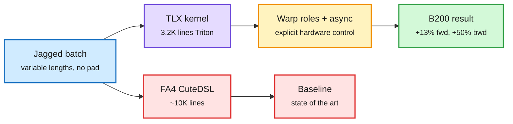

# Jagged Flash Attention in TLX Beats FA4 on Blackwell, and Models Start Writing the Kernels

**Source:** PyTorch blog via X Following feed (2026-10-01); NVIDIA blog on GPT-6 Astra Ultrafast (2026-10-01)
**Links:** [PyTorch blog: Optimizing Jagged Flash Attention with TLX](https://pytorch.org/blog/optimizing-jagged-flash-attention-with-tlx-the-road-toward-sota-fa4-on-blackwell/) · [@PyTorch post](https://x.com/PyTorch/status/2105788900576743798) · [NVIDIA: GPT-6 Astra Ultrafast](https://nvda.ws/3W2bZ5H) · [@nvidia post](https://x.com/nvidia/status/2105809442365423918)
**Raw:** X feed capture `raw/twitter/feed/2026-10-02-morning-ranked.json` (gitignored)

## TL;DR

Meta's Generative Ads Model (GEM) spends most of its time in one kernel: attention over **jagged** batches, where each user's sequence has a different length and there is no padding. Reaching peak Blackwell (B200) speed has meant hand-written CuteDSL or CUDA, which is slow to write and hard to extend. Meta rebuilt the kernel in **TLX** (Triton Low-level Extensions: explicit, hardware-aware controls added on top of Triton's tile-based model, such as warp specialization and asynchronous memory movement). The kernel is about **3.2K lines versus roughly 10K for FlashAttention-4's CuteDSL kernels**, and on GEM's jagged shapes it beats FA4 (May 2026 version) by **about 13% forward and about 50% backward** in bfloat16. Because it stays in Triton, modeling engineers can read, extend and fuse it, not only kernel specialists.

Same day, NVIDIA said OpenAI's **GPT-6 Astra Ultrafast** runs up to 8x faster than Astra Standard on Blackwell, and that OpenAI "used our internal models to optimize inference on NVIDIA GPUs." OpenAI's inference lead Philippe Tillet (the creator of Triton) said Astra "can turn that knowledge into high-performance kernels."

Less kernel code, faster on the shapes that matter

A Triton-level kernel with low-level controls overtakes a 3x longer hand-tuned one on jagged batches.

Blue is the workload, purple is the new kernel, amber is the hardware controls it exposes, green is the result, red is the heavier baseline.

## How it relates to prior wiki pages

- **Kernels keep leaving hand-written CUDA.** The 10-02 Media Zone tracked DeepSeek's TileKernels and DeepGEMM-Ascend ports and Xenova's WebGPU kernels. TLX is the same move inside NVIDIA's own stack: a higher-level language reaching or passing hand-tuned speed. See [GPU kernels](gpu-kernels.md).
- **Model-written kernels go to production.** The 09-22 [KernelBench-M](2026-09-22-kernelbench-m-mutation-analysis.md) page asked whether LLM-generated kernels are correct, not just fast. OpenAI now says its own models tune the inference kernels behind a paid product. That makes the correctness question a production one.
- **Cost lens:** a 50% faster backward pass is a direct training-cost cut for recommendation models, which run at far larger token volumes than most LLM fine-tunes.

## Gaps

- The comparison is on GEM's jagged shapes; FA4 likely still leads on standard dense, fixed-length LLM attention.
- NVIDIA's post gives no breakdown of how much of the 8x comes from model-written kernels versus hardware and batching choices.

Related: [GPU kernels](gpu-kernels.md) · [Compute economics](compute-economics.md)
