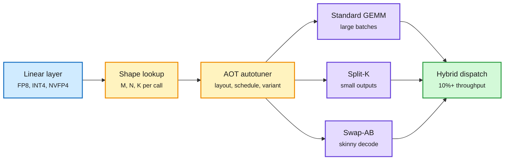

# Helion in vLLM: One Autotuned GEMM Beats CUTLASS and DeepGEMM on Hopper

**Source:** [PyTorch blog, 2026-10-02](https://pytorch.org/blog/building-a-high-performance-and-portable-vllm-linear-backend-with-helion/) by Sean Chen (Red Hat) and Shangdi Yu (PyTorch, Meta), surfaced via [@PyTorch](https://x.com/PyTorch/status/2106113342980890825)
**Raw:** `raw/twitter/feed/2026-10-03-morning-ranked.json` (article body enriched by the farmer)

## TL;DR

vLLM's quantized linear layers (FP8, INT8, INT4, NVFP4) normally dispatch to hand-written kernel libraries: CUTLASS, DeepGEMM, FlashInfer. Each library covers some shapes and formats well and others poorly. Helion is PyTorch's hardware-agnostic kernel DSL (a small Python language for writing GPU kernels as tiles). The team wrote **one** Helion GEMM (general matrix multiply) that can express three algorithmic variants: standard GEMM, Split-K (split the shared dimension across thread blocks, useful when the output is small) and Swap-AB (swap operands so a skinny decode-time matrix maps better onto tensor cores). An ahead-of-time autotuner searches memory layout, scheduling and the variant itself per input shape, and a hybrid dispatcher falls back to the existing library where it is still faster. On Hopper this **outperforms vLLM's default CUTLASS and DeepGEMM backends across the evaluated models**, with consistent end-to-end gains and **over 10% throughput** on some workloads.

The algorithm choice becomes an autotuning knob

One kernel source, three variants, picked per shape.

Blue is the layer call, amber is the per-shape tuning decision, purple is a kernel variant, green is the dispatched result.

## Key points

- **Variant selection is the new lever.** Prior tuning picked tile sizes inside one algorithm. Helion lets the tuner pick the algorithm too.
- **Hybrid dispatch is honest engineering.** Where a library kernel still wins, vLLM keeps it.
- **LLM-guided search** is supported to shrink autotuning time.
- **Hopper only so far.** Blackwell and AMD results are not in this post; AMD separately presents FlyDSL, an MLIR-native GEMM backend for TorchInductor, at PyTorch Conference (10-20/21).

## How it relates to prior wiki pages

- **Third kernel-DSL result in two days.** [Jagged Flash Attention in TLX (10-02)](2026-10-02-jagged-flash-attention-tlx-blackwell.md) showed a 3.2K-line Triton-level attention kernel beating FlashAttention-4's ~10K-line CuteDSL kernel on Blackwell. Helion now does the same for GEMM against CUTLASS. TorchTPU (10-02) ran upstream vLLM on TPUs through PyTorch. Pattern: high-level DSLs plus search are now matching vendor libraries on the hottest kernels, which lowers the cost of supporting new hardware and new quant formats.
- **Fits the "models write kernels" thread.** OpenAI said 10-02 that its models tuned GPT-6 Astra Ultrafast's kernels; Helion's LLM-guided autotuning is the open version of that loop.

## Related

[GPU kernels](gpu-kernels.md) · [Quantization](../inference-efficiency/quantization.md)
