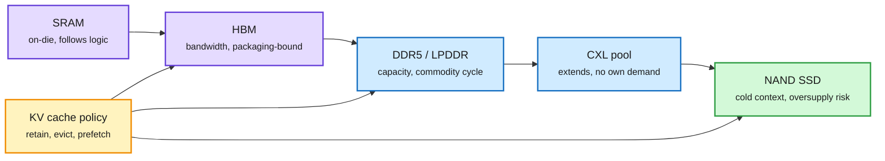

# Inference memory tiers and their market cycles

**TL;DR.** Ken Huang's essay (Agentic AI newsletter, 10-04) argues "AI memory" is not one product. Inference uses a hierarchy: **SRAM** inside the processor (fastest, smallest), **HBM** stacked beside the accelerator (extreme bandwidth, limited capacity), **DDR5/LPDDR/MRDIMM/SOCAMM** system memory, **CXL** to pool or extend memory outside CPU channels, and **NAND SSDs** for models, vector indexes, checkpoints and cold context. Each tier has different economics. HBM has the strongest structural position because frontier accelerators need it, but it depends on advanced packaging, customer qualification and AI capex, so **it will not escape the cycle**. Server DRAM and NAND get long-run AI demand but keep their boom-bust behavior. SRAM follows logic-chip design, not the DRAM cycle. Specialized and embedded memory may be more resilient than commodity bits, without the same upside. The essay is careful to separate engineering requirements from supplier roadmaps and analyst estimates.

Hot data sits close, cold data sits cheap

Decode is bandwidth-bound, so the KV cache fights for the top two tiers.

Purple is the fast tier, blue is system memory and pooling, green is bulk storage, amber is the software policy that places data.

## Key claims

- **Prefill versus decode.** Prefill is parallel arithmetic; decode generates one token at a time and is bound by memory bandwidth and cache access. That split decides which tier matters.
- **Capacity is not bandwidth.** NAND cannot replace HBM in the token loop; DDR5 holds more than HBM per dollar but sits farther away.
- **Placement and reuse decide performance.** The serving software decides when to retain, compress, evict, prefetch or retrieve each object. This is the KV-cache tiering problem stated as a market thesis.
- **Cycle exposure by tier.** HBM: structural but capex-exposed. DRAM and NAND: growing and cyclical. SRAM: tied to logic design. CXL: derived demand. Processing-in-memory: promising, not yet a substitute.

## Same-day numbers from the feed

A widely shared forecast puts memory industry revenue near **$1.5T in 2027 and only about $1.6T in 2028**, while Micron says supply stays tight through 2028. If cleanroom shortages hold, the 2028 figure looks low ([@StockSavvyShay](https://x.com/StockSavvyShay/status/2106388251078713416)). The 10-03 digest logged JPMorgan's HBM view (revenue up about 2.5x in 2027, HBM rising from 19% to 31% of DRAM capacity by 2028) and Micron's fiscal 2026 close at $133.19B revenue. Huang's frame explains why both can be true: HBM's share climbs on structural need while total memory revenue flattens on the commodity tiers.

## How it relates to prior wiki pages

- **Supports** [memory hierarchy](memory-hierarchy.md): the concept page tracks the same tiers from the engineering side; this adds the per-tier economics.
- **Confirms** [Galahad (10-02 digest)](../daily-digest/2026-10/2026-10-02.md), which found 98.7% of prompt tokens are re-reads and that keeping KV across requests makes a document a one-time cost. That only pays if a cheaper tier (DRAM, CXL, SSD) can hold the cache, which is the demand case for the lower tiers.
- **Pairs with** [three chokepoints (10-04)](2026-10-04-supply-chokepoints-cerebras-broadcom-memory.md): Cerebras sidesteps HBM by putting SRAM on the wafer. In Huang's frame that moves its memory exposure from the DRAM cycle to the logic cycle.

Raw: `raw/gmail/2026-10-04-newsletters.md` (gitignored), `raw/rss/2026-10-04-agentic-ai-ai-inference-memory-technologies-and-market-cycles.md`.
