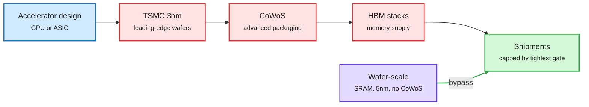

# Three chokepoints, and the architectures that route around them

**TL;DR.** The US Saturday hardware conversation on X lined up around one frame. Cerebras CEO Andrew Feldman named the three supply bottlenecks that cap accelerator shipments: **HBM memory, CoWoS advanced packaging, and TSMC 3nm capacity**. Cerebras' wafer-scale design uses none of them (on-wafer SRAM instead of HBM, no CoWoS interposer, 5nm instead of 3nm), so its supply profile differs from mainstream GPU systems. Around it: Broadcom is said to hold **~75% of the AI ASIC market** with six core customers, with Anthropic becoming its largest custom-chip client in FY27, and unit shipments doubling to ~10M in 2027 and ~24M by 2030 as ASPs climb from ~$10K to ~$18K. A memory forecast has industry revenue near **$1.5T in 2027 and only ~$1.6T in 2028**, while Micron says supply stays tight through 2028. And TSMC is reportedly exploring owning and operating a Texas fab for Musk's Terafab, with SpaceX anchoring capacity. These are social claims from analysts and a CEO interview, not filings; treat the numbers as directional.

Every mainstream accelerator passes three gates

Wafer-scale skips all three; custom ASICs still pass through them.

Blue is the design, red the three supply gates, purple the wafer-scale bypass, green shipments.

## Also in the window

- **ERRC (PyTorch Conference poster, Oct 20-21):** compresses tensor-parallel inter-GPU traffic and reinvests the saved bandwidth in correcting the quantization error the compression introduced. Interconnect becomes a tunable budget. No paper yet.
- **Memory to 2028:** the forecast's flat 2028 implies supply, not demand, sets revenue; if cleanroom shortages persist, 2028 estimates for Micron, SK hynix (HBM, DRAM) and SanDisk (enterprise SSD) look low.

## How this relates to prior wiki pages

- **Confirms the memory-supply thread** on [memory-hierarchy](memory-hierarchy.md): JPMorgan's ~2.5x HBM revenue in 2027 and HBM rising to 31% of DRAM capacity by 2028; Tesla cutting AI5/AI6 RAM to secure volume.
- **Extends compute-as-finance** on [compute-economics](compute-economics.md): yesterday Broadcom agreed to lend Anthropic up to $42B against a five-year TPU commitment it co-designs. Anthropic becoming Broadcom's largest custom-chip client in FY27 is the other side of that loan.
- **Architecture as supply strategy.** The wafer-scale bypass argument is the hardware analog of decision models on the software side: the cheapest unit is the one that does not compete for the scarce input.

## Gaps

- Cerebras still depends on TSMC wafers (5nm) and on wafer yield; "sidesteps all three" is the CEO's framing. SRAM capacity per wafer limits model size per system, which pushes weights off-wafer for large models.

**Raw source:** X Following feed captures of 2026-10-03.
