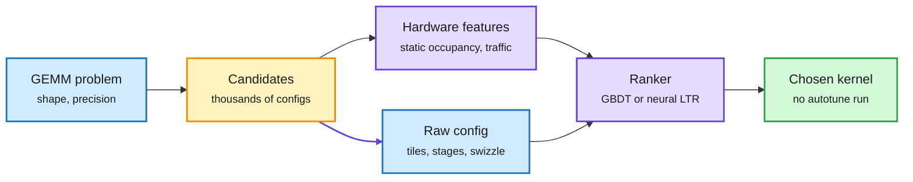

# Hardware-aware features for CUTLASS kernel selection

**TL;DR.** NVIDIA's CUTLASS library exposes tens of thousands of equivalent kernels for one matrix multiply (GEMM). Picking the fastest one usually means expensive autotuning (running many candidates) or hand-written heuristics. This paper (Chandran, Rinderer, Budanaz, Calotoiu, Copik et al.; arXiv 2609.35587; Kurate cs.LG top 20 this week) adds **statically computable estimates of the hardware behavior each candidate will induce** (things like occupancy, tile waste and memory traffic, computed without running the kernel) to the raw configuration parameters. They build a dataset of **4.9 million CUTLASS kernels** and train gradient-boosted and neural learning-to-rank models. On held-out problems the hardware-aware features cut selection regret (the slowdown versus the true best kernel) by **up to 40% versus structural features** and **64.2% versus NVIDIA's own matrix-multiply heuristics**. The features also transfer with little data across precisions and fused epilogues.

Tell the ranker what the hardware will do, not just what the config says

The new box is the static hardware estimate; no candidate is executed at selection time.

Blue is input, amber is the candidate pool, purple is the new feature and the ranker, green is the selected kernel.

## Key findings

- 4.9 million CUTLASS kernels form the training set, ranked within each problem.
- Up to 40% lower selection regret than structural (config-only) baselines.
- 64.2% lower regret than NVIDIA's matrix-multiply heuristics.
- Data-efficient transfer across precisions and epilogue fusion within CUTLASS GEMM.

## How this relates to prior wiki pages

- **Third angle on "who picks the kernel" in four days.** Helion in vLLM ([10-03](2026-10-03-helion-vllm-linear-backend.md)) wrote one GEMM source and let an ahead-of-time autotuner pick variant and config per shape, beating vLLM's default CUTLASS and DeepGEMM on Hopper. Jagged Flash Attention in TLX ([10-02](2026-10-02-jagged-flash-attention-tlx-blackwell.md)) showed a small DSL kernel beating FA4. This paper attacks the same selection step without any search at runtime: a learned ranker with physics-style features. Autotuning, DSLs and learned selectors are converging on one problem, the cost of choosing among equivalent kernels.
- **Fits OpenAI's "model-optimized kernels" claim for GPT-6 Astra Ultrafast** (see [gpu-kernels](gpu-kernels.md)): if models write and choose kernels, a cheap, accurate ranker is the piece that makes search affordable.
- Updates [gpu-kernels](gpu-kernels.md).

## Gaps

- GEMM only. Attention, MoE grouped GEMM and fused norm kernels are where selection is hardest today.
- The abstract does not name the GPU generations. Whether features computed for Hopper transfer to Blackwell's new tensor-memory model is the real test.
- No end-to-end serving throughput number, only selection regret.

## Research angle

Can the same hardware-feature trick rank DSL-generated kernels (Helion, TLX, cuTile) rather than CUTLASS templates? If so, a learned ranker could replace most of the autotuning budget in compiler stacks like TorchInductor.

**Raw source:** Kurate cs.LG leaderboard, 2026-10-05 (`raw/kurate/2026-10-05-cs-lg.md`).
