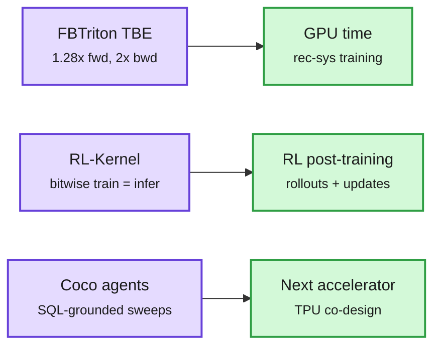

# Kernels and co-design: FBTriton TBE beats CUDA, RL-Kernel targets RL post-training, Coco grounds TPU architects

**Sources:** [PyTorch blog: Modernizing Table Batched Embeddings with FBTriton](https://pytorch.org/blog/modernizing-table-batched-embeddings-with-fbtriton/) (via @PyTorch, X feed) · [RL-Kernel on GitHub](http://github.com/RL-Align/RL-Kernel) (reader's repost of @ContentCase) · [Coco, arXiv 2610.02376](https://arxiv.org/abs/2610.02376) (Google, Google DeepMind, MIT; via @dair_ai) · Cerebras CS-4 claim (via @StockSavvyShay)
**Raw:** `raw/twitter/2026-10-06-evening.md` · `raw/twitter/feed/2026-10-07-*-ranked.json` (gitignored)

## TL;DR

Three infrastructure items from the same US day, all about getting more work out of fixed silicon.

- **FBTriton TBE (Meta).** Table-Batched Embedding (TBE) kernels do embedding lookups and pooling for many tables in one GPU launch; they dominate recommendation-model training. Meta rewrote them in FBTriton (its Triton fork) and **beat the legacy hand-written CUDA: up to 1.28x faster forward, 2x faster backward**. The forward pass loops each program over all features instead of launching a batch x table grid, issues four (or eight on a tuned path) independent row loads to hide memory latency, accumulates in FP32, and splits out a small-table histogram fast path. The developer-velocity claim matters as much as the speed: a Python-level kernel is easier to retune per GPU generation.
- **RL-Kernel (open source).** A low-level library for RL post-training of LLMs (GRPO, PPO) built on FlashInfer, with CUTLASS planned. It ships custom sampling, prefix-shared attention (the shared prompt is computed once across many rollouts) and TMA-based kernels (TMA is Hopper's hardware unit for bulk async copies). Its stated goal is **bitwise-identical numerics between training and inference engines**, which removes the train-inference mismatch that destabilizes RL. Claims up to 163x speedups on some hot components; that is a per-op best case until end-to-end numbers appear.
- **Coco (Google/MIT).** An agent platform deployed with TPU architects for model-hardware co-design. Each decision depends on hundreds of GB of fresh simulator sweeps no model has seen, so "chat with your data" hallucinates exactly where it matters. Coco registers every sweep in a normalized relational schema so **every number an agent reports comes from a SQL query**, exposes typed tools agents compose themselves, and encodes recurring analyses such as iso-execution comparison (systems at matched execution configs, including dominated points). Early deployment report, no controlled benchmark; the goal is halving time-to-insight.
- **Cerebras CS-4** reportedly doubles per-wafer performance without a new chip and claims inference up to 30x faster than GPUs, with installs dropping from days to hours against a ~$25B backlog. Vendor claim via a stock account; treat as a pointer.

Same silicon, more work: three layers of the stack

Kernel rewrites, train-inference consistency, and grounded design agents each attack a different waste.

Purple is the technique, green is the cost it attacks.

## Relation to prior wiki pages

- **Triton replacing hand-CUDA keeps accumulating** on [GPU kernels](gpu-kernels.md): Helion as a vLLM linear backend (10-03), Jagged Flash Attention in TLX on Blackwell (10-02), and now a production rec-sys kernel family. The hardware-aware CUTLASS selection paper (10-05) is the opposite bet, keeping CUDA templates and learning which one to pick.
- **RL is now the compute sink.** Reflection's Beam used 10,500 GB300s for four weeks of RL, more than its pretraining cluster; Prime Intellect said post-training/RL and inference are "taking over compute" on its platform. RL-Kernel (kernel layer) and [LoGRA (10-07)](../llms-foundation-models/2026-10-07-logra-low-rank-gradient-rl.md) (optimizer-memory layer) are the infrastructure response.
- **Coco's "retrieve, don't memorize" rule** matches the [agent memory](../agentic-systems/agent-memory.md) consensus that structured stores beat free-text recall for numbers.

## Related

[GPU kernels](gpu-kernels.md) · [Compute economics](compute-economics.md) · [RL for LLMs](../llms-foundation-models/rl-for-llms.md)
