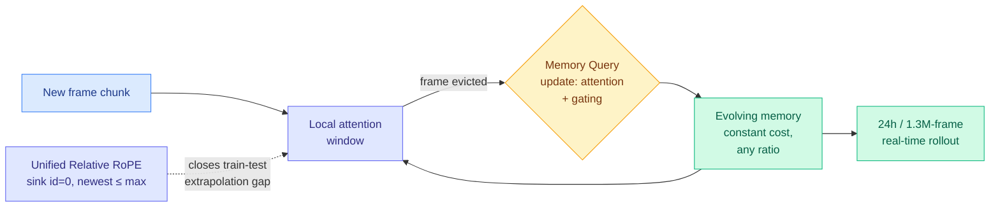

# Echo-Infinity: Learnable Evolving Memory for Real-Time Infinite Video Generation

**Date:** 2026-06-04
**Source:** HuggingFace Daily Papers
**arXiv:** [2606.04527](https://arxiv.org/abs/2606.04527)

## TL;DR

Autoregressive video generators produce frames one chunk at a time, conditioned on the history of frames already generated. That history is the bottleneck: keep all of it and cost grows without bound; throw it away and quality collapses through compounding error. Existing systems manage the history with handcrafted rules: predefined KV-cache schedules, fixed-ratio heuristic compression, or inference-time RoPE adaptation. Echo-Infinity replaces the handcrafting with a **learnable evolving memory**. A small set of Memory Queries is updated by attention and a gating mechanism whenever past frames are evicted from the local window, and these queries are optimized end-to-end with the video diffusion transformer. The memory supports any compression ratio at constant compute independent of video length. A second contribution, the Unified Relative RoPE Recipe, anchors sink frames to position 0 and caps the newest frame's RoPE id at the model's pretrained maximum, closing the train-test extrapolation gap. The system demonstrates 24-hour, >1.3 million-frame real-time rollouts, claimed as a first.

## Key findings

1. **Learned memory beats handcrafted curation.** Memory Queries updated by attention plus gating, trained jointly with the diffusion transformer, replace predefined KV schedules and fixed-ratio compression. They also act as a generation prior: quality improves even when only the optimized initial query state is used.
2. **Constant cost at any length.** The query set is fixed-size, so compute per step is independent of how long the video has run, with the compression ratio a free knob rather than a fixed heuristic.
3. **RoPE recipe closes the extrapolation gap.** Anchoring sink frames to id 0 and letting the newest frame grow only up to the pretrained maximum temporal RoPE id frees generation from the finite RoPE limit and matches training to inference, enabling the 24-hour rollout.

## Relation to prior wiki state

Echo-Infinity is the video-generation instance of the single biggest pattern on the [KV cache page](kv-cache.md): the move from handcrafted cache management to a *learned* one. The page tracks this everywhere. [Make Each Token Count](2026-05-12-make-each-token-count-kv-eviction.md) (05-12) learned per-token retention instead of recency heuristics; [VaSE](2026-06-03-vase-value-aware-stochastic-kv-eviction.md) (06-03) found that handcrafted top-k eviction starves the cache and a value-magnitude guard plus stochasticity fixes it. Echo-Infinity makes the same argument for video: predefined KV schedules and fixed-ratio compression "inevitably lose historical information and amplify compounding errors," so learn the memory instead.

It also extends the video-KV thread directly. The page already holds [WorldKV](2026-05-24-worldkv-video-world-memory.md) (evicted KV as retrievable world memory), [Forcing-KV](2026-05-15-forcing-kv-video-diffusion-kv-cache-compression.md) (per-head role pruning), [StateKV](2026-06-01-statekv-linear-video-vlm.md) (06-01, fixed recurrent state as cross-frame memory), and [EarlyTom](2026-05-30-earlytom-early-token-compression-video.md) (in-encoder compression). Echo-Infinity is closest to StateKV's fixed-state idea, but where StateKV wraps a pretrained model training-free, Echo-Infinity *trains* the memory queries end-to-end with the generator, and targets generation rather than understanding. The "Memory Query updated on eviction" mechanism is the diffusion-video cousin of the SSM consolidation in [Language Models Need Sleep](2026-05-27-language-models-need-sleep.md) (05-27, fold evicted context into fast weights), with the consolidation happening online via gating rather than in an offline sleep pass.

## Research angle

1. **Memory-as-prior is the surprising result.** That the optimized initial query state alone improves quality suggests the learned memory captures a reusable generation prior, not just per-video history. Whether that prior transfers across prompts or domains is the question.
2. **Does the learned-memory argument transfer back to text KV?** Echo-Infinity argues learned beats handcrafted for video history; the symmetric claim for long-context text decoding (learn the eviction queries end-to-end instead of VaSE-style training-free rules) is the obvious cross-modal test.
3. **Constant-cost claim needs a drift audit.** Constant compute over 1.3M frames is the headline; whether semantic drift over 24 hours is bounded, or just slow, is the missing long-horizon quality measurement.

## Links

- [Paper (arXiv)](https://arxiv.org/abs/2606.04527)
- [HuggingFace page](https://huggingface.co/papers/2606.04527)
- Raw: [raw/huggingface/2026-06-04-echo-infinity-learning-evolving-memory-for-real-time-infinit.md](../../raw/huggingface/2026-06-04-echo-infinity-learning-evolving-memory-for-real-time-infinit.md)
- Concept page: [KV Cache](kv-cache.md)
- Related: [StateKV 06-01](2026-06-01-statekv-linear-video-vlm.md) · [VaSE 06-03](2026-06-03-vase-value-aware-stochastic-kv-eviction.md) · [WorldKV 05-24](2026-05-24-worldkv-video-world-memory.md) · [Make Each Token Count 05-12](2026-05-12-make-each-token-count-kv-eviction.md)
