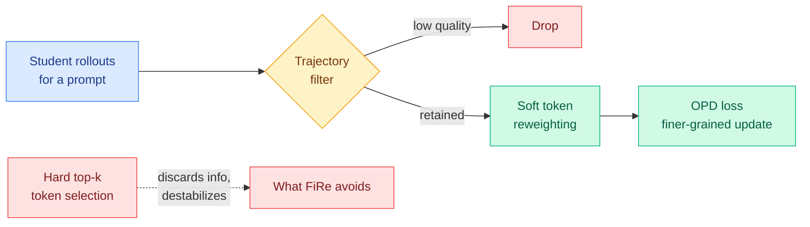

# FiRe-OPD: Filter, Then Reweight On-Policy Distillation

**Date:** 2026-06-04
**Source:** HuggingFace Daily Papers
**arXiv:** [2606.02684](https://arxiv.org/abs/2606.02684)
**Code:** [github.com/YuYingLi0/FiRe-OPD](https://github.com/YuYingLi0/FiRe-OPD)

## TL;DR

On-policy distillation (OPD) trains a small student on its own rollouts using token-level supervision from a larger teacher. The whole spring of OPD research has been narrowing the supervision: which trajectories to keep, which tokens carry signal, which teacher labels are reliable. FiRe-OPD operates on both granularities at once. It first **filters** trajectories to drop low-quality rollouts, then applies **soft reweighting** within the survivors to emphasize informative tokens. The key design choice is softness: instead of hard top-k token selection (which throws information away), FiRe-OPD weights every retained token continuously, which it argues mitigates information loss and stabilizes optimization. It validates across strong-to-weak, single-teacher, and multi-teacher settings, reporting +6.25 on AIME 2024 (strong-to-weak) and +18.81 on Miner (multi-teacher) over recent token-level OPD methods.

## Key findings

1. **Two-level granularity in one recipe.** Trajectory-level filtering removes bad rollouts before any token-level work; soft token reweighting then redistributes emphasis inside the retained trajectories. Prior methods picked one level.
2. **Soft beats hard.** Against hard token selection (the TIP/TA-OPD style of keeping only a small subset), FiRe-OPD's soft weighting keeps all retained tokens but down-weights the uninformative ones, which it claims reduces information loss and improves optimization stability.
3. **Robust across teacher regimes.** Gains hold in strong-to-weak (+6.25 AIME 2024), single-teacher, and multi-teacher (+18.81 Miner) settings, suggesting the filter-then-reweight structure is not tied to one distillation topology.

## Relation to prior wiki state

FiRe-OPD is the synthesis step the [knowledge distillation concept page](knowledge-distillation.md) has been building toward. The selection line ran: [TIP](2026-04-16-tip-token-importance-on-policy-distillation.md) (04-16, under 10% of tokens carry signal, picked by entropy/divergence) → [TA-OPD](2026-06-01-ta-opd-token-teachability.md) (06-01, keep only teacher corrections the student can actually reach). Both do *hard* token selection. FiRe-OPD argues hard selection discards usable signal and replaces it with continuous reweighting, while adding a trajectory-level filter on top. The trajectory filter also echoes [The Many Faces of On-Policy Distillation](2026-05-13-many-faces-on-policy-distillation.md) (05-13), which warned that aggregating over bad rollouts collapses the student to a useless average policy.

Most directly, it answers the open question from yesterday's [TrOPD](2026-06-03-tropd-trust-region-on-policy-distillation.md) Research angle (06-03), which asked for a method that unifies the *selection* axis (which tokens) with a *control* axis. FiRe-OPD unifies selection across two levels (trajectory filter + soft token weight) but does not add TrOPD's reliability trust region; the fully unified policy (reachable tokens, inside a reliability band, with trajectory filtering) is still unwritten. It also pairs with same-day [SDPG](2026-06-04-sdpg-self-distilled-policy-gradient.md) (06-04), which attacks the same OPD-stability surface from the RL side by folding a full-vocabulary self-distillation KL into the policy gradient.

## Research angle

1. **Compose with the trust region.** FiRe's soft reweighting and TrOPD's reliability band are orthogonal. A weight that is the product of "informativeness" (FiRe) and "teacher reliability" (TrOPD) is the obvious unified objective and should dominate either alone.
2. **Where does the soft weight come from?** The paper reweights by informativeness; whether that weight is the same quantity as TA-OPD's teachability or TIP's entropy/divergence is untested. If they coincide, the field has been computing one signal three ways.
3. **Multi-teacher is the standout number.** The +18.81 on Miner in multi-teacher is far larger than the strong-to-weak gain, hinting that trajectory filtering matters most when teachers disagree. A teacher-disagreement-aware filter is the natural follow-up.

## Links

- [Paper (arXiv)](https://arxiv.org/abs/2606.02684)
- [HuggingFace page](https://huggingface.co/papers/2606.02684)
- Raw: [raw/huggingface/2026-06-04-filter-then-reweight-rethinking-optimization-granularity-in.md](../../raw/huggingface/2026-06-04-filter-then-reweight-rethinking-optimization-granularity-in.md)
- Concept page: [Knowledge Distillation](knowledge-distillation.md)
- Related: [TIP 04-16](2026-04-16-tip-token-importance-on-policy-distillation.md) · [TA-OPD 06-01](2026-06-01-ta-opd-token-teachability.md) · [TrOPD 06-03](2026-06-03-tropd-trust-region-on-policy-distillation.md) · [SDPG 06-04](2026-06-04-sdpg-self-distilled-policy-gradient.md)
