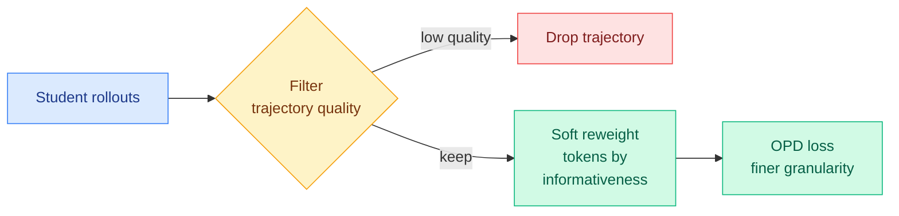

# Filter, Then Reweight: Rethinking Optimization Granularity in On-Policy Distillation (FiRe-OPD)

**Source:** HuggingFace Daily Papers
**arxiv:** [2606.02684](https://arxiv.org/abs/2606.02684)
**Date:** 2026-06-04
**Raw:** [raw/huggingface/2026-06-04-filter-then-reweight-rethinking-optimization-granularity-in.md](../../raw/huggingface/2026-06-04-filter-then-reweight-rethinking-optimization-granularity-in.md)
**Tier:** 2 (on-policy distillation; intersects Tier 1 efficiency)

## TL;DR

On-policy distillation (OPD) trains a student on its own rollouts using a teacher's token-level supervision. The field has been moving away from supervising every token toward selecting which trajectories and which tokens to learn from. FiRe-OPD does both, in two stages: first filter out low-quality rollout trajectories, then within the survivors apply soft reweighting to emphasize informative tokens. The soft weighting (rather than hard keep/drop on tokens) avoids the information loss of hard selection and is more stable.

## Diagram

## Key findings

1. **Two-level granularity beats single-level.** Filtering at the trajectory level removes bad rollouts; soft reweighting at the token level then focuses learning on informative tokens within the good ones.
2. **Soft weighting > hard selection.** Hard token selection (keep top-k, drop the rest) throws away signal; soft reweighting keeps all tokens but down-weights uninformative ones, which is more stable and loses less information.
3. **Gains across settings:** +6.25 on AIME 2024 in strong-to-weak distillation, +18.81 on Miner in the multi-teacher setting; also validated single-teacher. Beats recent token-level OPD methods.

## Relation to prior wiki state

FiRe-OPD is the newest entry in a thread that is now unmistakably a convergence. The wiki has logged, in sequence:
- **TIP (04-16, token-importance: most teacher tokens carry no signal, ~10% suffice).**
- **TA-OPD (06-01, learn only from teacher corrections the student can actually reach).**
- **TrOPD (06-03, restrict OPD updates to tokens where the teacher's supervision is reliable; clip the rest).**
- **Harmful Continuation (06-03, even answer-correct CoT traces hurt SFT past the conclusion — a span-level filter).**

That is at least four papers in under two months making the same core claim: **uniform supervision over every token is wasteful and often harmful; the signal is sparse and you must select for it.** FiRe-OPD's specific contribution is to argue that the selection should be *soft* (reweight) not *hard* (filter) at the token level, while keeping the filter *hard* at the trajectory level. It is a granularity refinement on an already-converged direction.

It also pairs with today's **SDPG (self-distilled policy gradient)** and **ThoughtFold (folding redundant reasoning)** — three same-day papers all about making the learning signal in reasoning/distillation denser and more selective.

## Why it matters

Distilling small reasoning models is now a core production task (Microsoft's MAI-Code-1-Flash, every "flash"/"mini" tier). The compute saved by not supervising junk tokens is real, and the stability gain from soft-over-hard weighting directly attacks the collapse failures TrOPD and the Extrapolation Cliff (05-14) named. FiRe-OPD is a drop-in granularity upgrade for any team already running OPD.

## Gaps

The trajectory filter and the token-reweighting function are separately designed; whether a single jointly-learned weighting over (trajectory × token) would dominate is untested. The informativeness signal driving the soft weights is not compared against a learned verifier signal.

## Links

- [Paper](https://arxiv.org/abs/2606.02684) · [code](https://github.com/YuYingLi0/FiRe-OPD)
- Related: [TrOPD 2026-06-03](2026-06-03-tropd-trust-region-on-policy-distillation.md), [SDPG 2026-06-04](../llms-foundation-models/2026-06-04-sdpg-self-distilled-policy-gradient.md), [ThoughtFold 2026-06-04](../llms-foundation-models/2026-06-04-thoughtfold-folding-reasoning-chains.md)
- Concept: [knowledge distillation](knowledge-distillation.md), [RL for LLMs](../llms-foundation-models/rl-for-llms.md)
