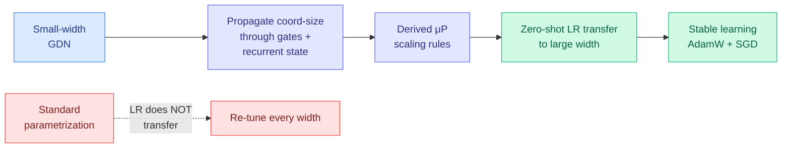

# Unlocking Feature Learning in Gated Delta Networks at Scale (μP for linear attention)

**Date:** 2026-06-04
**Source:** HuggingFace Daily Papers
**arXiv:** [2606.04048](https://arxiv.org/abs/2606.04048)

## TL;DR

The Maximal Update Parametrization (μP) lets you tune hyperparameters on a tiny model and transfer them to a huge one with no re-tuning, because it keeps every coordinate's update size scale-invariant as width grows. μP was derived for standard Transformers. Sub-quadratic architectures like Gated Delta Networks (GDN, a linear-attention family whose state evolves by a gated delta rule) have structured state transitions and gating that the standard derivation does not cover, so μP did not transfer to them. This paper does the work: it propagates coordinate-size estimates through GDN's forward pass, gating mechanisms, and recurrent state dynamics to derive the correct scaling rules. With those rules, learning-rate transfers cleanly across model widths under both AdamW and SGD; under standard parametrization it fails to transfer. The contribution is the missing theory that lets efficient linear-attention models inherit μP's zero-shot hyperparameter transfer.

## Key findings

1. **μP derived for a gated linear-attention model.** The analysis rigorously propagates coordinate-size estimates through the parts standard μP ignores: the structured state transition and the gating. This yields explicit scaling rules for GDN.
2. **Learning-rate transfer holds under two optimizers.** Configurations transfer the optimal learning rate across widths under both AdamW and SGD; standard parametrization does not transfer, confirming the derivation is doing real work rather than absorbing a lucky constant.
3. **Closes a practical gap for efficient architectures.** Sub-quadratic models are pursued precisely to save compute; needing to re-tune hyperparameters at every scale erodes that saving. μP transfer restores it.

## Relation to prior wiki state

This paper is the convergence of two threads the wiki has tracked separately. The first is the **Gated DeltaNet architecture line** on the [attention-mechanisms page](../llms-foundation-models/attention-mechanisms.md): [Gated DeltaNet-2](2026-05-24-gated-deltanet-2-decoupled-erase-write.md) (05-24, splits the single scalar gate into channel-wise erase and write gates) and [MDN](2026-05-11-mdn-momentum-deltanet-linear-attention.md) (05-11, adds momentum to the linear-attention state update) improved the *recurrent rule*; today's paper makes that family *trainable at scale without re-tuning*.

The second is the **optimizer-and-scaling codesign** thread. [Parallax](2026-05-29-parallax-local-linear-attention.md) (05-29) showed Muon unlocks local-linear-attention capacity where AdamW stalls, the first architecture-optimizer codesign for an attention mechanism; the [MoE μP / Maximally Scale-Stable Parameterization](../ai-routing/2026-05-17-moe-mup-maximally-scale-stable-parameterization.md) paper (05-17, also Kurate cs.LG #14 this week at ai_rating 9.0) did the same derivation for mixture-of-experts. Today's GDN-μP is the third leg: μP-style scale-stability is being extended, architecture by architecture, to everything that is not a vanilla Transformer (MoE, then local-linear attention, now gated delta networks).

The timing is sharp. The same morning, the [Marin / Open Athena pretraining-efficiency post](../llms-foundation-models/2026-06-04-marin-moe-pretraining-efficiency.md) (surfaced via [@eliebakouch](https://x.com/eliebakouch/status/2062236377991741508)) reported a 6.7x theoretical (3.6x realized) speedup moving a dense recipe to MoE plus a Muon optimizer swap, validated through clean scaling-ladder ablation. Industry is shipping the scale-stable-MoE recipe while academia extends the parametrization theory to the next efficient architecture. Same lever, two sides of the fence.

## Research angle

1. **One parametrization for the whole efficient zoo?** MoE, local-linear attention, and gated delta networks each got a bespoke μP derivation. Whether a single unified scale-stable parametrization covers all structured-state architectures, or each needs its own propagation, is the open theory question.
2. **Transfer of more than learning rate.** The paper transfers LR; whether batch size, warmup, and weight decay also transfer under the derived rules (as full μP promises) determines how much re-tuning is truly eliminated.
3. **Does Muon help GDN like it helped Parallax?** The optimizer-codesign thread predicts Muon should unlock GDN capacity beyond AdamW. The paper tests AdamW and SGD; the Muon test is the obvious missing experiment.

## Links

- [Paper (arXiv)](https://arxiv.org/abs/2606.04048)
- [HuggingFace page](https://huggingface.co/papers/2606.04048)
- Raw: [raw/huggingface/2026-06-04-unlocking-feature-learning-in-gated-delta-networks-at-scale.md](../../raw/huggingface/2026-06-04-unlocking-feature-learning-in-gated-delta-networks-at-scale.md)
- Concept page: [Attention Mechanisms](../llms-foundation-models/attention-mechanisms.md)
- Related: [Gated DeltaNet-2 05-24](2026-05-24-gated-deltanet-2-decoupled-erase-write.md) · [MDN 05-11](2026-05-11-mdn-momentum-deltanet-linear-attention.md) · [Parallax 05-29](2026-05-29-parallax-local-linear-attention.md) · [MoE μP 05-17](../ai-routing/2026-05-17-moe-mup-maximally-scale-stable-parameterization.md) · [Marin MoE 06-04](../llms-foundation-models/2026-06-04-marin-moe-pretraining-efficiency.md)
