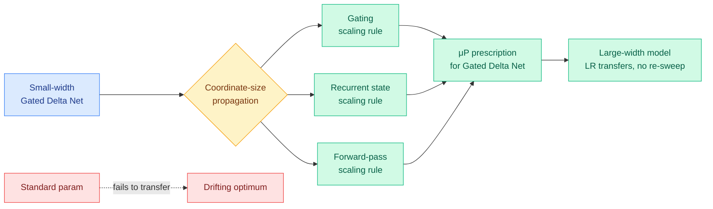

# Unlocking Feature Learning in Gated Delta Networks at Scale

**Source:** HuggingFace Daily Papers
**arxiv:** [2606.04048](https://arxiv.org/abs/2606.04048)
**Date:** 2026-06-04
**Raw:** [raw/huggingface/2026-06-04-unlocking-feature-learning-in-gated-delta-networks-at-scale.md](../../raw/huggingface/2026-06-04-unlocking-feature-learning-in-gated-delta-networks-at-scale.md)
**Tier:** 1 (efficient sub-quadratic architecture, hyperparameter transfer, scaling)

## TL;DR

The Maximal Update Parametrization (μP) is the rule set that lets you tune hyperparameters on a small model and transfer them to a big one without re-sweeping. It was derived for standard Transformers. This paper derives it for Gated Delta Networks, a linear-attention architecture with structured state transitions and gating. By propagating coordinate-size estimates through the forward pass, the gating mechanism, and the recurrent state dynamics, the authors get scaling rules that make learning-rate transfer across model widths actually work under both AdamW and SGD. Standard parametrization fails to transfer for these models; the derived μP works.

## Diagram

## Key findings

1. **μP does not extend to gated linear models for free.** The structured state transitions and the gating make the coordinate-size bookkeeping different from a standard attention block. Naive width-μP misallocates per-coordinate scale through the recurrence.
2. **The derived rules give clean learning-rate transfer across widths** under both AdamW and SGD, on real language-model pre-training. Standard parametrization does not transfer for these architectures.
3. **The derivation is mechanism-specific.** They track scale through the delta-rule update and the gate separately, rather than treating the block as a black-box recurrence.

## Relation to prior wiki state

This is the linear-attention companion to **MoE-μP (05-17, "How to Scale Mixture-of-Experts: From muP to the Maximally Scale-Stable Parameterization", which derived scale-stable hyperparameter transfer across the MoE axes of expert count, expert width, and routing sparsity)** ([summary](../ai-routing/2026-05-17-moe-mup-maximally-scale-stable-parameterization.md)). MoE-μP made the sparse-width axis principled; this paper makes the recurrent-state axis principled. Both are answers to the same economic problem: frontier pre-training runs cost tens of millions, and any hyperparameter sweep that must be re-run at target scale is most of that budget. μP for dense Transformers cut that an order of magnitude; the field is now porting μP to every architecture that actually ships.

A pattern is forming: in three weeks the wiki has logged μP extensions to MoE (05-17) and now to gated linear attention (06-04). The thread is "no frontier architecture should be tuned by expensive sweep when the scaling rule can be derived once." See the [LLM routing concept page](../ai-routing/llm-routing.md) for the MoE-μP context.

It also lands the same week as **Marin's MoE pretraining recipe (openathena.ai, surfaced via @eliebakouch on Twitter)**, which reports a 6.7x theoretical (3.6x realized) speedup moving dense→MoE plus stacked optimizer and routing improvements. Marin is the empirical, recipe-level instance; Gated Delta μP and MoE-μP are the theory layer under it. See [Marin MoE summary](2026-06-04-marin-moe-pretraining-speedup.md).

## Why it matters

Gated Delta Networks are a sub-quadratic alternative to softmax attention, in the same family of linear-attention and state-space designs (Mamba, DeltaNet, RWKV) that the field keeps revisiting for long-context efficiency. The blocker to adopting them at frontier scale has been the same as for any new architecture: you cannot afford to re-discover the right learning rate by sweeping at 100B+. A closed-form μP for the architecture removes that blocker. If a lab wants a linear-attention backbone for cheap long-context inference, they can now tune at small width and trust the transfer.

## Research angle

1. **μP for gated linear attention + MoE jointly.** Modern efficient models mix linear attention with MoE feedforward. Whether Gated Delta μP composes with MoE-μP across both axis families at once is unwritten, and is the obvious next paper. Falsifiable: a single prescription that transfers LR across width, expert count, AND recurrent-state size on one hybrid backbone.
2. **Does the recurrent-state scaling rule hold under the gating variants** used in shipping models (different gate parameterizations)? The paper covers one gated delta formulation.
3. **Transfer under hybrid attention.** Same open question MoE-μP left: most 2026 architectures interleave softmax, sliding-window, and linear attention. Whether the derived rules survive interleaving is untested.

## Links

- [Paper](https://arxiv.org/abs/2606.04048)
- Related: [MoE-μP 2026-05-17](../ai-routing/2026-05-17-moe-mup-maximally-scale-stable-parameterization.md), [Marin MoE pretraining 2026-06-04](2026-06-04-marin-moe-pretraining-speedup.md)
- Concept: [attention mechanisms](../llms-foundation-models/attention-mechanisms.md), [LLM routing](../ai-routing/llm-routing.md)
