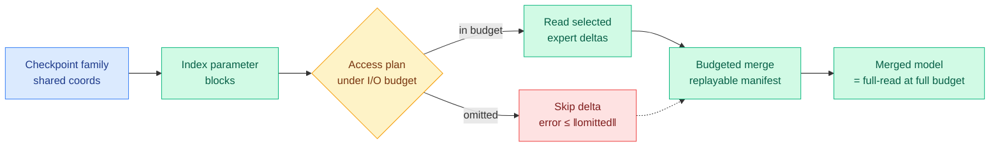

# Access Sets Matter: Budgeting Expert Reads for Scalable Weight-Space Model Merging (MergePipe)

**Source:** HuggingFace Daily Papers
**arxiv:** [2605.29489](https://arxiv.org/abs/2605.29489)
**Date:** 2026-06-04
**Raw:** [raw/huggingface/2026-06-04-access-sets-matter-budgeting-expert-reads-for-scalable-weigh.md](../../raw/huggingface/2026-06-04-access-sets-matter-budgeting-expert-reads-for-scalable-weigh.md)
**Tier:** 1 (efficiency, model merging, I/O budgeting)

## TL;DR

Model merging (combining several fine-tuned checkpoints into one by operating on their weights) is usually treated as pure algebra on tensors. MergePipe reframes it as an I/O problem: at LLM scale the bottleneck is not the arithmetic, it is which expert weight blocks you have to read off disk/memory. MergePipe casts merging as an expert *access-set* problem: given a merge operator and a family of checkpoints in a shared coordinate system, choose which expert delta blocks to actually read under an explicit I/O budget. It reduces expert-read I/O by up to an order of magnitude and gets up to 11x speedups, with bounded error.

## Diagram

## Key findings

1. **Merging is I/O-bound, not compute-bound, at LLM scale.** The limiting resource is the set of expert weights that must be read. MergePipe makes that set the optimization variable.
2. **Budget-sound by construction.** The access plan recovers the exact full-read merge when given full budget, and degrades gracefully below it. For fixed-coefficient additive operators, the error from omitting a delta block is provably bounded by the norm of the omitted delta.
3. **Up to 11x speedup and up to an order-of-magnitude I/O reduction** across Qwen and Llama merging workloads, with O(10⁻³) parameter deviation from full-read merges and no monotonic downstream degradation.
4. **Replayable manifests.** The plan is deterministic and recorded, so a merge is reproducible.

## Relation to prior wiki state

This is the model-merging instance of the wiki's running **"the load-bearing part is sparse and locatable, so budget for it explicitly"** thread. The same week, VaSE (06-03) protected a handful of large-magnitude value states in the KV cache; the Small RL Controller (06-03) budgeted the sampling loop; MERIT (06-03) split data along a low-dimensional conflict subspace. MergePipe applies the identical move to merging: most delta blocks contribute little, so read the ones that matter under a budget and bound the error of skipping the rest.

It is also the read-budget counterpart to **BEAM (05-16, binary expert-activation masking that learns which experts to activate per token)**: BEAM budgets expert *activation* at inference; MergePipe budgets expert *reads* at merge time. Both treat the expert as the unit of accounting in a sparse model.

## Why it matters

Merging is how teams cheaply combine specialist fine-tunes without retraining (e.g. the split-then-merge recipes in MERIT and MAI-Thinking-1). As models grow to hundreds of billions of MoE parameters, the merge step itself becomes a data-movement bottleneck. Framing it as a budgeted access problem with a provable error bound makes merging a tunable cost rather than an all-or-nothing operation, which matters for any continuous-integration pipeline that merges checkpoints regularly.

## Gaps

The error bound is proved for fixed-coefficient additive operators; nonlinear or data-dependent merge operators are not covered with the same guarantee. The downstream evaluation shows no monotonic degradation but does not stress test adversarial budget allocations.

## Links

- [Paper](https://arxiv.org/abs/2605.29489)
- Related: [BEAM 2026-05-16](../ai-routing/2026-05-16-beam-binary-expert-activation-masking-moe.md), [MERIT 2026-06-03](../llms-foundation-models/2026-06-03-merit-decentralized-instruction-tuning-merging.md)
- Concept: [knowledge distillation](knowledge-distillation.md), [LLM routing](../ai-routing/llm-routing.md)
