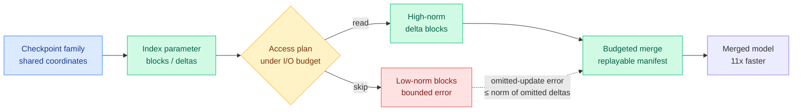

# MergePipe: Budgeting Expert Reads for Weight-Space Model Merging

**Date:** 2026-06-04
**Source:** HuggingFace Daily Papers
**arXiv:** [2605.29489](https://arxiv.org/abs/2605.29489)

## TL;DR

Weight-space model merging combines several fine-tuned checkpoints into one by doing arithmetic on their parameters (average, task-vector add, and so on). The literature treats it as an algebraic operation, but at LLM scale the real cost is not the math, it is the I/O: you have to read every expert weight block off disk or out of memory before you can merge it. MergePipe reframes merging as an **expert access-set problem**: given a merge operator and a family of checkpoints in a shared weight coordinate system, decide *which expert delta blocks to read* under an explicit I/O budget. It indexes parameter blocks, builds deterministic access plans, and runs the budgeted merge with replayable manifests. The plan is budget-sound by construction (full budget recovers the exact full-read merge), and for fixed-coefficient additive operators the error from omitted blocks is provably bounded by the norm of the omitted deltas. On Qwen and Llama merging workloads it cuts expert-read I/O by up to an order of magnitude and delivers up to 11x speedups, with O(10^-3) parameter deviation and no monotonic benchmark degradation.

## Key findings

1. **Merging is I/O-bound, not compute-bound.** The binding resource at LLM scale is the set of expert weights that must be read. MergePipe is a budget-aware execution layer that treats this read set as the thing to optimize.
2. **Budget-sound with a provable error bound.** At full budget it reproduces the exact full-read merge; for fixed-coefficient additive operators, the error from skipped blocks is bounded by the norm of the omitted deltas, so the budget knob has a guarantee, not just an empirical curve.
3. **Order-of-magnitude I/O reduction, 11x speedup.** On Qwen and Llama workloads, budget sweeps show O(10^-3) parameter deviation from full-read merges and no monotonic downstream degradation, so most of the read cost was buying almost nothing.

## Relation to prior wiki state

MergePipe sits at the intersection of two threads. The first is **model merging**, which yesterday's [MERIT](../llms-foundation-models/2026-06-03-merit-decentralized-instruction-tuning-merging.md) (06-03, partition a data mixture along conflict axes, fine-tune apart, merge once) treated as the cheap alternative to joint training. MERIT asked *how to split so the merge is good*; MergePipe asks *how to execute the merge cheaply once you have the parts*. They compose: MERIT produces the checkpoint family, MergePipe merges it under an I/O budget.

The second is the wiki's recurring **"memory bandwidth is the wall, not FLOPs"** framing, which the [KV cache page](kv-cache.md) traces from SemiAnalysis's prompt-cache economics through [dMoE](2026-06-01-dmoe-block-level-moe-diffusion-llm.md) (06-01, block-coherent expert routing because loading the union of activated experts is memory-bound). MergePipe is the offline-merging instance of the same physics: the expensive part of touching a large MoE is reading its experts, so budget the reads. The "skip low-norm deltas" rule is also the same **sparse-and-locatable** instinct the [06-03 digest](../daily-digest/2026-06/2026-06-03.md) tracked across VaSE (large-magnitude value states) and Local Perturbation Theory (low-dim conflict subspace): a few high-norm blocks carry the merge, the rest can be skipped.

## Research angle

1. **Norm-budgeting is a learned-eviction problem in disguise.** Choosing which delta blocks to read by norm is structurally the same decision as KV eviction by value-magnitude (VaSE). A learned access planner that predicts block importance, rather than ranking by static norm, is the natural next step.
2. **Error bound only proven for additive operators.** TIES, DARE, and spherical-interpolation merges are non-additive; whether the budget-soundness guarantee extends to them is the open theoretical question.
3. **Merge-time budgeting meets serve-time routing.** If both merging and inference are gated by expert reads, a single block index could serve both an I/O-budgeted merge and an I/O-budgeted MoE forward pass.

## Links

- [Paper (arXiv)](https://arxiv.org/abs/2605.29489)
- [HuggingFace page](https://huggingface.co/papers/2605.29489)
- Raw: [raw/huggingface/2026-06-04-access-sets-matter-budgeting-expert-reads-for-scalable-weigh.md](../../raw/huggingface/2026-06-04-access-sets-matter-budgeting-expert-reads-for-scalable-weigh.md)
- Concept page: [KV Cache](kv-cache.md)
- Related: [MERIT 06-03](../llms-foundation-models/2026-06-03-merit-decentralized-instruction-tuning-merging.md) · [dMoE 06-01](2026-06-01-dmoe-block-level-moe-diffusion-llm.md)
