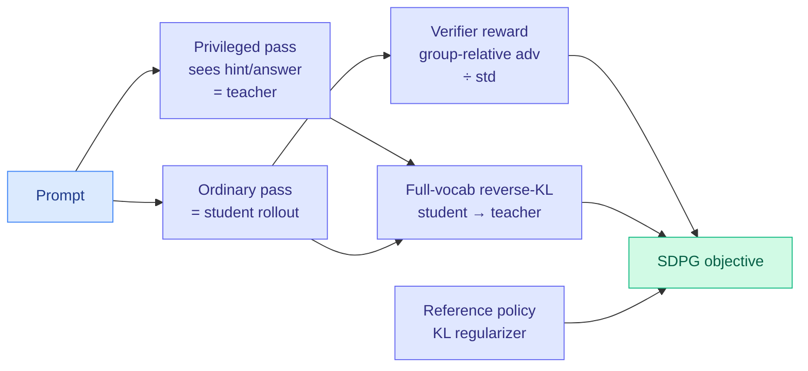

# SDPG: Self-Distilled Policy Gradient

**Date:** 2026-06-04
**Source:** HuggingFace Daily Papers
**arXiv:** [2606.04036](https://arxiv.org/abs/2606.04036)
**Code:** [github.com/lauyikfung/SDPG](https://github.com/lauyikfung/SDPG)

## TL;DR

Reinforcement learning with verifiable rewards (RLVR) trains reasoning models on a sparse signal: one scalar reward per rollout, which makes credit assignment hard and learning noisy. SDPG densifies that signal with on-policy self-distillation. The model conditions on privileged context (for example, a hint or the answer) to supervise its own ordinary generations, and that supervision is written as an auxiliary full-vocabulary reverse-KL loss from student to teacher (the same model, two conditionings). SDPG combines three terms: group-relative verifier advantages normalized by standard deviation, exact full-vocabulary on-policy self-distillation, and reference-policy KL regularization. The result is more stable and more performant than both RLVR and self-distillation baselines.

## Key findings

1. **Privileged self-distillation as dense supervision.** A single model run twice (once seeing privileged context, once not) yields a teacher-student pair without any external model. The reverse-KL between them is a per-token dense signal layered on top of the sparse verifier reward.
2. **Exact full-vocabulary KL, not a cheap estimator.** Where memory-constrained OPD methods fall back on the K1 reverse-KL estimator (the source of the gradient outliers TrOPD fought), SDPG uses the exact full-vocabulary divergence, trading memory for stability.
3. **Three-term objective.** Group-relative verifier advantage (normalized by standard deviation), exact self-distillation KL, and reference-policy KL together beat RLVR-only and self-distillation-only baselines on stability and performance.

## Relation to prior wiki state

SDPG is the RL-side answer to a question the [knowledge distillation page](knowledge-distillation.md) and yesterday's digest left open: are on-policy distillation and RLVR governed by the same instability, and can one objective serve both? Yesterday's [Looking Ahead](../daily-digest/2026-06/2026-06-03.md) predicted "a single trust-region stabilizer serves both on-policy distillation and RLVR within 60 days," after [TrOPD](2026-06-03-tropd-trust-region-on-policy-distillation.md) (06-03, trust region for OPD) and Microsoft's MAI-Thinking-1 (06-03, asymmetric trust region for a long GRPO run) converged on the same primitive. SDPG does not use a trust region, but it does the deeper unification: it puts the OPD reverse-KL loss *inside* the policy-gradient objective alongside the verifier advantage, so distillation and RLVR are one loss, not two stabilizers. This is the same "RL is weighted SFT" instinct as [DRIFT](../llms-foundation-models/2026-06-01-drift-decoupled-rollouts-weighted-sft.md) (06-01), now generalized to self-distillation.

It pairs with same-day [FiRe-OPD](2026-06-04-fire-opd-filter-then-reweight-distillation.md) (06-04): FiRe refines *which* supervision to keep (filter trajectories, reweight tokens), SDPG changes *what* the supervision is (privileged-context self-distillation as a dense reward). Two OPD papers in one day, both pushing past the sparse-reward / hard-selection baselines.

## Research angle

1. **Privileged context is the new teacher.** SDPG replaces an external teacher with the same model under privileged conditioning, the same trick as [D-OPSD](2026-05-07-d-opsd-self-distillation-step-distilled-diffusion.md) (05-07, teacher sees image, student sees only text). Whether privileged-conditioning self-distillation generally substitutes for a larger teacher is a clean, falsifiable scaling question.
2. **Exact vs estimated KL is the memory tradeoff.** SDPG pays full-vocabulary memory to avoid the K1 outliers; TrOPD keeps the cheap estimator and bounds it with a trust region. A head-to-head on the same reasoning task would settle which is cheaper at frontier scale.
3. **Does the verifier advantage need the self-distillation term once both are dense?** If the privileged self-distillation already densifies the signal, the marginal value of the group-relative verifier advantage is the ablation that matters most.

## Links

- [Paper (arXiv)](https://arxiv.org/abs/2606.04036)
- [HuggingFace page](https://huggingface.co/papers/2606.04036)
- Raw: [raw/huggingface/2026-06-04-self-distilled-policy-gradient.md](../../raw/huggingface/2026-06-04-self-distilled-policy-gradient.md)
- Concept page: [Knowledge Distillation](knowledge-distillation.md) · [RL for LLMs](../llms-foundation-models/rl-for-llms.md)
- Related: [FiRe-OPD 06-04](2026-06-04-fire-opd-filter-then-reweight-distillation.md) · [TrOPD 06-03](2026-06-03-tropd-trust-region-on-policy-distillation.md) · [DRIFT 06-01](../llms-foundation-models/2026-06-01-drift-decoupled-rollouts-weighted-sft.md) · [D-OPSD 05-07](2026-05-07-d-opsd-self-distillation-step-distilled-diffusion.md)
