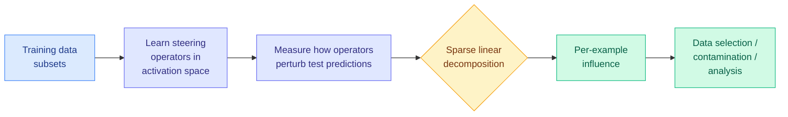

# STRIDE: Training Data Attribution via Sparse Recovery from Subset Perturbations

**Source:** HuggingFace Daily Papers
**arxiv:** [2606.05165](https://arxiv.org/abs/2606.05165)
**Date:** 2026-06-04
**Raw:** [raw/huggingface/2026-06-04-stride-training-data-attribution-via-sparse-recovery-from-su.md](../../raw/huggingface/2026-06-04-stride-training-data-attribution-via-sparse-recovery-from-su.md)
**Tier:** 2 (interpretability / data attribution; intersects efficiency)

## TL;DR

Training Data Attribution (TDA) traces a model's predictions back to the training examples that caused them. The gold standard is causal (retrain with data added/removed and observe the change), which is infeasible for LLMs, so most methods approximate the effect in parameter space using gradients across billions of parameters — expensive and reliant on local approximations. STRIDE shifts the problem into *activation space*: it learns lightweight "steering operators" that mimic the behavioral shift caused by training on a data subset, then recovers individual example influences via sparse linear decomposition (in the spirit of compressive sensing). It is state-of-the-art for LLM pre-training attribution and 13x faster than prior art.

## Diagram

## Key findings

1. **Attribute in activation space, not parameter space.** Instead of tracking gradients over billions of parameters, STRIDE models the *functional* effect of training data on activations, sidestepping the cost and the local-approximation fragility of gradient TDA.
2. **Steering operators + sparse recovery.** Lightweight operators mimic the behavioral shift from training on a subset; measuring their perturbation of test predictions lets STRIDE recover individual influences by sparse linear decomposition.
3. **SOTA for LLM pre-training attribution, 13x faster** than previous methods.
4. Validated on downstream uses: data selection, data-contamination detection, qualitative analysis.

## Relation to prior wiki state

STRIDE fits two threads. First, the **steering-vector / activation-space line** the wiki tracks in interpretability — it reuses the same "learn an operator that reproduces a behavioral shift in activation space" idea that powers steering and probing work, but points it at data attribution. Second, the **"sparse and locatable"** thread: STRIDE assumes a small number of training examples carry the influence for a given prediction and recovers them by sparse decomposition, the data-attribution instance of the same sparsity prior behind VaSE (KV value states), MergePipe (expert deltas), and MERIT (conflict subspace).

It is also directly useful as the measurement tool behind data-curation papers like the Kurate-rated "A Bitter Lesson for Data Filtering" (Mohri/Duchi/Hashimoto): if you can cheaply attribute which data helped, you can filter empirically rather than heuristically.

## Why it matters

Cheap, accurate data attribution unlocks practical data selection and contamination auditing at pre-training scale. A 13x speedup over gradient methods, plus escaping the local-approximation problem, makes TDA usable as a routine pipeline step rather than a research curiosity.

## Gaps

The steering-operator approximation introduces its own modeling error; how faithfully activation-space perturbation tracks true causal leave-one-out influence at frontier scale is the validation question. Sparse recovery assumes influence really is sparse, which may fail for diffuse/stylistic effects.

## Links

- [Paper](https://arxiv.org/abs/2606.05165)
- Concept: [knowledge distillation](knowledge-distillation.md)
