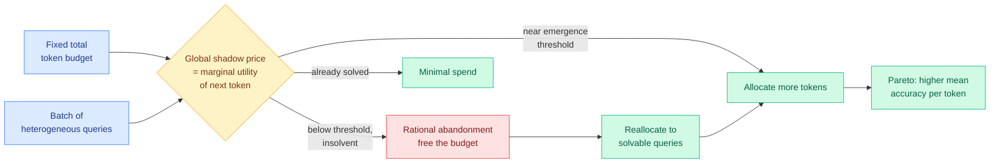

# The Shadow Price of Reasoning: CLEAR and Economic Budget Allocation for LLMs

**TL;DR.** Inference-time scaling (letting a model "think longer" with more tokens) raises accuracy but costs compute. Most deployments allocate uniformly: a fixed max-token cap on every query. This paper argues that is economically irrational because the compute-utility curve is S-shaped and heterogeneous across queries. It formulates batch-level token-budget allocation as a global constrained optimization governed by a **shadow price** (the marginal utility of one more token, equalized across queries under scarcity) and proposes **CLEAR** (Constrained Latent-utility Equilibrium Allocation for Reasoning), which performs *rational abandonment*: it stops spending on hopeless queries and reallocates that budget to solvable queries sitting just below their accuracy emergence threshold. Up to 3x global accuracy over uniform allocation in resource-scarce regimes.

**Source:** HuggingFace Daily Papers (upvotes: 4) · alphaxiv overview available
**arxiv:** [2606.03092](https://arxiv.org/abs/2606.03092)
**Raw:** [raw/huggingface/2026-06-05-the-shadow-price-of-reasoning-economic-perspective-on-optima.md](../../raw/huggingface/2026-06-05-the-shadow-price-of-reasoning-economic-perspective-on-optima.md)

## Key points

- **The S-curve.** Per-query utility vs tokens has three phases: a flat strict regime (too few tokens to solve anything), a steep surge near an emergence threshold (where extra tokens pay off most), and saturation. Uniform allocation ignores all three.
- **Shadow price.** Borrowed from constrained optimization economics: at the optimum, the marginal accuracy gain per token is equalized across all funded queries. Queries whose marginal value never clears the shadow price are abandoned.
- **Rational abandonment.** The mechanism that distinguishes CLEAR from cascade routing: it explicitly gives up on insolvent queries and moves their budget to queries near their surge threshold.
- **Result.** Up to 3x global accuracy vs uniform allocation under scarcity; improves the Pareto frontier of total token cost vs mean accuracy across several reasoning tasks and traffic streams.

## How this relates to prior wiki knowledge

This is a routing/efficiency paper in economic clothing, and it lands squarely in the [LLM routing](../ai-routing/llm-routing.md) thread. Where the productized routing work this week is about *compute location* (Perplexity's local/cloud orchestrator on 06-04, NVIDIA OpenShell on 06-03), CLEAR routes a different scarce resource: the reasoning-token budget across a batch. It also complements the over-thinking line: [ThoughtFold](../llms-foundation-models/2026-06-04-thoughtfold-folding-reasoning-chains.md) (06-04) cut redundant reasoning *within* one query by ~56%; CLEAR cuts wasted reasoning *across* queries by abandoning the unsolvable ones. ThoughtFold makes each chain shorter; CLEAR decides which chains deserve length at all. The two compose: fold each funded query, then allocate budget by shadow price.

The "rational abandonment" idea is the inference-time twin of [FiRe-OPD's](2026-06-04-fire-opd-filter-then-reweight-distillation.md) (06-04) trajectory filter, which dropped low-quality rollouts before training. Both say: do not spend equally on inputs of unequal value. CLEAR formalizes it as an equilibrium with a price.

## Gaps

- Abandonment requires predicting which queries are insolvent before spending; the abstract does not say how reliably the emergence threshold is estimated online, and a mis-estimate abandons a solvable query.
- Tested on reasoning benchmarks with known answers; in open-ended generation there is no clean accuracy signal to define the utility curve, so the shadow price is harder to compute.

## Research angle

The shadow price is a clean knob for a serving system: one global scalar that, raised or lowered, slides the whole batch along the cost-accuracy Pareto front. The open question is whether it can be learned jointly with a model-selection router so the system decides *both* which model and how many tokens per query under one budget. That would unify the compute-location routing thread (which model/where) with the compute-amount thread (how long to think) into a single constrained allocator. Watch for a router that emits a (model, token-budget) pair priced by a shared shadow price.

## Related pages
- [../ai-routing/llm-routing.md](../ai-routing/llm-routing.md)
- [../llms-foundation-models/2026-06-04-thoughtfold-folding-reasoning-chains.md](../llms-foundation-models/2026-06-04-thoughtfold-folding-reasoning-chains.md)
