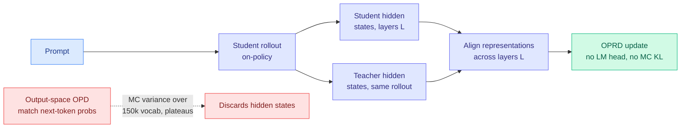

# OPRD: On-Policy Representation Distillation

**TL;DR.** On-policy distillation (OPD) trains a small student on its own rollouts by matching the teacher's next-token probabilities. OPRD argues that supervising only in output space wastes the teacher: it throws away every intermediate hidden state once the LM head has fired, and it pays a permanent Monte-Carlo variance tax from estimating a KL over a ~150k-token vocabulary. OPRD lifts distillation into hidden-state space, aligning student and teacher representations across selected layers on the same rollouts and bypassing the LM head entirely. It eliminates the sampling variance, closes the student-teacher gap on AIME 2024/2025 and AIMO where output-space OPD plateaus below the teacher, and trains 1.44x faster using 54% less memory than top-k OPD.

**Source:** HuggingFace Daily Papers (upvotes: 2)
**arxiv:** [2606.06021](https://arxiv.org/abs/2606.06021) · **Code:** https://github.com/ShenzhiYang2000/OPRD
**Raw:** [raw/huggingface/2026-06-05-oprd-on-policy-representation-distillation.md](../../raw/huggingface/2026-06-05-oprd-on-policy-representation-distillation.md)

## Key points

- **The output-only limit.** Output-space OPD matches probabilities after the LM head. Two costs: (1) sampling variance from Monte-Carlo reverse-KL estimates over huge vocabularies never goes away during training; (2) the teacher is treated as a black box, so all per-layer structural information is discarded after the head.
- **The move.** Align student and teacher hidden states across selected layers on the same student rollouts, bypassing the LM head. Theoretically this removes the MC sampling variance entirely and supplies richer per-layer structure than a single output distribution.
- **Results.** Closes the student-teacher gap on AIME 2024/2025 and AIMO, where output-space OPD baselines plateau *below* the teacher. Also 1.44x faster training and 54% less memory than top-k OPD (no full-vocabulary head to estimate).

## How this relates to prior wiki knowledge

This is the next axis in the spring's [on-policy distillation program](knowledge-distillation.md). That program spent April and May arguing about *which tokens* to supervise in output space: [TIP](2026-04-16-tip-token-importance-on-policy-distillation.md) (04-16, under 10% of tokens carry signal), [TA-OPD](2026-06-01-ta-opd-token-teachability.md) (06-01, only reachable teacher corrections), [TrOPD](2026-06-03-tropd-trust-region-on-policy-distillation.md) (06-03, only where the teacher is reliable), and [FiRe-OPD](2026-06-04-fire-opd-filter-then-reweight-distillation.md) (06-04, soft-reweight retained tokens after a trajectory filter). Every one of these operates in output space and fights the same enemy: noisy reverse-KL gradients over a large vocabulary. **OPRD changes the venue rather than the selection rule.** By distilling representations instead of probabilities, it dissolves the variance problem the whole selection line was managing, rather than selecting around it.

There is a real tension to track against today's other keystone, [Rethinking Continual Experience Internalization](../agentic-systems/2026-06-05-continual-experience-internalization.md), which finds that *off-policy* context-distillation on high-quality teacher trajectories is more stable than on-policy context-distillation (on-policy is limited by local corrections on student-induced flawed states). OPRD is firmly on-policy but sidesteps that critique by supervising representations on student rollouts rather than correcting student-generated text. Whether representation-space alignment inherits the on-policy instability the experience-internalization paper documents, or escapes it because hidden-state targets are denser than token corrections, is the open question that links the two papers.

The "bypass the noisy head, supervise the richer internal signal" instinct also rhymes with [STRIDE](2026-06-04-stride-training-data-attribution.md) (06-04), which moved training-data attribution out of parameter-space gradients into activation space for a 13x speedup. Both say the activation/representation layer carries cleaner signal than the surface it was being read off.

## Gaps

- Which layers to align, and how the selection generalizes across student/teacher depth ratios, is not characterized in the abstract.
- All results are reasoning-math (AIME/AIMO); whether representation alignment transfers to code, tool use, or cross-tokenizer pairs (where output-space methods like [BLD](2026-04-17-cross-tokenizer-distillation-byte-level.md) had to engineer a neutral channel) is untested. Hidden-state alignment presumes compatible representation geometry, which a tokenizer mismatch breaks.

## Research angle

The natural unification is OPRD's representation target *plus* the selection-axis machinery: align hidden states only on teachable/reliable positions, inside a trust region. The deeper question is whether representation distillation makes the token-selection debate moot. If matching hidden states removes the variance that motivated selecting tokens in the first place, the entire TIP→TA-OPD→TrOPD→FiRe line was solving a problem created by distilling at the wrong layer. Watch for a paper that reports OPRD beating FiRe-OPD and TrOPD on the unified OPD benchmark with no token selection at all.

## Related pages
- [knowledge-distillation.md](knowledge-distillation.md)
- [../agentic-systems/2026-06-05-continual-experience-internalization.md](../agentic-systems/2026-06-05-continual-experience-internalization.md)
- [../llms-foundation-models/rl-for-llms.md](../llms-foundation-models/rl-for-llms.md)
