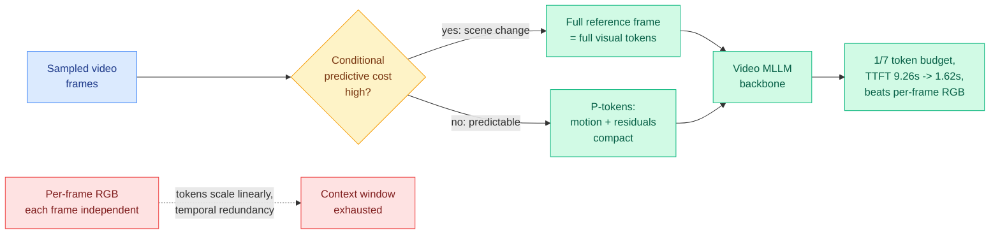

# AdaCodec: A Predictive Visual Code for Video MLLMs

**TL;DR.** AdaCodec borrows the oldest trick in video compression (don't re-send a frame that the previous frame already predicts; send only the changes) and applies it to the *interface* between a video and a multimodal LLM. Instead of encoding every sampled frame as an independent block of RGB visual tokens, AdaCodec spends a full token budget on a reference frame only when the scene cannot be predicted from prior context, and otherwise emits compact "P-tokens" describing inter-frame motion and prediction residuals. The result: at 1/7 the token budget (32k tokens) it beats the Qwen3-VL-8B per-frame baseline running at 224k tokens on every long-video benchmark, and cuts time-to-first-token from 9.26s to 1.62s.

**Source:** HuggingFace Daily Papers · arxiv [2606.02569](https://arxiv.org/abs/2606.02569)

## What it is

Video multimodal LLMs (video MLLMs, language models that take video plus text as input) almost universally sample frames, encode each frame as an independent RGB image, and feed the resulting visual tokens to the language backbone. Because adjacent frames share most of their content, this repeats information the model has already seen, and the visual-token count grows linearly with the number of frames. That forces a "coverage–detail dilemma": sample sparsely and miss events, or sample densely and blow the context window while pushing latency up.

AdaCodec redesigns the video-to-MLLM interface around **predictive coding** (the same principle behind P-frames in H.264/HEVC and in biological vision: transmit the prediction error, not the raw signal). It scores each frame's *conditional predictive cost* given prior context. Cheap-to-predict frames are sent as compact P-tokens (motion + residuals); only genuine scene changes earn a full reference-frame token allocation.

## Key results

- Across all eleven benchmarks, AdaCodec beats the Qwen3-VL-8B per-frame RGB baseline at a **matched** visual-token budget.
- At **1/7 the budget** (32k tokens), AdaCodec surpasses the 224k-token baseline on every long-video benchmark.
- Time-to-first-token drops from **9.26s to 1.62s** (~5.7x), the latency that actually matters for interactive video Q&A.
- On five general-video benchmarks it raises the average score, so the compression is not buying length at the cost of per-frame fidelity.

## How it relates to prior wiki knowledge

This is a **compression-at-the-interface** paper, and it rhymes with two recurring wiki threads. First, it is the video-token analogue of the KV-cache eviction line in [kv-cache.md](kv-cache.md): both ask "which past computation is redundant given everything already in context, and can we avoid paying for it?" AdaCodec answers on the *input* side (don't encode redundant frames) where KV eviction answers on the *cache* side (don't store redundant keys/values). Second, it extends the wiki's "uniform supervision/processing is wasteful, spend where the signal is" frame that runs through the whole distillation token-selection sequence ([knowledge-distillation.md](knowledge-distillation.md): TIP → TA-OPD → TrOPD → FiRe) and through [CLEAR](2026-06-05-clear-shadow-price-reasoning-budget.md) (06-05, ration inference tokens across queries by marginal utility). AdaCodec is the same instinct applied to *frames*: spend full tokens only where conditional predictive cost is high.

It contrasts with the [Stream-R1](2026-05-07-stream-r1-reliability-perplexity-distillation.md) line (05-07, reweighting a video-diffusion distillation loss by per-frame reliability): both recognize heterogeneous information density across frames, but Stream-R1 reweights a *training* loss while AdaCodec changes the *inference-time representation*.

## Gaps

The conditional-predictive-cost gate must itself run per frame; the paper does not break out the overhead of that decision against the tokens it saves. P-tokens encode motion + residuals, which works when changes are local and smooth; hard cuts, rapid camera motion, or scenes that are "mostly new every frame" should degrade gracefully to the per-frame baseline, but the worst-case behavior is not characterized. All results are on the Qwen3-VL-8B backbone; whether the predictive interface transfers to other video MLLM families is untested.

## Industrial implication

For any product doing long-video understanding (security footage, meeting recordings, sports, surveillance), a 5.7x TTFT cut at a fraction of the token budget is the difference between an interactive experience and a batch job. The predictive-code interface is also model-agnostic in principle, so it could become a preprocessing layer that any video MLLM adopts without retraining the backbone.

## Related pages

- [kv-cache.md](kv-cache.md)
- [knowledge-distillation.md](knowledge-distillation.md)
- [2026-06-05-clear-shadow-price-reasoning-budget.md](2026-06-05-clear-shadow-price-reasoning-budget.md)
- [../vision-audio-video](../vision-audio-video)

Raw source: `raw/huggingface/2026-06-06-adacodec-a-predictive-visual-code-for-video-mllms.md`
