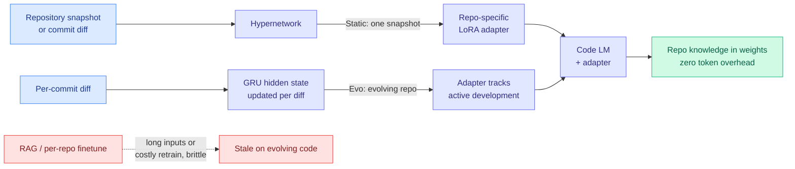

# Code2LoRA: Hypernetwork-Generated Adapters for Code Language Models under Software Evolution

**TL;DR.** Code models need repository context (imports, APIs, project conventions) to be useful, and today that context is paid for either as long retrieved inputs (RAG) or as per-repo fine-tuning. Both are costly at scale and brittle when the codebase changes. Code2LoRA trains a hypernetwork (a network that outputs the weights of another network) to generate a repository-specific LoRA adapter, injecting the repo's knowledge directly into the model's weights with **zero inference-time token overhead**. A static variant turns a snapshot into an adapter; an evolution variant keeps a GRU hidden state that updates the adapter per code diff, so the adapter tracks an actively developed codebase instead of going stale.

**Source:** HuggingFace Daily Papers · arxiv [2606.06492](https://arxiv.org/abs/2606.06492)

## What it is

A code language model resolving an import or completing a call needs to know what the rest of the repository looks like. The standard answers are to stuff retrieved snippets into the prompt (RAG, which costs context tokens on every query) or to fine-tune / train a LoRA per repository (which costs a training run per repo and goes stale the moment the code changes). Code2LoRA replaces both with a hypernetwork that reads the repository and **predicts** a LoRA adapter in a forward pass. The adapter, not the prompt, carries the repo knowledge, so there is no per-query token cost.

Two usage modes:

- **Code2LoRA-Static** converts a single repository snapshot into one adapter, for comprehension of stable codebases.
- **Code2LoRA-Evo** maintains an adapter backed by a GRU hidden state that is updated per code diff, so the adapter evolves with an actively developed repo rather than being regenerated from scratch.

## Key results

- New benchmark **RepoPeftBench**: 604 Python repositories, a static track (40K train / 12K test assertion-completion tasks) and an evolution track (215K / 87K commit-derived tasks).
- Static track: **63.8% cross-repo and 66.2% in-repo exact match**, matching the per-repository LoRA upper bound (i.e., the predicted adapter is about as good as one trained on the repo directly).
- Evolution track: **60.3% cross-repo exact match, +5.2 points** over a single shared LoRA, showing the per-diff GRU update genuinely tracks the moving codebase.
- Knowledge injection happens once into the weights, so queries carry **zero extra context tokens**.

## How it relates to prior wiki knowledge

This is the second hypernetwork-generated-LoRA paper in today's batch alongside [Video2LoRA](2026-06-06-video2lora-parametric-video-internalization.md) (predicts a LoRA from a video so a VLM answers with zero visual tokens at query time), and both descend from the "Doc-to-LoRA" idea of mapping a text document into an adapter. The shared move is **parametric context internalization**: stop paying for context as tokens in the prompt and instead bake it into weights, predicted in one pass rather than trained. See the new concept page [parametric-context-internalization.md](parametric-context-internalization.md).

It also extends the wiki's parametric-memory thread. [How LoRA Remembers](2026-05-29-how-lora-remembers-parametric-memory-law.md) (05-29) characterized how much a low-rank adapter can store; Code2LoRA is the deployment-side answer to "then generate that store cheaply and keep it fresh." And it sits against the [MInT million-scale LoRA serving](2026-05-14-mint-million-scale-lora-serving.md) (05-14) line: MInT serves many adapters, Code2LoRA is about producing the right adapter per repo without a training run for each.

## Gaps

The hypernetwork is trained on Python; cross-language transfer (TypeScript, Rust, large monorepos with mixed languages) is untested. Exact-match assertion completion is a narrow task; whether the adapter helps multi-file refactors or agentic edits, where the relevant context is non-local, is open. The GRU-per-diff update is shown to beat a shared LoRA, but drift over thousands of commits (does the adapter accumulate error and need periodic full regeneration?) is not characterized.

## Industrial implication

For IDE assistants and coding agents operating over private repos, this is a route to repo-aware completion without either the per-query token tax of RAG or the per-repo training cost of fine-tuning. An adapter that updates per commit is exactly the shape a CI-integrated code assistant wants: regenerate on push, serve with no prompt overhead. If the Python-only result generalizes, "ship a hypernetwork, generate adapters on demand" could displace retrieval for the stable-knowledge half of code context.

## Related pages

- [parametric-context-internalization.md](parametric-context-internalization.md)
- [2026-06-06-video2lora-parametric-video-internalization.md](2026-06-06-video2lora-parametric-video-internalization.md)
- [2026-05-29-how-lora-remembers-parametric-memory-law.md](2026-05-29-how-lora-remembers-parametric-memory-law.md)
- [2026-05-14-mint-million-scale-lora-serving.md](2026-05-14-mint-million-scale-lora-serving.md)

Raw source: `raw/huggingface/2026-06-06-code2lora-hypernetwork-generated-adapters-for-code-language.md`
