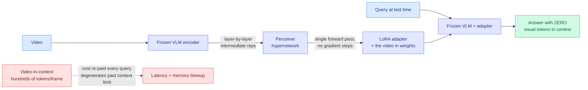

# Video2LoRA: Parametric Video Internalization for Vision-Language Models

**TL;DR.** Video in a vision-language model is brutally expensive: each frame is hundreds of tokens, and that cost is re-paid on every query about the video. Video2LoRA reads the layer-by-layer activations a frozen VLM produces while encoding a video, and a perceiver hypernetwork predicts a LoRA adapter in a single forward pass. The video then lives in the adapter, not the context: the same frozen VLM answers queries with **zero visual tokens in its prompt**. It is statistically non-inferior to direct video-in-context inference across all five captioning benchmarks and seven of eight QA pairings, while cutting answer-time visual-token load by up to **1,500x** and time-to-first-token by **6 to 80x**.

**Source:** HuggingFace Daily Papers · arxiv [2606.04351](https://arxiv.org/abs/2606.04351) (University of Maryland)

## What it is

Standard LoRA fine-tuning learns an adapter through iterative gradient updates. Video2LoRA instead **predicts** the adapter directly from the video. As a frozen VLM (the paper uses SmolVLM2 at 500M and 2.2B) encodes the video, a perceiver hypernetwork consumes the intermediate representations it produces at each layer and emits a LoRA adapter in one pass. At query time the model runs with the adapter and no visual tokens at all: the video has been internalized into the weights.

It is the video extension of "Doc-to-LoRA" (which mapped a text document into an adapter so an LLM could answer about it with no text in context). Video raises the bar: an order of magnitude more tokens per example (forcing a single-pass, non-iterative scheme), genuinely cross-modal compression (visual semantics must become language-model weight perturbations), and input that varies along resolution and time axes that have no textual analog.

## Key results

- **Statistically non-inferior and equivalent** to direct video-in-context inference on all five captioning benchmarks at both model scales, and on seven of eight video-QA benchmark/scale pairings.
- Up to **1,500x** lower answer-time visual-token load and **6 to 80x** faster time-to-first-token.
- Trained only on 12 frames at 384px, it stays stable up to **1,024 frames and 1024px**, where direct video-in-context inference often degenerates (repetition, incoherence past the context window).
- Adapters generated independently for non-overlapping video segments **compose in rank space**, hinting at a path to chunked long-video internalization (encode segments separately, add their adapters).

## How it relates to prior wiki knowledge

This is the companion to today's [Code2LoRA](2026-06-06-code2lora-hypernetwork-repo-adapters.md) (predicts a repo-specific adapter from code, zero query tokens) and the third member of the Doc-to-LoRA / hypernetwork-adapter family. Both papers internalize context into predicted weights rather than carrying it as tokens, the move captured in the new concept page [parametric-context-internalization.md](parametric-context-internalization.md).

Against the wiki's video-efficiency line it is a genuinely different axis. [AdaCodec](2026-06-06-adacodec-predictive-visual-code-video-mllms.md) (today) and the video KV-cache work ([VideoMLA](2026-06-02-videomla-low-rank-latent-kv-cache.md), [StateKV](2026-06-01-statekv-linear-video-vlm.md)) keep the video *in context* but make the tokens cheaper or the cache smaller. Video2LoRA removes the video from context entirely. They are complementary: AdaCodec compresses what you feed, Video2LoRA decides you do not feed it at all and put it in weights instead. The rank-space composition result also rhymes with the merge-time expert budgeting in [MergePipe](2026-06-04-mergepipe-expert-read-budgeting-merging.md) (adapters/experts that add in parameter space).

## Gaps

"Statistically non-inferior" is the claim, not "better": the adapter matches but does not beat video-in-context, so the win is purely cost. Generation cost of the hypernetwork pass itself is amortized only if the same video is queried many times; for single-query video it may not pay off, and the abstract does not give the break-even query count. Rank-space composition is shown to work but its ceiling (how many segments before interference) is untested. Only SmolVLM2 backbones; transfer to larger frontier VLMs is open.

## Industrial implication

For any product that answers repeated questions about the same video (a lecture, a deposition, a long surveillance clip, a film), internalizing it once into an adapter and serving every later query with zero visual tokens is a large, durable cost cut. The stability to 1,024 frames where in-context inference degenerates is the more strategic result: it points at long-video understanding that does not hit the context wall at all. If hypernetwork adapter generation gets cheap enough, "internalize then query" could become the default interface for any media a model will be asked about more than once.

## Related pages

- [parametric-context-internalization.md](parametric-context-internalization.md)
- [2026-06-06-code2lora-hypernetwork-repo-adapters.md](2026-06-06-code2lora-hypernetwork-repo-adapters.md)
- [2026-06-06-adacodec-predictive-visual-code-video-mllms.md](2026-06-06-adacodec-predictive-visual-code-video-mllms.md)
- [2026-06-02-videomla-low-rank-latent-kv-cache.md](2026-06-02-videomla-low-rank-latent-kv-cache.md)

Raw source: `raw/huggingface/2026-06-06-video2lora-parametric-video-internalization-for-vision-langu.md`
