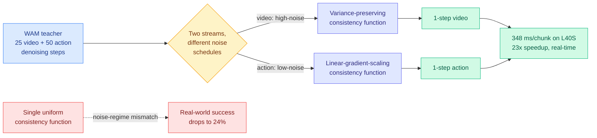

# Flash-WAM: Modality-Aware Step Distillation for World-Action Models

**Source:** HuggingFace Daily Papers · [arXiv 2606.05254](https://arxiv.org/abs/2606.05254)
**Raw:** [raw/huggingface/2026-06-07-flash-wam-modality-aware-distillation-for-world-action-model.md](../../raw/huggingface/2026-06-07-flash-wam-modality-aware-distillation-for-world-action-model.md)
**Authors:** Arman Akbari, Arash Akbari, Ci Zhang, Geng Yuan, Weiwei Chen, Yanzhi Wang et al. (Northeastern, U. Georgia, EmbodyX)

## TL;DR

World-action models (WAMs) jointly generate future video and robot actions through iterative diffusion, but need tens of denoising steps, so latency (8.1s per chunk on an L40S) rules out real-time control. Off-the-shelf step distillation breaks here because the video and action streams use *different noise schedules* and arrive at training with different marginal noise distributions. Flash-WAM is a modality-aware consistency-distillation framework that picks a different consistency parametrization per stream: a linear-gradient-scaling form for the action stream's low-noise regime, a variance-preserving form for the video stream's high-noise regime. Result on LingBot-VA: single-step inference per modality, per-chunk latency from 8.1s to 348ms (23x), task success preserved in sim (85.5% RoboTwin 2.0, 95.7% LIBERO) and substantially recovered in the real world (60% on a Unitree G1) where naive consistency distillation collapses to 24%.

## Key points

- **Why one consistency function fails.** Video is high-dimensional and redundant so it tolerates high noise; low-dimensional, precision-critical actions need a gentler schedule. The two streams therefore see different marginal noise distributions during distillation, and a single uniform consistency function degrades. Flash-WAM matches the consistency-function family to each stream's noise regime, grounded in a structural analysis of achievable gradient scaling under the consistency boundary condition.
- **23x speedup, accuracy held.** 8.1s → 348ms per chunk on an NVIDIA L40S, crossing the ~500ms threshold for closed-loop control. Sim success preserved; real-world G1 humanoid at 60% average vs naive consistency distillation's 24% at the same one-step budget.

## How this relates to prior wiki knowledge

- **Distillation as the recurring efficiency lever.** This is a fresh instance of the wiki's central distillation thread. Where [OPRD](2026-06-05-oprd-on-policy-representation-distillation.md) (06-05, match teacher hidden states instead of output tokens) and the spring's selective-token line (TIP) ask *what to match*, Flash-WAM asks *how to parametrize the distillation when one model has two streams with incompatible statistics*. The shared move with [D-OPSD](2026-05-07-d-opsd-self-distillation-step-distilled-diffusion.md) (self-distillation for step-distilled diffusion) and [SDVG](2026-04-22-sdvg-speculative-decoding-video.md) is collapsing iterative diffusion into far fewer steps; the novelty here is per-modality, not per-step.
- **Real-time embodied control as the deadline.** Step distillation has been a quality-vs-speed knob for image/video synthesis; Flash-WAM reframes it as the difference between a robot policy that can and cannot run closed-loop. The 24%-vs-60% gap is the clearest signal yet that naive single-modality distillation is the wrong default for joint generative policies.

## Research angle

The structural analysis of the consistency-function family is the reusable contribution: it predicts which parametrization a stream's noise regime admits. Open questions: does the two-function split generalize to WAMs with more than two streams (tactile, proprioception, language tokens), and does the one-step regime hold under domain shift, where the real-world recovery from 24% to 60% still leaves a 40% real-sim gap. Worth tracking against the broader "more compute is not monotonically better" finding — here, one step is enough *if* the consistency function respects the modality.

→ Concept page: [knowledge-distillation](knowledge-distillation.md) · [speculative-decoding](speculative-decoding.md)
