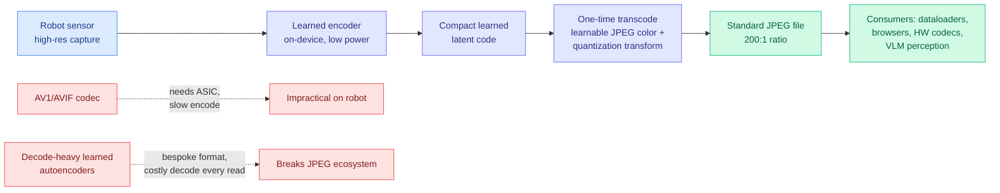

# SEAOTTER: Sensor-Embedded Autoencoding with One-Time Transcode

**Source:** HuggingFace Daily Papers · [arXiv 2606.03940](https://arxiv.org/abs/2606.03940) · [Code](https://github.com/UT-SysML/seaotter)
**Raw:** [raw/huggingface/2026-06-07-seaotter-sensor-embedded-autoencoding-with-one-time-transcod.md](../../raw/huggingface/2026-06-07-seaotter-sensor-embedded-autoencoding-with-one-time-transcod.md)
**Authors:** Dan Jacobellis, Neeraja J. Yadwadkar (UT Austin)

## TL;DR

SEAOTTER is a compression framework for cloud robotics that resolves the three-way mismatch between sensor, cloud, and consumer compute budgets. A lightweight learned encoder runs on the robot (cheap, low-power), a one-time transcode step in the cloud converts the learned latent into a **standard JPEG file**, and every downstream consumer (training pipelines, browsers, hardware codecs) reads it with zero learned-decoder cost. At 200:1 compression versus AVIF, it reports 7x faster encoding, 3.5x faster decoding, and +8% ImageNet top-1 accuracy, while staying compatible with the decades of infrastructure built around JPEG.

## Key points

- **The encode-once, decode-many problem.** Cloud robotics ingests visual data once but reads it repeatedly (training, inference, auditing). Learned codecs that win on rate-distortion typically pay for it with an expensive neural decoder paid on *every* read, plus a bespoke latent format incompatible with JPEG tooling. SEAOTTER pays the learned cost once on each side and serves a standard file forever after.
- **Learnable JPEG transform.** Naive transcoding of a learned latent into JPEG degrades downstream accuracy. The novelty is a *learnable* JPEG color and quantization transform that preserves features needed for global, dense, and vision-language perception, so the JPEG output is not just viewable but accurate for machine perception.
- **Numbers.** 200:1 compression ratio; vs AVIF: 7x faster encode, 3.5x faster decode, +8% ImageNet top-1. Trains both general-purpose and task-aware transcoding pipelines for a frozen pre-trained encoder.

## How this relates to prior wiki knowledge

- **Input-side compression, like AdaCodec.** This extends the input-side efficiency thread the wiki opened with [AdaCodec](2026-06-06-adacodec-predictive-visual-code-video-mllms.md) (06-06, which cut video-to-MLLM tokens 7x by sending a full frame only on a scene change). AdaCodec compresses frames before they enter the model; SEAOTTER compresses sensor images before they leave the robot. Both attack the data path *upstream* of the model rather than the model itself.
- **The asymmetry framing matches asymmetric autoencoders.** It is the deployment-pragmatic counterpoint to bespoke learned codecs: keep the learned-latent compactness but exit to a standard format so the rest of the stack is untouched. This is the same "respect the existing infrastructure" instinct behind [parametric context internalization](parametric-context-internalization.md)'s use of frozen base models.
- **Compute-scarcity context.** A 7x cheaper encode on power-limited hardware is exactly the kind of lever the wiki's 2026 compute-scarcity thread (CLEAR 06-05, the HBM-to-2031 shortage) keeps pointing at: do more perception per watt and per byte.

## Research angle

The load-bearing claim is that a learned latent can be projected into JPEG's DCT+quantization basis with a *learned* transform and lose almost nothing for machine perception. Open questions: how far the +8% holds across non-ImageNet perception (detection, segmentation, VLA control loops), whether the task-aware transcoder overfits to the downstream task it was trained against, and whether the one-time cloud transcode becomes the new bottleneck at fleet scale. The deeper template — exit a learned representation into a standard, hardware-accelerated format — could generalize to audio (learned latent → standard AAC) or video (learned latent → standard H.264).

→ Concept page: [knowledge-distillation](knowledge-distillation.md) · related: [AdaCodec](2026-06-06-adacodec-predictive-visual-code-video-mllms.md)
