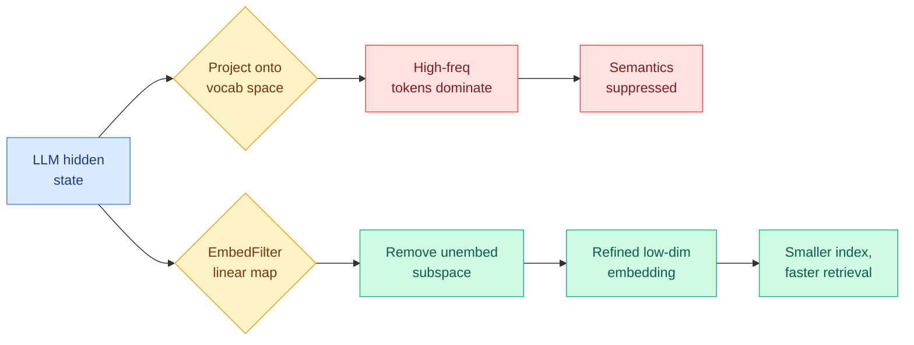

# Your UnEmbedding Matrix is Secretly a Feature Lens for Text Embeddings (EmbedFilter)

**Source:** HuggingFace Daily Papers
**arxiv:** [2606.07502](https://arxiv.org/abs/2606.07502)
**Date:** 2026-06-08
**Raw:** [raw source](../../raw/huggingface/2026-06-08-your-unembedding-matrix-is-secretly-a-feature-lens-for-text.md)
**Tier:** 2 (with a Tier 1 intersection: the dimensionality-reduction byproduct compresses retrieval indexes and speeds search)

## TL;DR

Large language models (LLMs) are great at zero-shot tasks but make weak off-the-shelf text embedding models, scoring below dedicated embedders on MTEB (the Massive Text Embedding Benchmark, the standard suite for retrieval and similarity tasks). EmbedFilter pins down why: when you project an LLM text embedding onto vocabulary space, it aligns mostly with frequent but uninformative tokens, and that over-expression of high-frequency tokens drowns out the fine-grained semantics that retrieval needs. The cause is the unembedding matrix, the output projection that turns hidden states into vocabulary logits. That matrix encodes a latent subspace that actively writes those frequent tokens into the embedding. EmbedFilter is a single linear transformation that subtracts out that subspace, suppressing the high-frequency-token pull and sharpening the semantic signal. As a free byproduct it lowers the embedding dimension, which shrinks the retrieval index and speeds search while keeping the refined embedding quality intact, and it improves zero-shot downstream accuracy across several LLM backbones.

## Key points

- Diagnosis: LLM text embeddings align with frequent but uninformative tokens when projected onto vocabulary space, and this excessive high-frequency-token expression suppresses nuanced semantics, which is why raw LLM embeddings underperform on MTEB.
- Mechanism identified: the unembedding matrix (output projection to vocab logits) encodes a latent subspace that actively writes those frequent tokens into embedding space. Filtering out that subspace removes the distortion.
- EmbedFilter is a single linear transformation applied directly to LLM-derived embeddings. No retraining of the backbone is required.
- Byproduct: inherent dimensionality reduction. Index storage drops and retrieval speeds up while refined embedding quality is fully preserved.
- Result: across multiple LLM backbones, EmbedFilter delivers superior zero-shot downstream performance even at significantly reduced embedding dimensions.

## Relation to prior wiki state

This pairs directly with [smart-embedding-multi-vector-from-single.md](2026-05-26-smart-embedding-multi-vector-from-single.md), which extracted multiple retrieval vectors from a single LLM forward pass. SMART added expressive capacity from one pass, EmbedFilter subtracts distortion from one pass. They attack the same problem (turning a generative LLM into a strong embedder cheaply) from opposite ends, and they are composable: filter first, then expand into multi-vector. It also touches retrieval-side compression themes seen in [w-rac-retrieval-aware-chunking.md](2026-04-20-w-rac-retrieval-aware-chunking.md) and [worldkv-world-memory-retrieval-compression.md](2026-05-22-worldkv-world-memory-retrieval-compression.md), though those compress the indexed content rather than the embedding geometry itself. The deeper theme is "the output projection is reusable structure": prior work mined the unembedding matrix for interpretability via the logit lens, and EmbedFilter reuses that same matrix as a filter rather than a readout.

## Why it matters

The interesting move here is mechanistic, not just empirical. The standard fix for weak LLM embedders is contrastive fine-tuning, which is expensive and per-backbone. EmbedFilter instead names the exact failure mode (a frequency-token subspace baked into the unembedding matrix) and removes it with a closed-form linear projection, so the cost is a one-time matrix computation rather than a training run. Because the filtered representation lives in a lower-dimensional subspace, the win compounds on the serving side: a smaller embedding means a smaller ANN index, less memory per vector, and faster nearest-neighbor search, all without quality loss. That is the part worth caring about for efficiency. Most dimensionality reduction (PCA, random projection) trades accuracy for size, whereas here the reduction comes from deleting a subspace that was actively hurting accuracy, so size and quality move the same direction. **Research angle:** is the frequency-token subspace a fixed property of a tokenizer plus its unembedding matrix, computable once and reused across all downstream tasks, or does the optimal filtered rank shift by domain? If it is fixed and transferable, EmbedFilter becomes a default preprocessing layer for any LLM-as-embedder retrieval stack.

## Gaps

The abstract reports superior zero-shot downstream performance but does not quantify the MTEB gains, the exact dimension reductions, or the retrieval-latency speedups, so the magnitude of the win is unverified here. It is also unclear whether the linear filter holds up on long documents and cross-lingual retrieval, where frequent-token statistics differ from the English short-text MTEB setting.

## Links

- Paper: [arxiv 2606.07502](https://arxiv.org/abs/2606.07502) · Code: [github.com/CentreChen/EmbFilter](https://github.com/CentreChen/EmbFilter)
- Raw: [raw source](../../raw/huggingface/2026-06-08-your-unembedding-matrix-is-secretly-a-feature-lens-for-text.md)
