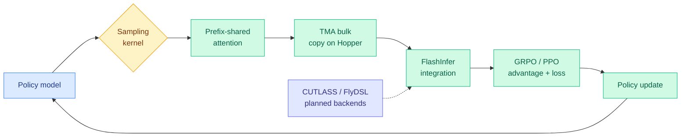

# RL-Kernel: A Low-Level Kernel Library for RLHF Training of LLMs

**Source:** Twitter curated retweet (@sheriyuo via @bayesiansapien)
**Repo:** [github.com/RL-Align/RL-Kernel](https://github.com/RL-Align/RL-Kernel)
**Date:** 2026-06-08
**Raw:** [raw source](../../raw/twitter/2026-06-08-afternoon.md)
**Tier:** 1 (GPU optimization)

## TL;DR

RL-Kernel is a newly open-sourced low-level kernel library built for RLHF (reinforcement learning from human feedback, the post-training stage where a model is tuned against a reward signal) training of LLMs. It targets the algorithms that dominate that stage, GRPO (Group Relative Policy Optimization, which compares a group of sampled responses to estimate advantage without a separate value network) and PPO (Proximal Policy Optimization, the clipped-objective policy-gradient method). The library is deeply integrated with FlashInfer, the attention and sampling kernel suite for LLM serving, and ships custom implementations of sampling, prefix-shared attention, and TMA (Tensor Memory Accelerator, Hopper's asynchronous bulk-copy engine that moves tiles between global and shared memory without occupying compute threads). The authors report that some high-frequency training components hit up to 163x speedups while also using less memory. Future plans add CUTLASS and FlyDSL backends, and the team is recruiting collaborators with GPU access.

## Key points

- Purpose-built for RLHF post-training, not inference serving. Primary algorithm targets are GRPO and PPO.
- Deeply integrated with FlashInfer; planned support for CUTLASS and FlyDSL backends.
- Ships custom kernels for sampling, prefix-shared attention, and TMA (Hopper's async bulk-copy engine), plus other performance-critical components.
- Reported result: up to 163x speedup on some high-frequency training components, alongside reduced memory usage.
- Repo self-describes as "modern RL post-training infrastructure" optimized for NVIDIA and AMD GPUs, with a focus on vLLM integration and Triton kernels. The team is recruiting collaborators with GPU access.

## Relation to prior wiki state

This sits at the intersection of two prior threads. On the kernel side, the concept page [gpu-kernels.md](gpu-kernels.md) and the benchmark pages [kernelbench-x-llm-gpu-kernel-benchmark.md](2026-05-09-kernelbench-x-llm-gpu-kernel-benchmark.md), [agentkernelarena-gpu-kernel-optimization-agents-benchmark.md](2026-05-19-agentkernelarena-gpu-kernel-optimization-agents-benchmark.md), and [accelopt-gpu-kernel-optimization.md](2026-04-20-accelopt-gpu-kernel-optimization.md) all treat GPU kernels as a hand-tuned or LLM-generated optimization surface, but they target inference and dense compute. RL-Kernel is the first entry that frames the kernel-optimization target as the RL post-training loop specifically. On the RL-infra side, [speculative-decoding-rl-rollouts.md](2026-04-30-speculative-decoding-rl-rollouts.md) showed that the rollout-generation phase of RL is itself a major bottleneck worth accelerating, and [small-rl-controller-adaptive-sampling.md](2026-06-03-small-rl-controller-adaptive-sampling.md) treated RL sampling as a tunable control problem. RL-Kernel takes the lower-level path: it optimizes the sampling and attention kernels that those rollouts run on. There is also a clear industry parallel surfacing the same day on Twitter, OpenPipe ART (Agent Reinforcement Trainer, GRPO extended to multi-step agent trajectories), which signals that GRPO-centric training stacks are consolidating into named, reusable infrastructure.

## Why it matters

The load-bearing observation is that RL post-training has a fundamentally different kernel profile than inference serving, and the field is only now building infrastructure that respects that. An RLHF step is rollout-heavy: you sample many responses from the current policy (often a group, for GRPO), score them, then do a policy-gradient update. The sampling phase shares a long common prefix across the group, which is exactly what prefix-shared attention exploits, and the bulk tensor movement between the sampling and update phases is what TMA was built to overlap with compute. A generic serving kernel does not optimize for this group-sampling structure, so reported component-level speedups of up to 163x are plausible precisely because the baseline was a serving kernel doing redundant prefix work and synchronous copies. The strategic point is that RL post-training infra is splitting off as a distinct optimization target with its own kernels, separate from the inference-serving kernels that FlashInfer and FlashAttention were originally tuned for, and whoever owns that layer shapes how cheaply frontier labs can run reward-model tuning. **Research angle:** how much of the 163x is the prefix-sharing structural win that generalizes versus a one-off TMA-overlap gain tied to Hopper, and does the advantage survive on AMD or on the planned CUTLASS and FlyDSL backends where TMA equivalents differ?

## Gaps

The 163x figure is an author-reported, component-level claim from a code release with no paper, no benchmark methodology, and no named baseline, so end-to-end training-throughput and convergence-parity gains are unverified. It is also unclear which hardware the speedups were measured on, given that TMA is Hopper-specific while the repo claims AMD support.

## Links

- Repo: [github.com/RL-Align/RL-Kernel](https://github.com/RL-Align/RL-Kernel) · Tweet: [@sheriyuo](https://x.com/sheriyuo/status/2063554266325819575)
- Raw: [raw source](../../raw/twitter/2026-06-08-afternoon.md)
