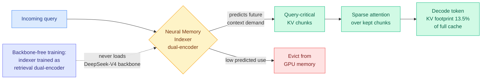

# FlashMemory-DeepSeek-V4: Lookahead Sparse Attention (LSA)

**Source:** HuggingFace Daily Papers, 2026-06-09. arxiv [2606.09079](https://arxiv.org/abs/2606.09079).
**Raw:** [farmed](../../raw/huggingface/2026-06-09-flashmemory-deepseek-v4-lightning-index-ultra-long-context-v.md)

## TL;DR

Standard decoding keeps the entire KV cache (the stored attention keys and values for every past token) resident in GPU memory, which is the dominant memory cost for ultra-long-context serving. FlashMemory (FM-DS-V4) adds **Lookahead Sparse Attention (LSA)**: a small Neural Memory Indexer that *predicts which future context the model will need* and keeps only those query-critical KV chunks in GPU memory, evicting the rest. The headline result is that the physical KV cache shrinks to **13.5% of the full-context baseline on average while accuracy holds or rises slightly (+0.6% absolute)**, and at 500K-token context the physical KV overhead drops over 90% without destabilizing the backbone. The other contribution is a training trick: the indexer is a standard dual-encoder trained with off-the-shelf retrieval frameworks, **without ever loading the massive DeepSeek-V4 backbone into GPU memory** ("backbone-free decoupled training").

## Key points

- **Lookahead, not lookback.** Most KV eviction is reactive: it scores tokens by past attention mass (H2O), recency, learned retention gates ([Make-Each-Token-Count](2026-05-12-make-each-token-count-kv-eviction.md), 05-12), or value magnitude ([VaSE](2026-06-03-vase-value-aware-stochastic-kv-eviction.md), 06-03). LSA is *predictive*: the indexer forecasts which chunks future queries will demand and pre-selects them. This is the first explicitly lookahead eviction policy the wiki tracks.
- **13.5% average physical KV footprint** across LongBench-v2, LongMemEval, RULER, with +0.6% absolute accuracy on average (acts as an attention denoiser, not just a compressor).
- **>90% KV overhead reduction at 500K context** with the backbone's reasoning intact.
- **Backbone-free decoupled training** is the systems contribution: framing the indexer as a dual-encoder lets it be trained with standard retrieval pipelines on commodity hardware, sidestepping the cost of co-training a sparse-attention indexer inside a frontier-scale model.

## Relation to prior wiki state

- **Extends [DeepSeek-V4 interleaved compressed attention](2026-05-25-deepseek-v4-interleaved-compressed-attention.md) (05-25).** DeepSeek-V4 already routes between three attention regimes per layer (HCA 128:1 global, CSA 4:1 indexed selective, recent window). FM-DS-V4 builds *on that same backbone* and adds a learned predictive indexer on top — DeepSeek-V4's CSA indexer was reactive over the current compressed space; LSA's indexer is trained separately and predicts forward.
- **Same "16-dim retrieval subspace" lineage as [RTPurbo](2026-05-24-rtpurbo-full-to-sparse-attention.md) (05-24)** (full-attention retrieval geometry lives in a tiny subspace) and **[MISA](2026-05-11-misa-mixture-of-indexer-sparse-attention.md) (05-11)** (treat the DSA indexer heads as an MoE pool). FlashMemory keeps the indexer cheap and decoupled, which is the natural next step from MISA's "indexer is the bottleneck" observation.
- **Hardware backdrop.** Confirms the Ken Huang memory-hierarchy thesis (06-07) that as context grows, KV cache, not weights, becomes the binding memory constraint. A 90% physical-KV cut at 500K is exactly the lever the HBM-scarce-into-2030 economics demand.

## Gaps

Indexer mispredictions are the failure surface: a predicted-irrelevant chunk that turns out to matter is gone (no recompute path described). Whether the dual-encoder indexer transfers to non-DeepSeek-V4 backbones, and how LSA composes with quantization of the kept chunks, is untested.

## Related pages

- [kv-cache.md](kv-cache.md)
- [DeepSeek-V4 interleaved compressed attention](2026-05-25-deepseek-v4-interleaved-compressed-attention.md)
- [End-to-End Context Compression (LCLM)](2026-06-09-lclm-end-to-end-context-compression.md)
