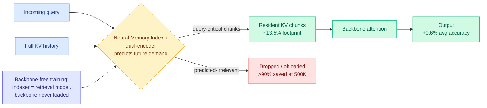

# FlashMemory-DeepSeek-V4: Lookahead Sparse Attention (LSA)

**TL;DR.** FlashMemory-DeepSeek-V4 (FM-DS-V4) attacks the ultra-long-context KV-cache memory wall with **Lookahead Sparse Attention (LSA)**: instead of passively keeping every historical token's keys and values in GPU memory, a small **Neural Memory Indexer** predicts which KV chunks future queries will need and keeps only those resident. The indexer is trained **backbone-free** as a standard dual-encoder retrieval model, so the massive DeepSeek-V4 backbone never has to be loaded into GPU memory during indexer training. Result: average physical KV-cache footprint drops to **13.5% of the full-context baseline** while preserving or slightly raising accuracy (+0.6% absolute on average) across LongBench-v2, LongMemEval, and RULER; at **500K context the physical KV overhead is suppressed by over 90%** without destabilizing the backbone's reasoning.

## Key points

- **Lookahead, not lookback.** Standard sparse attention selects KV based on the *current* query. LSA proactively predicts *future* context demand and preserves only the query-critical chunks, acting as an "attention denoiser" on tasks that depend on long-term global memory.
- **Backbone-free decoupled training is the practical novelty.** By framing the indexer as a dual-encoder, it is trained with off-the-shelf retrieval frameworks without ever loading the full backbone into GPU memory. This is what makes training a DeepSeek-V4-scale memory indexer affordable.
- **Numbers.** Physical KV-cache footprint = 13.5% of full-context average; >90% reduction at 500K; +0.6% absolute accuracy on average across LongBench-v2, LongMemEval, RULER.
- "Less is more": dropping predicted-irrelevant history both saves memory and slightly improves accuracy, the same dilution argument made by [Make Each Token Count](2026-05-12-make-each-token-count-kv-eviction.md).

## How it relates to prior wiki knowledge

- **Extends the learned-indexer line.** [RTPurbo / Full Attention Strikes Back](2026-05-24-rtpurbo-full-to-sparse-attention.md) (05-24) found long-range retrieval lives in a tiny 16-dimensional subspace and a small indexer suffices. FM-DS-V4 takes the next step: it makes that indexer a separately trained dual-encoder predicting *future* need, not just scoring the current query. [MISA](2026-05-11-misa-mixture-of-indexer-sparse-attention.md) (05-11) routed the DSA indexer on the head axis; LSA routes on a predicted-demand axis.
- **Confirms the "memory bandwidth is the wall" thesis.** Directly addresses the [Ken Huang memory-hierarchy survey](../hardware/2026-06-07-agentic-ai-memory-hierarchy.md) (06-07) point that as context grows, KV cache (not weights) dominates memory traffic. A 90%-at-500K reduction is exactly the lever that survey said the market needs.
- Confirms the eviction-improves-quality pattern from [VaSE](2026-06-03-vase-value-aware-stochastic-kv-eviction.md) (06-03) and [Make Each Token Count](2026-05-12-make-each-token-count-kv-eviction.md) (05-12).

## Gaps

- No end-to-end serving throughput numbers under production batching; the headline is physical KV footprint, not tokens/sec.
- A mispredicting indexer is a silent failure mode (drops a chunk a later query needed). The paper reports average accuracy gains but not worst-case retrieval misses on adversarial long-range dependencies.

**Source:** HuggingFace Daily Papers · [Paper](https://arxiv.org/abs/2606.09079) · raw: `raw/huggingface/2026-06-09-flashmemory-deepseek-v4-lightning-index-ultra-long-context-v.md`

**Related:** [kv-cache.md](kv-cache.md) · [memory-hierarchy](../hardware/memory-hierarchy.md) · [llm-routing](../ai-routing/llm-routing.md)
