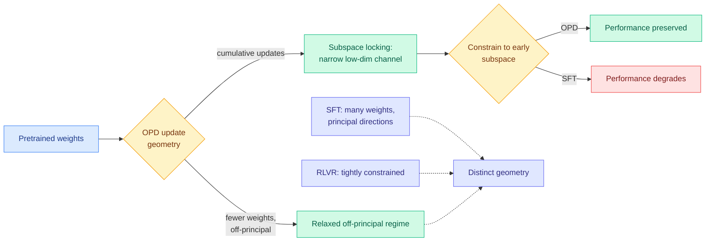

# On the Geometry of On-Policy Distillation

**TL;DR.** On-policy distillation (OPD, where a student generates its own rollouts and learns from the teacher's token-level distribution over them) has been the wiki's most-tracked post-training method all spring, but its *training dynamics* were unexamined. This paper characterizes the trajectory of OPD updates **in parameter space** and contrasts it with SFT and RLVR (reinforcement learning with verifiable rewards). Two findings stand out. First, OPD sits in a **relaxed off-principal regime**: versus SFT it touches fewer weights and avoids principal directions more strongly; versus RLVR its updates are less tightly constrained. Second, OPD exhibits **subspace locking**: cumulative updates rapidly collapse into a narrow low-dimensional channel, and constraining training to the *early* update subspace preserves OPD performance but badly degrades SFT. Conclusion: OPD is not a midpoint between SFT and RLVR; it induces its own update geometry.

## Key points

- **Subspace locking** is the headline: OPD's useful learning lives in a low-dimensional channel fixed early in training. The locked subspace is *functionally sufficient* — you can constrain training to it and lose nothing.
- **Control experiments isolate what matters.** Sparsifying the update tokens and shifting rollout generation off-policy both *preserve* the rank dynamics, but mixing the OPD objective with RLVR *changes* them. So the geometry is a property of the OPD objective, not of on-policy sampling or token density.
- This is a diagnostic / mechanism paper, not a new method. Its value is explaining *why* the spring OPD interventions behaved as they did.

## How it relates to prior wiki knowledge

- **Explains the whole token-selection line at once.** [TIP](2026-04-16-tip-token-importance-on-policy-distillation.md) (04-16, <10% of tokens carry signal), [TA-OPD](2026-06-01-ta-opd-token-teachability.md) (06-01, only reachable corrections), and [OPRD](2026-06-05-oprd-on-policy-representation-distillation.md) (06-05, distill hidden states not logits) all found that *most of the OPD update is unnecessary*. Subspace locking is the geometric reason: the update was always confined to a narrow channel, so sparsifying tokens preserves rank dynamics (exactly what the control experiment shows). The selection methods were implicitly riding the locked subspace.
- **Companion to today's [Trajectory-Refined Distillation](2026-06-09-trd-trajectory-refined-distillation.md)** (TRD, 06-09): TRD diagnoses *prefix failure* at the trajectory level; this paper diagnoses the *parameter-space* geometry. Two mechanism papers on OPD the same day, attacking different layers of the same method.
- Confirms OPD is its own regime, complementing the [Extrapolation Cliff](2026-05-14-extrapolation-cliff-on-policy-distillation.md) (05-14) closed-form bound on when OPD beats OPRL.

## Gaps

- Diagnostics are run on specific model pairs/scales; whether subspace locking holds at frontier scale or for non-reasoning tasks is open.
- "Functionally sufficient" is shown by constraining to the early subspace, but the paper does not turn this into a *cheaper* training method (e.g. low-rank OPD), which is the obvious follow-up.

## Research angle

If OPD truly locks into a low-dimensional subspace early, OPD could be run as an explicit low-rank update (LoRA-shaped) with no quality loss, cutting optimizer memory. The open question: can the locked subspace be *predicted* before training, or only observed after? A predictor would make OPD dramatically cheaper.

**Source:** HuggingFace Daily Papers · [Paper](https://arxiv.org/abs/2606.07082) · raw: `raw/huggingface/2026-06-09-on-the-geometry-of-on-policy-distillation.md`

**Related:** [knowledge-distillation.md](knowledge-distillation.md) · [../llms-foundation-models/rl-for-llms.md](../llms-foundation-models/rl-for-llms.md) · [2026-06-09-trd-trajectory-refined-distillation.md](2026-06-09-trd-trajectory-refined-distillation.md)
