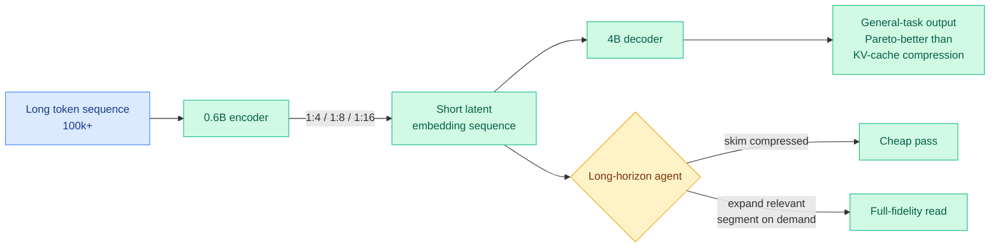

# Latent Context Language Models (LCLMs): End-to-End Context Compression at Scale

**TL;DR.** Most long-context efficiency work compresses the KV cache. This paper revisits the older **encoder-decoder compression** idea (map a long token sequence to a *short* sequence of latent embeddings that a decoder consumes) and makes it competitive for the first time. The authors run an architecture search, pre-training many variants from scratch, then continually pre-train a family of **0.6B-encoder / 4B-decoder** models on **350B+ tokens each** at compression ratios of **1:4, 1:8, and 1:16**. The resulting **Latent Context Language Models (LCLMs)** push the Pareto frontier across general-task accuracy, compression speed, and peak memory, beating KV-cache compression on the accuracy-efficiency tradeoff. They also work as backbones for long-horizon agents: the agent skims a compressed context and **adaptively expands** the segments it actually needs.

## Key points

- **Architecture search first.** Rather than bolt a compressor onto an existing model, they pre-trained many encoder-decoder variants from scratch to find what design and training recipe actually works, then scaled the winner. This is why LCLMs beat prior encoder-decoder compressors that "were not competitive."
- **Three compression ratios** (1:4, 1:8, 1:16), each a 0.6B-encoder + 4B-decoder model continually pre-trained on 350B+ tokens.
- **Production-friendly by construction.** A core complaint about KV-cache compression is that many methods need the input to fit the target model's context window and break modern inference engines. Encoder-decoder compression sidesteps both: the long input is consumed by the small encoder.
- **Agentic skim-then-expand.** The compressed latent context is a cheap index the agent reads first, expanding only the segments it needs to full fidelity.

## How it relates to prior wiki knowledge

- **Counterpoint to the KV-cache-compression orthodoxy.** The [kv-cache](kv-cache.md) page is dominated by cache-side methods (VaSE, Conf-KV, FlashMemory's LSA today). LCLMs argue the encoder-decoder *input-side* route, long thought inferior, wins on the Pareto frontier once trained at scale. Pairs directly against today's [FlashMemory-DeepSeek-V4](2026-06-09-flashmemory-ds-v4-lookahead-sparse-attention.md): two opposite answers (drop KV chunks vs. never form them) to the same 500K-context memory wall, landing the same day.
- **Extends the trained-compressor argument.** [LongAttnComp](2026-06-02-longattncomp-context-compression.md) (06-02) argued a *trained* scorer beats training-free attention heuristics for compressing the prefill input. LCLMs generalize that all the way to a from-scratch encoder-decoder, and add the adaptive-expansion agent loop.
- **Skim-then-expand echoes** the compressed-history-plus-selective-recall pattern in [parametric-context-internalization](parametric-context-internalization.md) and SAM-style state-adaptive memory.

## Gaps

- 4B decoder is small; whether the Pareto advantage over KV-cache compression holds at frontier (70B+) decoder scale is untested.
- 1:16 compression accuracy on retrieval-heavy needle tasks vs. lossless full context is the number to watch; "general-task" Pareto gains can hide long-range recall loss.

**Source:** HuggingFace Daily Papers · [Paper](https://arxiv.org/abs/2606.09659) · raw: `raw/huggingface/2026-06-09-end-to-end-context-compression-at-scale.md`

**Related:** [kv-cache.md](kv-cache.md) · [parametric-context-internalization.md](parametric-context-internalization.md) · [2026-06-09-flashmemory-ds-v4-lookahead-sparse-attention.md](2026-06-09-flashmemory-ds-v4-lookahead-sparse-attention.md)
