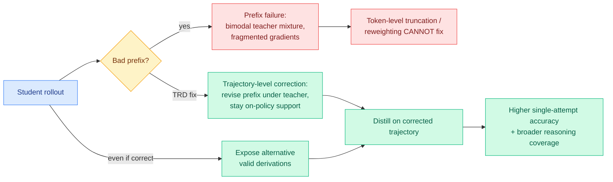

# Trajectory-Refined Distillation (TRD)

**TL;DR.** On-policy distillation (OPD) gives dense per-token teacher supervision along the student's own rollouts, but TRD identifies a structural failure the whole token-level line missed: **prefix failure**. When the student's rollout goes wrong early, dense per-token supervision over that bad prefix induces a **bimodal teacher mixture and fragmented gradients** that no amount of token-level loss truncation or reweighting can fix. The remedy is to stop intervening at the token level and instead make a **trajectory-level correction**: TRD revises the student's rollout under teacher guidance while staying within on-policy support, fixing the problematic prefix *before* distillation. It also broadens exploration by exposing the student to alternative valid derivations even when the original rollout was already correct. Across benchmarks and model scales, TRD beats prior OPD baselines on single-attempt accuracy and reasoning coverage. Code: github.com/louieworth/trd.

## Key points

- **Prefix failure is the new diagnosis.** A wrong early step makes the rest of the rollout sit in a region where the teacher's per-token distribution is bimodal (it wants to both continue the student's path and jump back to the correct one), so the gradient fragments. Token-level fixes operate too late, on a trajectory already off the rails.
- **The fix is structural, not statistical.** Correct the trajectory (revise the bad prefix) rather than reweight tokens on a doomed one. This is a genuine level-shift from the spring token-selection program.
- **Exploration bonus.** Even on already-correct rollouts, TRD surfaces alternative valid derivations under teacher guidance, broadening reasoning coverage rather than just sharpening the single path.
- Also applies to **on-policy self-distillation (OPSD)**, where a privileged-information-conditioned student acts as its own teacher.

## How it relates to prior wiki knowledge

- **Closes a loop the token-selection line left open.** [TIP](2026-04-16-tip-token-importance-on-policy-distillation.md) → [TA-OPD](2026-06-01-ta-opd-token-teachability.md) → [TrOPD](2026-06-03-tropd-trust-region-on-policy-distillation.md) → [FiRe-OPD](2026-06-04-fire-opd-filter-then-reweight-distillation.md) all worked at the *token* level (which tokens to keep, reweight, or trust). TRD's claim is that token-level interventions are fundamentally insufficient when the *prefix* is bad. FiRe-OPD's trajectory *filter* dropped bad rollouts; TRD instead *repairs* them, salvaging the signal FiRe discards.
- **Mechanism companion to today's [On the Geometry of On-Policy Distillation](2026-06-09-geometry-on-policy-distillation.md).** Both are OPD mechanism papers on 06-09: Geometry explains the parameter-space channel, TRD explains the trajectory-space failure. Together they say OPD's behavior is governed by structure (subspace + prefix), not just per-token statistics.
- The privileged-conditioning OPSD teacher is the same trick as [D-OPSD](2026-05-07-d-opsd-self-distillation-step-distilled-diffusion.md) (05-07) and [SDPG](2026-06-04-sdpg-self-distilled-policy-gradient.md) (06-04).

## Gaps

- Revising the prefix "under teacher guidance while within on-policy support" needs the teacher to generate corrections; the added rollout cost vs. plain OPD is not the headline and matters for adoption.
- Prefix failure is demonstrated on reasoning benchmarks with clear correctness; whether it generalizes to open-ended generation where "correct prefix" is ill-defined is untested.

## Research angle

The selection axis (which tokens) and the correction axis (which trajectories) are now both named. The unwritten paper composes them: locate the prefix failure (TRD), correct it, then apply teachability-aware token selection (TA-OPD) inside the corrected trajectory, all confined to the locked subspace (today's Geometry paper). Three 2026 OPD threads, one joint formulation, still unwritten.

**Source:** HuggingFace Daily Papers · [Paper](https://arxiv.org/abs/2606.08432) · [Code](https://github.com/louieworth/trd) · raw: `raw/huggingface/2026-06-09-trajectory-refined-distillation.md`

**Related:** [knowledge-distillation.md](knowledge-distillation.md) · [2026-06-09-geometry-on-policy-distillation.md](2026-06-09-geometry-on-policy-distillation.md) · [../llms-foundation-models/rl-for-llms.md](../llms-foundation-models/rl-for-llms.md)
