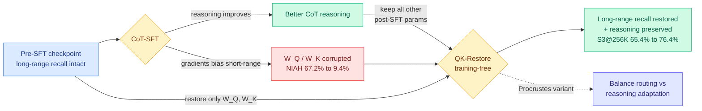

# Attention Amnesia in Hybrid LLMs: QK-Restore

**TL;DR.** Chain-of-thought supervised fine-tuning (CoT-SFT, training a model on worked-out reasoning traces to make it reason better) is now standard. This paper finds it has a hidden cost in hybrid linear-attention models: it quietly destroys long-context recall. On the Needle-In-A-Haystack retrieval test, HypeNet-9B at 256K context collapses from 67.2% to 9.4% after CoT-SFT. The cause is that CoT training biases attention gradients toward short-range patterns, corrupting the query and key projections (W_Q, W_K) that do long-range routing. The fix, QK-Restore, is almost free: copy only W_Q and W_K back from the pre-SFT checkpoint, keep everything else. Recall returns at zero training cost while reasoning gains are preserved.

## What it is

Hybrid LLMs interleave cheap linear-attention layers with a few full-attention layers to keep long-context cost down (the architecture family behind HypeNet and Jet-Nemotron). The paper documents a systematic failure mode it calls **attention amnesia**: after CoT-SFT, retrieval performance on Needle-In-A-Haystack degrades sharply, and the degradation worsens at harder retrieval settings and longer contexts.

The diagnosis is mechanistic. CoT supervision concentrates the learning signal on short-range, locally-sequential reasoning steps, so the attention gradients drift toward short-range patterns and disrupt the W_Q and W_K projections that are responsible for long-range routing (deciding which far-away token a query should attend to). **QK-Restore** is a training-free repair: restore only W_Q and W_K from the pre-SFT checkpoint, preserve every other post-SFT parameter. A **Procrustes variant** interpolates, trading a little routing fidelity for more reasoning adaptation. On HypeNet-5B it lifts S3@256K from 65.4% to 76.4% while holding reasoning performance.

## Why it matters / relation to prior wiki pages

- **A second "post-training silently breaks the thing you didn't measure" result this month.** It rhymes structurally with [Geometry of On-Policy Distillation](2026-06-09-geometry-on-policy-distillation.md) (06-09, the useful distillation update locks into a tiny subspace, so most per-token gradient is redundant) and [TRD](2026-06-09-trd-trajectory-refined-distillation.md) (06-09, a wrong early step poisons every token-level fix): all three say the dynamics of a post-training method matter more than its loss curve, and the failure hides until you probe the right axis. Here the unmeasured axis is long-range recall, and terminal reasoning scores look fine.
- **The hybrid-architecture tax.** The wiki has tracked hybrids as the efficiency win of 2026 ([Nemotron-3 Super hybrid MoE](2026-04-21-nemotron3-super-hybrid-moe.md), [DeepSeek-V4 interleaved compressed attention](2026-05-25-deepseek-v4-interleaved-compressed-attention.md), [MiniMax-M3 sparse attention](2026-06-03-minimax-m3-sparse-attention.md)). This is the first paper to show that the linear-attention half of a hybrid is *fragile under standard post-training*, and that the fragility lives in two specific weight matrices. Any team CoT-fine-tuning a hybrid is exposed.
- **Cheapest possible intervention.** Where [FocusFT](2026-05-13-focusft-dilution-aware-long-context.md) and dilution-aware methods retrain to protect long context, QK-Restore needs zero training: it is a checkpoint diff on two matrices. The localization (long-range routing == W_Q/W_K, reasoning == the rest) is the reusable insight.

## Gaps

Demonstrated on HypeNet and Jet-Nemotron specifically; whether the W_Q/W_K localization holds for other hybrid recipes or for full-attention models under CoT-SFT is untested. Restoring pre-SFT projections assumes the pre-SFT routing was good; for a model whose long-range routing was weak before SFT, there is nothing useful to restore. The Procrustes balance point is reported as a knob, not a principled optimum.

## Source

- Paper: https://arxiv.org/abs/2606.11052
- Raw: [raw/huggingface/2026-06-10-attention-amnesia-in-hybrid-llms-when-cot-fine-tuning-breaks.md](../../raw/huggingface/2026-06-10-attention-amnesia-in-hybrid-llms-when-cot-fine-tuning-breaks.md)
- Concept page: [KV Cache](kv-cache.md)
