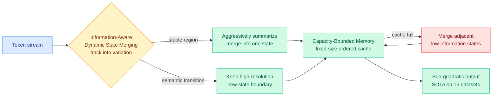

# DLA: Dynamic Linear Attention

**TL;DR.** Multi-state linear attention shrinks the quadratic cost of full attention by holding memory in a small fixed set of states, but every prior method merges those states with a *fixed* policy that cannot tell an important token from a routine one, so critical tokens get blurred and errors pile up over long sequences. DLA (Dynamic Linear Attention, arxiv 2606.10650) makes the merge policy data-dependent: it decides where one memory state should end and the next begin based on how much the token-level information is changing, keeping high resolution around semantic transitions and aggressively summarizing stable stretches. Across 16 datasets in three categories and two different linear-attention backbones it beats the prior state of the art.

## What it is

Linear attention replaces the quadratic softmax-attention computation with a recurrent state update, so cost grows linearly with sequence length instead of quadratically. To recover some of the representational power lost in that compression, recent work keeps not one but *several* memory states (multi-state linear attention) and merges them as the sequence advances. DLA is a dynamic memory-modeling framework for that multi-state setting with two parts:

- **Information-Aware Dynamic State Merging.** State boundaries are placed adaptively based on token-level information variation. Where the content shifts (a semantic transition), DLA opens a fresh high-resolution state; where content is stable, it folds tokens into a single coarse state.
- **Capacity-Bounded Memory Modeling.** A fixed-size, chronologically ordered state cache. When it fills, DLA selectively merges *adjacent low-information* states, so memory growth is bounded with minimal information loss.

## Why it matters / relation to prior wiki pages

- **Direct successor to the fixed-policy linear-attention line.** The wiki has tracked linear-attention memory mechanics through [MDN / Momentum DeltaNet](2026-05-11-mdn-momentum-deltanet-linear-attention.md) (momentum in the state update), [Gated DeltaNet 2](2026-05-22-gated-deltanet-2-linear-attention-decoupled-erase-write.md) (decoupled erase/write gates), and [Parallax](2026-05-29-parallax-local-linear-attention.md) (local linear attention). DLA's contribution is orthogonal: it is about *how many states and where their boundaries fall*, decided by content, not a fixed schedule. It is the first content-adaptive state-allocation policy in this line.
- **Same instinct as the day's KV-cache work, one architecture over.** [FlashMemory-DS-V4](2026-06-09-flashmemory-ds-v4-lookahead-sparse-attention.md) (06-09, predict which cached tokens future queries need and evict the rest) and [Make-Each-Token-Count](2026-05-12-make-each-token-count-kv-eviction.md) (05-12, learned eviction beats the full cache by removing attention dilution) both argue that *not all stored memory deserves equal resolution*. DLA applies that argument inside linear attention's state cache rather than a softmax KV cache: stable regions get summarized, transitions stay sharp.
- **Routing-as-resolution-allocation.** The merge decision is a per-region routing choice (high-res vs summarized) keyed to an information signal, conceptually adjacent to [Chiaroscuro Attention](../ai-routing/2026-06-09-chiaroscuro-attention-spectral-routing.md) (06-09) routing each token to a cheap or expensive mixer by spectral entropy. Both spend representational budget only where token content justifies it.

## Gaps

The abstract reports "superiority over state of the art" without the specific deltas, ratios, or the two backbone identities in the captured text, so the magnitude of the win and which long-context benchmarks move most are not yet pinned. The information-variation signal that drives merging adds per-token overhead the linear-cost claim must absorb; whether the net wall-clock stays sub-quadratic at very long context is the number to verify.

## Source

- Paper: https://arxiv.org/abs/2606.10650
- Raw: [raw/huggingface/2026-06-10-dynamic-linear-attention.md](../../raw/huggingface/2026-06-10-dynamic-linear-attention.md)
- Concept page: [KV Cache](kv-cache.md)
