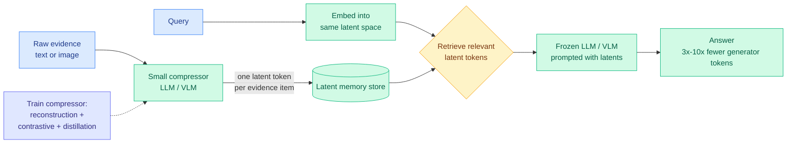

# Latent Memory: One Token per Multimodal Evidence

**TL;DR.** Retrieval-augmented QA grounds a model in external evidence, but the standard pipeline retrieves raw text and images and feeds them to the generator, which is expensive in tokens and storage. Latent Memory (arxiv 2606.10572) replaces each evidence item, text or image, with a *single* high-dimensional latent token produced by a small compressor model. Retrieval and generation both happen in that latent space: the query is embedded into the same space, the relevant latent tokens are pulled, and they are prompted directly to a frozen LLM or VLM. It matches strong RAG baselines on seven text and multimodal QA benchmarks while using 3x to 10x fewer generator tokens, and posts the best image-grounded QA on WebQA.

## What it is

A latent-space memory paradigm for resource-constrained QA. Every memory item, regardless of modality, becomes one latent token. The compressor is trained end-to-end with three objectives so each latent token is simultaneously useful for **reconstruction** (it must encode the evidence faithfully), **retrieval** (it must sit near matching queries in the space), and **generation** (a frozen generator must be able to read it). At inference the raw evidence is never passed to the generator; only the compact latents are.

## Why it matters / relation to prior wiki pages

- **The retrieval-side counterpart to yesterday's two long-context poles.** [LCLM](2026-06-09-lclm-end-to-end-context-compression.md) (06-09, compress a long input into a short latent sequence with a trained encoder-decoder, never build the KV cache) and [FlashMemory-DS-V4](2026-06-09-flashmemory-ds-v4-lookahead-sparse-attention.md) (06-09, predictively evict the cache) both attack the cost of *the model's own working memory*. Latent Memory attacks the cost of *external* memory: the retrieved evidence corpus. The shared move is the same one LCLM made, "treat a compact learned latent as the unit of memory instead of raw tokens," now pushed to the extreme of one token per evidence item and extended to images. Three papers in two days converging on latent-token memory is a pattern, not a coincidence.
- **Selective recall, again.** LCLM's skim-then-expand and FlashMemory's predict-then-keep both ration full-fidelity reads. Latent Memory rations differently: it pays the fidelity cost once, offline, in the compressor's training, then every read is cheap. It is the "compress hard up front" pole opposite LCLM's "expand on demand."
- **Multimodal evidence in one token is the sharper claim.** Reducing an image to a single latent that still supports grounded QA (best on WebQA) is a stronger compression statement than the text-only compressors the wiki has tracked, and connects to the modality-asymmetry argument in today's [DPVR vision-token routing](../ai-routing/2026-06-10-dpvr-vision-token-routing.md): vision tokens carry less per-token reasoning load than text and can be compressed harder.

## Gaps

One latent token per evidence item is a fixed, aggressive budget; the abstract does not report where recall breaks as evidence items get longer or more information-dense, which is exactly where single-token compression should fail. Benchmarks are QA with retrievable answers; whether a single latent preserves enough for multi-hop synthesis across many evidence items (versus single-fact lookup) is the untested case. The compressor is small but its training cost and how well a frozen generator reads latents it was not trained on are not foregrounded.

## Source

- Paper: https://arxiv.org/abs/2606.10572
- Code: https://github.com/zz1358m/Latent-Memory-Master
- Raw: [raw/huggingface/2026-06-10-one-token-per-multimodal-evidence-latent-memory-for-resource.md](../../raw/huggingface/2026-06-10-one-token-per-multimodal-evidence-latent-memory-for-resource.md)
- Concept page: [KV Cache](kv-cache.md)
