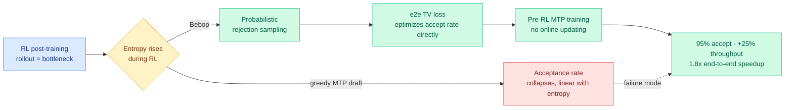

# Bebop: Breaking Entropy Bounds — accelerating RL training via MTP with rejection sampling

**TL;DR.** During reinforcement-learning post-training, multi-token prediction (MTP, where the model drafts several future tokens at once so a verifier can accept them in one step) is supposed to speed up the rollout stage through speculative decoding. In practice its acceptance rate collapses as training proceeds. Bebop diagnoses *why*: the MTP acceptance rate is bounded by model entropy, and RL training steadily raises entropy, so acceptance falls in a near-linear relationship. The fix is three-part: switch from greedy draft sampling to probabilistic rejection sampling, replace the cross-entropy / KL draft-training objective with a new end-to-end total-variation (TV) loss that directly optimizes the multi-step acceptance rate, and do the MTP training once before RL rather than chasing it online. Result: up to 95% acceptance, ~10% acceptance-rate improvement, up to 25% extra inference throughput, and up to 1.8x end-to-end speedup in async RL of Qwen3.5/3.6/3.7.

**Source:** HuggingFace Daily Papers · arxiv [2606.12370](https://arxiv.org/abs/2606.12370)

## Key findings

- **The bottleneck is entropy, and it is structural.** Bebop shows a clear negative linear relationship between the rise in model entropy during RL and the MTP acceptance rate. As RL pushes the policy to explore (which raises entropy by design), the draft model's guesses match the target less often, so speculative decoding stops paying off exactly when the rollout stage is most expensive.
- **Rejection sampling absorbs the entropy disturbance.** Probabilistic rejection sampling of draft tokens is far more robust to the entropy shift than greedy draft sampling, recovering acceptance that greedy decoding loses.
- **The conventional draft objective is wrong for this setting.** Cross-entropy or KL training of the MTP head is suboptimal under rejection sampling. Bebop's end-to-end TV loss directly optimizes the multi-step rejection-sampling acceptance rate, yielding ~10% acceptance-rate gains and up to 95% acceptance.
- **Train MTP once, before RL.** Pre-RL MTP training with the TV loss + rejection sampling holds a consistent acceptance rate and speedup across the *entire* RL run, eliminating costly online MTP re-training.
- **End-to-end gains.** Up to 25% extra inference throughput and up to 1.8x end-to-end acceleration in asynchronous RL across math reasoning, code generation, and agentic tasks on Qwen3.5/3.6/3.7.

## How this relates to prior wiki knowledge

This **extends** the wiki's long-running speculative-decoding-for-RL-rollouts thread. The [speculative decoding](speculative-decoding.md) concept page already tracked [Speculative Decoding for RL Rollouts](2026-04-30-speculative-decoding-rl-rollouts.md) (04-30, the first paper to apply drafting to the RL rollout bottleneck) and [GRAFT](2026-05-20-graft-draft-less-retrieve-more-speculative-decoding.md) (05-20, draft less, retrieve more). Bebop sharpens the diagnosis those papers left open: the reason rollout speculation degrades during RL is not implementation noise, it is an entropy bound. That is a *mechanism*, and it converts a known annoyance into a quantity you can optimize against.

It also **rhymes with** the MTP-on-CPU practitioner thread: [MTP in llama.cpp](2026-05-17-mtp-llama-cpp-merge-strix-halo-benchmarks.md) (05-17) and [ik_llama.cpp MTP CPU offload](2026-05-21-ik-llamacpp-mtp-cpu-offload-qwen36.md) (05-21) showed MTP acceptance is the load-bearing number for real throughput. Bebop is the training-time complement: it changes how the MTP head is *trained* so acceptance survives the most acceptance-hostile phase of the pipeline.

**Research angle.** The entropy-acceptance bound is the interesting object. If acceptance is genuinely bounded by entropy, then any inference-time-scaling or exploration-heavy regime (not just RL) should see the same collapse, and the TV-loss-plus-rejection recipe should transfer to test-time speculative decoding under high-temperature sampling. Open question: does the entropy bound interact with the trust-region softening lesson the wiki has tracked ([DRPO](../llms-foundation-models/2026-06-10-drpo-divergence-regularized-policy-optimization.md), 06-10)? A trust region that holds entropy down would, by this paper's own relationship, *raise* MTP acceptance for free — meaning rollout-speed and policy-stability tuning are coupled, not independent knobs.

→ Raw: [`raw/huggingface/2026-06-11-breaking-entropy-bounds-accelerating-rl-training-via-mtp-wit.md`](../../raw/huggingface/2026-06-11-breaking-entropy-bounds-accelerating-rl-training-via-mtp-wit.md)
