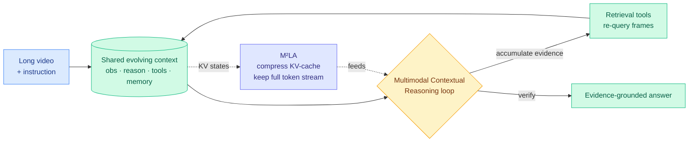

# InternVideo3: Agentify Foundation Models with Multimodal Contextual Reasoning (M²LA KV compression)

**TL;DR.** Open-source agentic work has been almost entirely text. InternVideo3 pushes agentic, multi-step, tool-using reasoning into *long video*, where a model must keep track of evidence across a long temporal window. Its framing — Multimodal Contextual Reasoning (MCR) — treats understanding as a closed loop over a shared, evolving context of observations, instructions, reasoning, tool actions, and memory, so long-video understanding becomes evidence accumulation and verification rather than one-shot captioning. The efficiency piece worth flagging for the wiki is **Multimodal Multi-head Latent Attention (M²LA)**, a token-preserving reparameterization that compresses the KV-cache states while keeping the full token stream. Trained in stages (continued pretraining, short-to-long SFT, rule-based RL, on-policy distillation), it posts strong numbers on Video-MME, MLVU, and EgoSchema and works as a retrieval-tool video agent.

**Source:** HuggingFace Daily Papers · arxiv [2606.12195](https://arxiv.org/abs/2606.12195)

## Key findings

- **Agentic loop for long video.** MCR reframes long-video understanding as a closed loop: the model accumulates observations, reasons, calls retrieval tools to re-inspect frames, updates memory, and verifies — instead of compressing the whole video into a single forward pass.
- **M²LA: compress KV, keep tokens.** Multimodal Multi-head Latent Attention is a token-preserving reparameterization that shrinks the KV-cache footprint without dropping any of the token stream. This is the MLA (multi-head latent attention) idea — project keys/values into a low-rank latent — carried into the multimodal, multi-head, long-video regime.
- **Staged training.** Continued pretraining → short-to-long supervised fine-tuning → rule-based RL → on-policy distillation. The short-to-long curriculum is what lets a model trained on short clips generalize to long-horizon temporal reasoning.
- **Results.** Strong on Video-MME, MLVU, and EgoSchema; instantiated as a video agent with retrieval tools showing robust evidence-grounded behavior.

## How this relates to prior wiki knowledge

This is the **video-agent extension** of the wiki's video-KV-compression cluster. The [KV cache](kv-cache.md) concept page tracks a string of video/VLM latent-KV methods: [VideoMLA](2026-06-02-videomla-low-rank-latent-kv-cache.md) (06-02, low-rank latent KV for video), [StateKV](2026-06-01-statekv-linear-video-vlm.md) (06-01, linear video VLM state), [WorldKV](2026-05-24-worldkv-video-world-memory.md) (05-24, video world-memory retrieval), and [Forcing-KV](2026-05-15-forcing-kv-video-diffusion-kv-cache-compression.md) (05-15, KV compression for video diffusion). M²LA is the same low-rank-latent-KV instinct, but uniquely it is *token-preserving* — most of those methods compress by evicting or merging tokens, whereas M²LA keeps every token and compresses only the per-token KV state. That distinction matters for an agent that may need to re-query an earlier frame: you cannot retrieve a token you evicted.

It also connects to yesterday's [Latent Memory](2026-06-10-latent-memory-one-token-evidence.md) (06-10, store each evidence item as one latent token, 3x–10x fewer generator tokens). InternVideo3 and Latent Memory are two answers to the same question — how does a long-horizon multimodal agent afford its own evidence? — with opposite token policies: Latent Memory collapses an item to one token; M²LA keeps all tokens and shrinks their KV state. The agentic-retrieval framing also rhymes with the [agent memory](../agentic-systems/agent-memory.md) thread (retrieve-then-verify loops).

**Research angle.** The token-preserving claim is the lever to probe. Token-preserving KV compression usually trades a smaller per-token KV for more tokens kept resident, so the net memory win depends on the compression ratio versus the eviction baselines (VideoMLA, WorldKV) it competes with — numbers the abstract does not give. For a routing/efficiency reader the open question is whether M²LA's latent KV can be *retrieved into* selectively (load only the latents the tool query needs) rather than kept fully resident, which would turn it from a compression scheme into a retrieval-addressable video memory.

→ Raw: [`raw/huggingface/2026-06-11-internvideo3-agentify-foundation-models-with-multimodal-cont.md`](../../raw/huggingface/2026-06-11-internvideo3-agentify-foundation-models-with-multimodal-cont.md)
