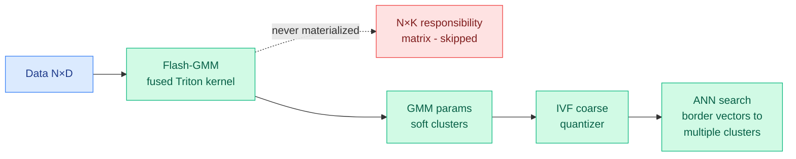

# Flash-GMM: a memory-efficient fused kernel for soft clustering

**Date:** 2026-06-12
**Source:** HuggingFace Daily Papers
**Links:** [Paper (arxiv 2606.10896)](https://arxiv.org/abs/2606.10896)

## TL;DR

Flash-GMM is a fused Triton kernel that computes Gaussian Mixture Models (GMMs, a soft-clustering method where each point gets a probability of belonging to each cluster, not a hard assignment) in a single GPU pass. The trick is the same one FlashAttention used for attention: **never materialize the full intermediate matrix**. The EM algorithm for GMMs needs an N×K "responsibility matrix" (point × cluster), which blows past GPU memory at scale — e.g. 80 GB for 10M points and 2048 clusters. By fusing the computation so the responsibility matrix is never written to HBM, Flash-GMM hits a **20x speedup** over existing implementations and trains on datasets **100x larger** on a single device. The paper's killer application: dropping soft GMM clustering into the IVF coarse quantizer for approximate nearest-neighbor (ANN) search, reaching fixed recall with up to **1.7x fewer distance computations**, or +2–12 recall@10 at matched cost.

## What problem it solves

GMMs are statistically richer than k-means (they model cluster shape and give soft memberships), but GPU implementations like TorchGMM die around 10M points because the responsibility matrix exceeds HBM. So practitioners default to k-means even when soft assignments would help. Flash-GMM removes the memory wall, making GMM a viable drop-in for k-means at scale.

## Core novelty

A **FlashAttention-style fusion applied to the EM responsibility computation** — tiling and online accumulation so the N×K matrix is computed block-by-block and never stored. The second contribution is showing this unlocks a concrete systems win: in IVF-based ANN (the index structure behind most vector databases), GMM responsibilities let *border vectors* be assigned to multiple clusters, which directly improves recall-per-compute.

## Key takeaways

- **20x** faster than existing GPU GMM implementations; **100x** larger datasets on one device.
- Soft GMM clustering becomes a drop-in replacement for k-means in the IVF coarse quantizer.
- **1.7x fewer distance computations** at fixed recall, or **+2–12 recall@10** at matched cost.
- Kernel released open-source.

## Relation to prior wiki state

- **Continues the "FlashAttention pattern generalizes" thread.** The wiki has logged this fusion idea spreading well beyond attention: [AccelOpt](2026-04-20-accelopt-gpu-kernel-optimization.md) (04-20, agentic kernel optimization) and [RL-Kernel](2026-06-08-rl-kernel-grpo-ppo-kernels.md) (06-08, RL-generated GPU kernels) both treat the fused-kernel form as the target. Flash-GMM is a hand-written instance of the same lesson: memory-traffic elimination, not FLOP reduction, is where modern GPU speedups live.
- **Quietly relevant to retrieval-augmented and KV-cache work.** Better ANN recall-per-compute is upstream of every RAG and long-context retrieval stack; the wiki's retrieval-aware chunking ([W-RAC, 04-17](2026-04-17-w-rac-retrieval-aware-chunking.md)) and KV-retrieval threads all sit on top of an ANN index whose quantizer Flash-GMM just made cheaper.

## Gaps

- The 20x/100x are kernel-level; the end-to-end win in a real vector-DB serving path (where index build is amortized) is shown only via the IVF recall numbers, not a full system benchmark.
- Triton-specific; no comparison to a CUDA hand-tuned baseline or to Hopper/Blackwell-specific paths.
- GMM's extra expressiveness over k-means helps "border" vectors most; how much of the recall gain survives on datasets without many border cases is not characterized.

## Industrial implication

Vector databases and ANN libraries (FAISS-class) could adopt GMM coarse quantizers if the recall-per-compute win generalizes, lowering serving cost for RAG at fixed quality. More broadly, Flash-GMM is another data point that classic ML primitives (GMM, EM) get a second life once someone writes the fused kernel — a cheap, high-leverage research direction.

## Links

- Raw: `raw/huggingface/2026-06-12-flash-gmm-a-memory-efficient-kernel-for-scalable-soft-cluste.md`
- Related: [AccelOpt 04-20](2026-04-20-accelopt-gpu-kernel-optimization.md) · [RL-Kernel 06-08](2026-06-08-rl-kernel-grpo-ppo-kernels.md)
</content>
