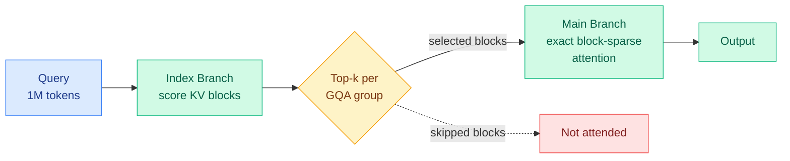

# MiniMax Sparse Attention (MSA): the paper behind MiniMax-M3

**Date:** 2026-06-12
**Source:** HuggingFace Daily Papers
**Links:** [Paper (arxiv 2606.13392)](https://arxiv.org/abs/2606.13392) · [Kernel (GitHub)](https://github.com/MiniMax-AI/MSA) · [MiniMax-M3 weights](https://huggingface.co/MiniMaxAI/MiniMax-M3)

## TL;DR

This is the actual paper for the sparse-attention engine inside MiniMax-M3, the open-weight 1M-context model the wiki first logged on 06-03 from a vendor blog. MSA is a **blockwise sparse attention built on top of Grouped Query Attention (GQA)**. A lightweight "Index Branch" scores key-value blocks and picks a Top-k subset *independently for each GQA group*; the "Main Branch" then runs exact attention over only those selected blocks. The headline numbers, now from the paper rather than marketing: on a 109B-parameter natively multimodal model, MSA matches dense GQA quality while cutting per-token attention compute **28.4x at 1M context**, and with the co-designed kernel delivers **14.2x prefill and 7.6x decoding wall-clock speedups on H800**.

## What problem it solves

Softmax attention is quadratic, so 1M-token context (needed for agentic workflows, repo-scale code reasoning, persistent memory) is untenable at deployment scale. Prior sparse-attention work either needs custom training, breaks tensor-core utilization with fine-grained access, or trades too much accuracy. MSA is deliberately streamlined to be deploy-friendly across a broad range of GPUs.

## Core novelty

Two pieces. (1) **Group-specific block selection on a GQA backbone**: each GQA group selects its own Top-k blocks, so retrieval is query-adaptive but execution stays block-level and hardware-friendly. (2) **GPU co-design**: an *exp-free* Top-k selection (avoids expensive exponentials in the scoring path) and a "KV-outer" sparse-attention layout that keeps tensor cores busy under block-granular access. The sparsity is translated into real wall-clock wins, not just FLOP reductions.

## Key takeaways

- **28.4x** lower per-token attention compute at 1M context, on par with GQA quality (109B model).
- **14.2x prefill / 7.6x decoding** wall-clock speedup on H800 with the co-designed kernel.
- Kernel is open-sourced; a production natively-multimodal model (MiniMax-M3) ships with it.

## Relation to prior wiki state

- **This paper supplies the audited mechanism behind the [MiniMax-M3 release (06-03)](2026-06-03-minimax-m3-sparse-attention.md)**, which we logged from the Kilo Code blog with MiniMax's own unverified figures (≈1/20 compute, ~9x prefill, ~15x decode). The paper's measured numbers refine those: 28.4x *compute* reduction but a more modest **14.2x prefill / 7.6x decode** in wall-clock — the gap between FLOP savings and realized speedup is exactly the kernel-efficiency story the 06-03 caveat flagged as uncharacterized.
- **Confirms the [RTPurbo / "Full Attention Strikes Back"](2026-05-24-rtpurbo-full-to-sparse-attention.md) (05-24) thesis** that full-attention models are intrinsically sparse and the useful token budget is query-dependent — RTPurbo reported ~9.36x prefill at 1M; MSA ships the same regime as a production open-weight model.
- **Sits on the sparse-attention-vs-eviction axis** the wiki has been tracking via [VaSE](2026-06-03-vase-value-aware-stochastic-kv-eviction.md) (training-free eviction) and [DeepSeek-V4 interleaved compressed attention](2026-05-25-deepseek-v4-interleaved-compressed-attention.md). MSA is firmly in the "select blocks, attend exactly" camp, and now it is the one with shipped open weights.
- **Pairs with today's [MaxProof](../llms-foundation-models/2026-06-12-maxproof-minimax-m3-test-time-scaling.md)**, also an M3-series paper — MiniMax dropped both the efficiency engine and a test-time-scaling proof system on the same day, a coordinated open-weight push.

## Gaps

- Quality is reported "on par with GQA" at the 109B scale; per-task long-context retrieval/multi-hop accuracy at 1M (does 28.4x compute reduction hold needle-in-haystack and multi-hop, or just perplexity?) is the number to scrutinize in the full paper.
- H800-specific kernel numbers; portability of the 14.2x/7.6x to Hopper/Blackwell or consumer GPUs is asserted ("broad range of GPUs") but not tabulated.
- The Index Branch adds its own cost; the paper frames the 28.4x as net, but the crossover context length below which MSA is *not* worth it is not stated.

## Links

- Raw: `raw/huggingface/2026-06-12-minimax-sparse-attention.md`
- Related: [MiniMax-M3 release 06-03](2026-06-03-minimax-m3-sparse-attention.md) · [RTPurbo 05-24](2026-05-24-rtpurbo-full-to-sparse-attention.md) · [VaSE 06-03](2026-06-03-vase-value-aware-stochastic-kv-eviction.md) · [kv-cache.md](kv-cache.md) · [MaxProof 06-12](../llms-foundation-models/2026-06-12-maxproof-minimax-m3-test-time-scaling.md)
</content>
