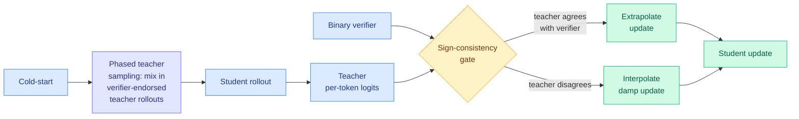

# SG-OPD: Sign-Gated On-Policy Distillation

**Date:** 2026-06-12
**Source:** HuggingFace Daily Papers
**Links:** [Paper (arxiv 2606.09304)](https://arxiv.org/abs/2606.09304)

## TL;DR

On-policy distillation (OPD) — training a student on its *own* rollouts with dense per-token supervision from a stronger teacher — has been the wiki's hottest efficiency thread for two months. SG-OPD attacks two assumptions OPD silently relies on and that break in practice: (1) the student and teacher are aligned at the trajectory level, and (2) every teacher token is equally trustworthy. The fix uses a **binary verifier as a trust signal at two granularities**. "Phased teacher sampling" mixes verifier-endorsed teacher rollouts into the cold-start so the student is not distilling from trajectories it could never have produced. A "sign-consistency gate" then *extrapolates* the distillation update on tokens where the teacher agrees with the verifier-correct direction, and *interpolates* (damps) it where teacher and verifier disagree. On competition math, SG-OPD beats standard OPD by 1.98 (per-sample) and 7.50 (per-question) on average.

## What problem it solves

The wiki has logged a clear arc: OPD beats off-policy distillation and plain RL because the student learns on its own distribution — but only when the teacher's signal is actually applicable. [TIP](2026-04-16-tip-token-importance-on-policy-distillation.md) (04-16, only ~10% of teacher tokens carry signal), the [Extrapolation Cliff](2026-05-14-extrapolation-cliff-on-policy-distillation.md) (05-14, a closed-form student-teacher gap above which OPD collapses), [FIRE-OPD](2026-06-04-fire-opd-filter-then-reweight-distillation.md) (06-04, filter-then-reweight tokens), and [TA-OPD](2026-06-01-ta-opd-token-teachability.md) (06-01, token teachability) all chip at the same problem: teacher supervision is uneven and sometimes off-distribution. SG-OPD names both failure modes explicitly and routes around them with a verifier.

## Core novelty

Using a **binary correctness verifier as the gating signal for distillation strength**, not just as an RL reward. The sign-consistency gate is the sharp idea: instead of trusting the teacher's per-token preference uniformly, it checks whether the teacher's gradient direction agrees with the verifier-correct direction, and pushes harder (extrapolate) when they agree, softer (interpolate) when they conflict. This is OPD's answer to the reward-hacking problem that today's Kurate-rated "LLMs Gaming Verifiers" (RLVR reward hacking) warns about — keep the verifier in the loop but only let it *modulate* a dense teacher signal rather than *be* the sparse signal.

## Key takeaways

- Beats standard OPD by **+1.98 per-sample, +7.50 per-question** on competition-level math.
- Two independent levers (trajectory-level phased sampling + token-level sign gate) that each address one broken OPD assumption.
- Verifier is binary (correct/incorrect), so the trust signal is cheap to compute where a verifier exists.

## Relation to prior wiki state

- **Confirms the two-month pattern that "uniform OPD is wasteful"** — SG-OPD is now at least the sixth paper (TIP, FIRE-OPD, TA-OPD, geometry-on-policy-distillation 06-09, TROPD 06-03) converging on selective, trust-weighted distillation. The field has decisively moved off "distill every teacher token."
- **Bridges OPD and the verifier-trust literature.** It operationalizes the same caution as [process-reward reliability (BetaPRM, 05-20)](../llms-foundation-models/2026-05-20-process-rewards-learned-reliability-betaprm.md): a verifier signal is only as good as its false-positive rate, so use it to gate, not to dictate.

## Gaps

- Only competition math is shown — exactly the domain where a clean binary verifier exists. The method's reach into open-ended domains (where "verifier-correct direction" is undefined) is the open question, and is the same wall CORVER (05-29) and verifiable-reward work keeps hitting.
- No ablation reported yet isolating phased sampling vs the sign gate; we cannot tell which lever does the work.
- Scale: gains are at competition-math fine-tuning scale; no frontier-scale or held-out-domain numbers.

## Industrial implication

Where a verifier is cheap (math, code, formal tasks), SG-OPD is a near-free upgrade to any OPD post-training pipeline, and the verifier-as-gate framing is reusable. For domains without a verifier it changes nothing — which keeps the "verifier-rich vs verifier-poor" divide that increasingly governs which capabilities get cheap to train.

## Links

- Raw: `raw/huggingface/2026-06-12-sg-opd-sign-gated-on-policy-distillation-via-sign-consistenc.md`
- Related: [knowledge-distillation.md](knowledge-distillation.md) · [TIP 04-16](2026-04-16-tip-token-importance-on-policy-distillation.md) · [Extrapolation Cliff 05-14](2026-05-14-extrapolation-cliff-on-policy-distillation.md) · [FIRE-OPD 06-04](2026-06-04-fire-opd-filter-then-reweight-distillation.md)
</content>
