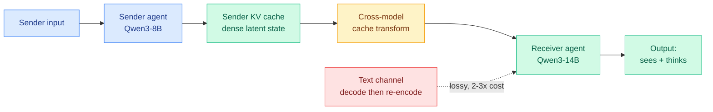

# See What I See, Know What I Think: Dense Latent Communication Across Heterogeneous Agents

**TL;DR.** When two LLM agents talk, they normally do it in text: the sender decodes its hidden state into words, the receiver re-encodes those words back into a hidden state. That round trip is lossy and expensive. This paper (Michigan, NVIDIA, Penn, CU Boulder, MSU) lets a *different* model read a sender's KV cache directly, so the receiver inherits both what the sender saw and how it was reasoning, at 2 to 3 times lower compute than text, with no quality loss in the setting where the receiver also sees the input. The trick is a lightweight cross-model cache transformation trained in two phases (reconstruct, then generate), and it is the first heterogeneous KV-cache method that survives the hard case where the receiver sees no input at all.

## What it is

Multi-agent systems (planner, retriever, executor) usually coordinate through natural language. The KV cache (the per-token key and value vectors a transformer stores so it does not recompute attention over the prompt on every new token) is a richer carrier: it is the model's actual working memory. Prior KV-cache communication worked only between *identical* copies of one model, where the latent spaces already line up. This paper attacks the heterogeneous case: a Qwen3-8B sender handing its cache to a Qwen3-14B receiver, where layer counts, head structure, and channel geometry all differ.

## Core novelty

An information-structure analysis splits the problem into two regimes. **Context-aware transfer** (receiver also sees the input) is driven by *sparse* reasoning signals, so a light touch suffices. **Context-unaware transfer** (receiver sees nothing, must reconstruct everything from the cache) needs *dense* contextual preservation. The method trains one lightweight cross-model cache transformer in two phases: a reconstruction phase that teaches it to preserve dense context, then a generation phase that teaches it to produce useful continuations. This dense alignment is what lets it work in the context-unaware regime where every prior heterogeneous method collapses.

## Key results

- Tested across all six directions of {Qwen3-4B, 8B, 14B} and six in-domain and out-of-domain benchmarks.
- Beats prior heterogeneous KV-transfer baselines on every direction.
- Matches or exceeds text communication in context-aware settings at roughly 2 to 3 times lower compute.
- Remains effective in context-unaware transfer, where prior methods fail outright.

## Gaps

All experiments are within the Qwen3 family (same tokenizer, same lineage). Cross-family transfer (Qwen to Llama, say) is the real test of "heterogeneous" and is not shown. Compute savings are reported as multiples; absolute wall-clock and memory for the transform module are not tabulated. No results at frontier scale or on long multi-turn agent traces, the place where text re-encoding cost actually dominates.

## How this relates to prior wiki knowledge

This extends the KV-cache line directly (see [kv-cache.md](kv-cache.md)). The wiki has tracked KV cache as something to *compress* (Octopus codec 05-21, OSCAR extreme quantization 05-21, VideoMLA low-rank latent 06-02, InternVideo3 M2LA 06-11) or *recompute-free reuse* (KV-Packet 04-17). This paper is a different use of the same object: KV cache as a *communication medium between models*, not just a memory to shrink. It also intersects the routing thesis the wiki built through MISA, BEAM, and VIA-SD (06-12, routing the minimum compute per token inside one model): here the "routing" decision is which agent's latent state to inject rather than recompute. The 2-3x saving is a margin lever in the same price-war context as MiniMax Sparse Attention (06-12).

**Raw source:** [HuggingFace](https://huggingface.co/papers/2606.13594) · [arXiv 2606.13594](https://arxiv.org/abs/2606.13594)
