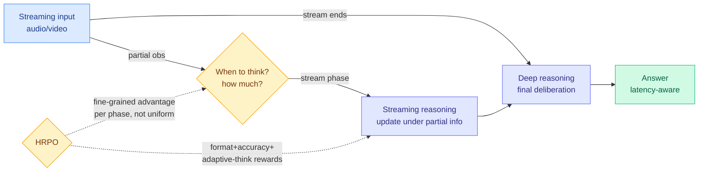

# AdaSR: Adaptive Streaming Reasoning with Hierarchical Relative Policy Optimization

**TL;DR.** Reasoning models usually follow a read-then-think pattern: observe the whole input, reason over a static context, answer. But many real settings are streaming, audio and video arrive continuously, and the model must reason and respond under partial information. Prior streaming-reasoning methods mostly imitate pre-built trajectories with supervised fine-tuning, which is rigid. AdaSR is an RL framework that lets a model reason *during* streaming and then deliberate once the stream completes, learning *when* to think and *how much* compute to spend at each stage. It is trained with HRPO (Hierarchical Relative Policy Optimization), which splits policy optimization into a streaming-reasoning phase and a deep-reasoning phase and assigns advantage at finer granularity instead of spreading one sequence-level advantage uniformly over all tokens. The result is a better balance of accuracy, compute, and streaming latency than the SFT baseline.

**Source:** HuggingFace · [Paper](https://arxiv.org/abs/2606.14694) · arxiv 2606.14694 · [code](https://github.com/EIT-NLP/StreamingLLM/tree/main/AdaSR)

## What it is

A streaming-reasoning framework trained by RL rather than imitation. The model interleaves lightweight reasoning while the input is still arriving with a heavier final deliberation once the stream ends, and it learns the schedule (when and how much to think) instead of following a fixed script.

## What problem it solves

Read-then-think assumes the full input is available up front, which fails for continuous audio/video. Existing streaming methods rely on supervised imitation of pre-constructed think-while-reading trajectories, so they cannot flexibly decide their own thinking schedule or trade latency against accuracy.

## Core novelty

HRPO: it decomposes policy optimization into a streaming-reasoning phase and a deep-reasoning phase and gives each finer-grained advantage assignment, rather than smearing a single sequence-level advantage across every token (the usual GRPO weakness). It combines format, accuracy, and an adaptive-thinking reward so the model keeps valid reasoning structure, preserves final accuracy, and is pushed toward latency-aware compute allocation.

## Key takeaways

- Reasons under partial observation during streaming, then deliberates once the stream completes.
- HRPO assigns advantage per reasoning phase, finer than uniform sequence-level credit.
- Reward mixes format + accuracy + adaptive-thinking to balance correctness against latency/compute.
- Beats the SFT baseline on the accuracy / compute / streaming-latency trade-off. Code released.

## Gaps

The trade-off is shown against an SFT baseline, not against strong test-time-compute controllers, so the comparison is to the weak prior, not the frontier. No wall-clock latency numbers in a real streaming deployment (the latency is benchmark-internal). Whether the learned think-schedule generalizes across stream rates and modalities is untested.

## How it relates to prior wiki knowledge

- HRPO joins today's GRPO-variant cluster with [Orchestra-o1's DA-GRPO](../ai-routing/2026-06-15-orchestra-o1-omnimodal-orchestration.md) and [S2L-PO](../llms-foundation-models/2026-06-15-s2l-po-small-models-explorers-grpo.md): three same-day papers each rebuilding GRPO's advantage assignment for a different structure (streaming phases, orchestration decisions, small-model exploration). The shared move is *finer-than-sequence-level credit*, the same instinct as [Temporal Scheduling for RLVR](../llms-foundation-models/2026-06-02-temporal-scheduling-rlvr.md) (06-02, schedule credit over training).
- The "learn how much to think" objective is the streaming instance of the adaptive-compute thread: [CLEAR](2026-06-05-clear-shadow-price-reasoning-budget.md) (06-05, ration reasoning budget across a batch with a shadow price) and today's [PoLar](2026-06-15-polar-program-of-layers.md) (skip/loop layers per input) all allocate compute per difficulty, AdaSR adds the *time* axis (allocate compute per stream stage).

## Research angle

The interesting lever is latency-aware reward: most test-time-compute work optimizes accuracy-per-token, AdaSR optimizes accuracy under a streaming-latency constraint, which is the real production objective for live audio/video agents. The open question is whether the streaming/deep phase split is the right decomposition or whether a continuous "think budget" controller (CLEAR-style shadow price, but over stream time) would dominate it.

→ Raw: `raw/huggingface/2026-06-15-adasr-adaptive-streaming-reasoning-with-hierarchical-relativ.md`
