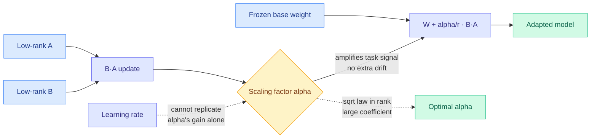

# LoRA-alpha: The Hidden Power of the Scaling Factor in LoRA Optimization

**TL;DR.** In Low-Rank Adaptation (LoRA, the parameter-efficient fine-tuning method that freezes the base model and trains two small low-rank matrices), everyone treats the scaling factor alpha as a redundant knob, a stand-in for the learning rate. This paper shows alpha is actually the dominant driver of effective optimization, and tuning the learning rate alone cannot reproduce what alpha does. Through a Signal-Drift framework it explains why: LoRA's spectral suppression smooths the loss landscape, which makes the usual hyperparameters too conservative and opens an "optimization gap." Alpha closes that gap by amplifying the task signal without inflating the drift. The optimal alpha follows a square-root law in the rank, with a coefficient much larger than the rank-tied heuristics (`alpha = 2r` etc.) assume. Their LoRA-alpha recipe restores alpha to a principled regime so LoRA works with standard small learning rates, improving accuracy while shrinking the hyperparameter search.

**Source:** HuggingFace · [Paper](https://arxiv.org/abs/2606.12883) · arxiv 2606.12883

## What it is

A theory-plus-empirics study of the single most-ignored LoRA hyperparameter. The effective LoRA update is `(alpha/r)·B·A`, and standard practice ties alpha to the rank r by a fixed heuristic and then tunes the learning rate. This paper decouples the two and shows they play different roles.

## What problem it solves

LoRA hyperparameter tuning is folklore: practitioners sweep learning rate and copy alpha=2r from a blog post. That leaves performance on the table because the rank-tied alpha heuristic systematically under-scales, and no amount of learning-rate tuning recovers the loss, since alpha and learning rate act on different parts of the optimization.

## Core novelty

The Signal-Drift framework and three findings. (1) LoRA's spectral suppression smooths the landscape, so default hyperparameters are over-conservative, an optimization gap. (2) Alpha exploits that smoothness by amplifying the task signal *without* raising the drift ratio, which the learning rate cannot do cleanly. (3) The optimal alpha scales as a square-root law in the rank with an unexpectedly large coefficient, so existing `alpha ∝ r` heuristics are mis-scaled. LoRA-alpha operationalizes this into a minimal recipe compatible with ordinary small learning rates.

## Key takeaways

- Alpha, not the learning rate, is the dominant lever for effective LoRA optimization.
- Optimal alpha follows a sqrt(rank) law with a large coefficient; standard rank-tied heuristics under-scale.
- LoRA-alpha consistently improves accuracy across diverse tasks while shrinking hyperparameter search.
- The mechanism is a smoothed landscape (spectral suppression) where signal amplification beats step-size inflation.

## Gaps

The Signal-Drift framework is validated empirically but the square-root coefficient is fit, not derived from first principles, so transfer to very high rank or to non-attention modules is unverified. No interaction study with the many LoRA variants (DoRA, rsLoRA, PiSSA) that also touch scaling. All on fine-tuning accuracy; no report on whether the principled alpha changes catastrophic-forgetting or merge behavior.

## How it relates to prior wiki knowledge

- This is a fine-tuning-efficiency result in the same "the geometry of the update is the real story" family as today's [OPD geometry paper](2026-06-15-dense-supervision-sparse-updates-opd-geometry.md) (OPD updates are spectrally concentrated and sit off the principal subspace). Both argue that *where and how strongly* the update lands matters more than raw step count.
- It complements the wiki's hypernetwork-LoRA line ([Code2LoRA](2026-06-06-code2lora-hypernetwork-repo-adapters.md) 06-06, [Video2LoRA](2026-06-06-video2lora-parametric-video-internalization.md) 06-06): those generate adapters; this one says how to *optimize* any adapter better.
- The "smoothed landscape makes defaults too conservative" claim rhymes with the Muon-vs-Adam optimizer thread ([Why Muon Outperforms Adam](../llms-foundation-models/2026-06-09-why-muon-outperforms-adam.md) 06-09): optimizer/scaling choices interact with landscape geometry, and the right knob depends on that geometry.

## Research angle

If the sqrt(rank) alpha law is real, it should compose with rank schedulers: jointly scheduling rank and alpha (raise rank, lower alpha by the law) could give a single principled fine-tuning trajectory. The cleaner test is whether the optimal alpha can be *predicted* from the base weight spectrum before training, which would remove alpha from the search entirely, the LoRA analogue of predicting OPD's subnetwork before training.

→ Raw: `raw/huggingface/2026-06-15-the-hidden-power-of-scaling-factor-in-lora-optimization.md`
