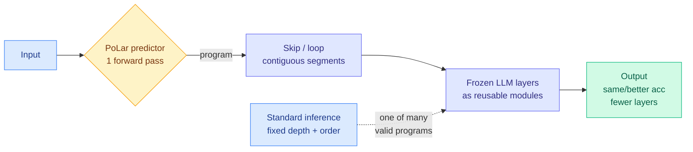

# PoLar: Skip a Layer or Loop It? Learning Program-of-Layers in LLMs

**TL;DR.** A pretrained LLM runs every input through the same fixed stack of layers in the same order. PoLar (Program-of-Layers) shows that this fixed forward pass is only one of many valid computations hiding inside a frozen model. For most inputs a shorter, reordered program (skip some layers, loop others) reaches the same or better accuracy, and many of the base model's wrong answers become right under an alternative program. PoLar trains a tiny prediction network that emits a per-input execution program (which contiguous layer segments to skip or repeat) in a single pass, with the base LLM fully frozen. On math reasoning it beats both standard inference and prior dynamic-depth methods, often while executing fewer layers, and the gains hold out of distribution.

**Source:** HuggingFace · [Paper](https://arxiv.org/abs/2606.06574) · arxiv 2606.06574 (Li, Li, Zhou; UMD + MBZUAI)

## What it is

PoLar treats a pretrained model's layers as reusable modules and asks: for *this* input, what program over those modules is best? The program is built from two operations applied to contiguous layer segments: **skip** (drop a segment) and **loop** (run a segment more than once). The authors first verify with Monte-Carlo Tree Search that such better-than-default programs exist for most inputs (a diagnostic, not the deployed method), then replace the expensive search with a lightweight learned **PoLar prediction network** that generates the program in one pass at inference time. The base model's weights never change.

## What problem it solves

Fixed-depth, fixed-order execution applies the same compute to every input regardless of difficulty, and it captures only a narrow slice of the model's latent reasoning capacity. Prior dynamic-depth work either does skipping *or* looping (not both), needs architectural redesign or retraining (Universal/Looped Transformers, early-exit lines), or makes local layer-wise routing decisions sequentially during the forward pass with no global coordination (DR.LLM). PoLar generalizes these: it supports both skip and loop over multi-layer segments, decided globally, with a frozen backbone.

## Core novelty

A single learned predictor that emits a *globally coordinated* program-of-layers (skip + loop over contiguous segments) in one forward pass, instead of sequential per-layer routing or expensive test-time search. The conceptual claim is the interesting part: fixed-depth execution is just one path through a space of valid latent computations the pretrained weights already support.

## Key takeaways

- For most inputs a substantially shorter program matches or beats full-depth accuracy.
- Many of the original model's wrong predictions are corrected by an alternative program with fewer layers.
- Beats standard inference and prior dynamic-depth methods on math benchmarks, gains persist OOD.
- Base LLM stays frozen; only the small predictor is trained.

## Gaps

Demonstrated on math reasoning; whether program-of-layers helps on open-ended generation, code, or long-context is untested. No wall-clock or kernel accounting for the predictor plus the irregular (skip/loop) execution path, which can defeat batching, so "fewer layers" may not translate to "faster" in a real serving stack. The OOD claim is within math-adjacent distributions.

## How it relates to prior wiki knowledge

- This is a **dynamic-compute-allocation** result in the same family as the wiki's long "the useful computation is sparse and locatable" thread, now applied to *depth* rather than tokens or KV blocks. It rhymes with [LongAct](../llms-foundation-models/2026-04-18-longact-saliency-sparse-rl.md) (04-18, gradient signal concentrated in high-magnitude activation positions) but at the layer-execution level.
- It is the depth-side analogue of the conditional-compute idea behind MoE routing ([MoE μP](../ai-routing/2026-05-17-moe-mup-maximally-scale-stable-parameterization.md)): route compute per input, but over *layers in time* instead of *experts in width*.
- Contrast with KV-cache and attention-sparsity efficiency ([MSA](kv-cache.md), [Parallax](2026-05-29-parallax-local-linear-attention.md)): those cut the *per-layer* cost; PoLar cuts the *number of layers run*. The two are orthogonal and composable.

## Research angle

The strongest open question is whether the program-of-layers is *content-addressable* (does the predictor learn "hard inputs get more loops") or merely a regularizer that happens to fix brittle forward passes. If the former, this is a route to test-time depth scaling without longer chains of thought, a different lever than CoT length. Pairing PoLar's depth-program predictor with a KV/attention-sparsity method would test whether width-sparsity and depth-sparsity gains stack.

→ Raw: `raw/huggingface/2026-06-15-skip-a-layer-or-loop-it-learning-program-of-layers-in-llms.md`
