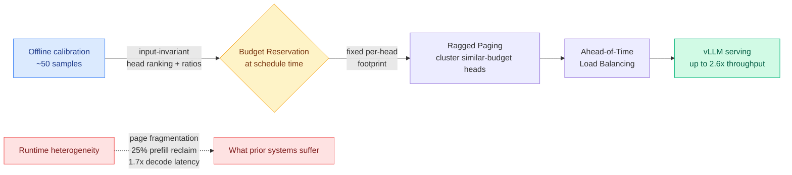

# Tangram: Non-Uniform KV Cache Compression Made Practical for Serving

**TL;DR.** Non-uniform KV-cache compression (give each attention head its own cache budget) preserves accuracy far better than uniform schemes, but no serving stack could actually run it: heterogeneous per-head lengths trap freed memory as page fragmentation, burn up to 25% of prefill reclaiming scattered pages, and skew GPU work enough to inflate decode latency 1.7x. Tangram (arxiv 2606.06302) makes non-uniform compression deployable by resolving statically at scheduling time what prior systems handled dynamically at runtime. The key empirical observation: head-wise retention is *input-invariant* — the head ranking and per-head ratios can be calibrated offline from as few as 50 samples, so the serving system never has to discover heterogeneity at runtime. Implemented on vLLM as a drop-in substrate under any existing non-uniform method, it matches their accuracy while lifting end-to-end throughput up to 2.6x over the full-KV baseline. Code: https://github.com/aiha-lab/TANGRAM.

## Key findings

- **Heterogeneity is structural, not input-dependent.** Head-wise retention follows a two-level regularity: an input-invariant head ranking, and narrowly bounded per-head ratios. Both calibrate offline from ~50 samples, so the system fixes budgets at scheduling time instead of discovering them per request.
- **Three static mechanisms replace three runtime costs.** Budget Reservation fixes each head's post-compression footprint at schedule time (eliminates page reclamation). Ragged Paging clusters similar-budget heads into independent page tables (turns fragmentation into reclaimable memory). Ahead-of-Time Load Balancing precomputes balanced GPU partitions (zero runtime re-planning).
- **Drop-in substrate.** Tangram does not invent a new compression policy. It is the serving layer that lets *existing* non-uniform methods actually run, matching their accuracy.
- **Up to 2.6x end-to-end throughput** over the full-KV baseline on vLLM for multi-turn serving.

## How it relates to prior wiki pages

This is the missing systems layer under the whole [KV cache](kv-cache.md) eviction/compression thread. The page has tracked the *policy* side for months — non-uniform per-head budgets in [MISA](2026-05-11-misa-mixture-of-indexer-sparse-attention.md) (head-axis indexer routing), per-head role pruning in [Forcing-KV](2026-05-15-forcing-kv-video-diffusion-kv-cache-compression.md), value-magnitude guards in [VaSE](2026-06-03-vase-value-aware-stochastic-kv-eviction.md), and the general finding (RTPurbo, 05-24) that only a subset of heads needs full context. Every one of those produces a *heterogeneous* cache, and every one quietly assumed a serving stack that does not exist. Tangram names that gap explicitly: modern stacks (vLLM PagedAttention) assume identical KV lengths across heads, so all the accuracy that non-uniform compression buys is eaten by fragmentation and re-planning overhead. Tangram is to non-uniform compression what [KVServe](2026-05-24-kvserve-service-aware-kv-compression.md) (05-24, service-aware compression as a first-class control surface) is to mixed quantization: it moves the configuration decision out of the runtime hot path.

It also confirms the Ken Huang memory-survey thesis the KV page leans on ([memory hierarchy](../hardware/2026-06-07-agentic-ai-memory-hierarchy.md)): as multi-turn context grows, the KV cache exceeds the model weights and *memory, not compute, is the binding constraint on throughput*. Tangram's whole pitch is that freed memory is worthless if the allocator cannot reclaim it.

**Research angle.** The load-bearing claim is that per-head retention is input-invariant enough to fix offline. That is a strong assumption: it would break for workloads with sharply different context distributions (code vs chat vs long-document), and the paper calibrates from only 50 samples. The open question is whether a single offline profile holds across the heterogeneous traffic a real multi-tenant endpoint sees, or whether you need a small bank of profiles selected per request — which would pull the decision back toward the runtime path Tangram is trying to escape. Composing Tangram's static reservation with VaSE-style stochastic eviction (which deliberately keeps the surviving cache *non-deterministic*) is an obvious tension worth testing: can you reserve a fixed footprint and still randomize within it?

## Source

Raw: [raw/huggingface/2026-06-16-tangram-unlocking-non-uniform-kv-cache-compression-for-effic.md](../../raw/huggingface/2026-06-16-tangram-unlocking-non-uniform-kv-cache-compression-for-effic.md) · [arxiv 2606.06302](https://arxiv.org/abs/2606.06302)
