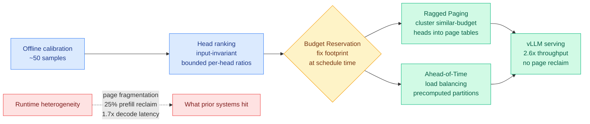

# Tangram: Non-Uniform KV Cache Compression as a Serving Substrate

**TL;DR.** Non-uniform KV cache compression (giving each attention head its own memory budget) keeps accuracy far better than compressing every head equally, but serving stacks assume all heads hold the same number of KV entries, so the freed memory gets trapped as page fragmentation and the irregular layout slows everything down. Tangram (arxiv 2606.06302, on vLLM) makes the heterogeneity a *static* property resolved at scheduling time rather than discovered at runtime, and turns non-uniform compression from "accuracy win, throughput loss" into a 2.6x end-to-end throughput gain over the full-KV baseline while matching the accuracy of the compression method it wraps.

## What it is

In multi-turn serving the KV cache grows with every turn and every user until it exceeds the model weights themselves, making memory (not compute) the binding constraint on throughput. Non-uniform compression allocates heterogeneous budgets across attention heads: some heads need long retention, others can be compressed hard. This preserves accuracy much better than uniform schemes. The problem is that modern serving stacks (vLLM's paged KV) assume identical KV lengths across heads, so heterogeneity (a) traps freed memory as page fragmentation, (b) spends up to 25% of prefill time reclaiming scattered pages, and (c) skews GPU workloads, inflating decode latency up to 1.7x and burning 15-20% of each decode step on re-planning.

Tangram's key observation: this head-wise heterogeneity does **not** need to be discovered at runtime. Head-wise retention follows a two-level structural regularity — an *input-invariant head ranking* with *narrowly bounded per-head ratios* — that can be calibrated offline from as few as 50 samples. Because the budget per head is essentially fixed, Tangram resolves statically what prior systems handled dynamically:

- **Budget Reservation** fixes each head's post-compression footprint at scheduling time, eliminating page reclamation entirely.
- **Ragged Paging** clusters similar-budget heads into independent page tables, turning fragmentation into reclaimable memory.
- **Ahead-of-Time Load Balancing** precomputes balanced GPU partitions, so there is zero runtime planning cost.

Implemented on vLLM as a drop-in substrate, Tangram matches the accuracy of existing non-uniform compression methods while improving end-to-end throughput up to 2.6x over the full-KV baseline. Code: https://github.com/aiha-lab/TANGRAM.

## How it relates to prior wiki knowledge

This is the **systems-layer complement** to the head-axis compression line the [KV cache page](kv-cache.md) has tracked. The wiki has accumulated several methods that *produce* head-heterogeneous budgets — [Forcing-KV](2026-05-15-forcing-kv-video-diffusion-kv-cache-compression.md) (05-15, static vs dynamic head roles), [MISA](2026-05-11-misa-mixture-of-indexer-sparse-attention.md) (05-11, head-axis indexer routing), [VaSE](2026-06-03-vase-value-aware-stochastic-kv-eviction.md) (06-03, value-magnitude guard) — but each is an *algorithm* that the serving stack then has to execute. Tangram is the missing substrate: it explains *why* non-uniform compression has been impractical in production (the paged-KV layout assumes uniform length) and removes the penalty.

It sits directly alongside [KVServe](2026-05-24-kvserve-service-aware-kv-compression.md) (05-24, service-aware adaptive compression as a control surface) as the second 2026 paper to treat **compression configuration as a first-class serving concern, not a static hyperparameter**. KVServe makes the *choice* of compression profile adaptive online; Tangram makes the *execution* of a non-uniform profile cheap by fixing it offline. The two are complementary poles: KVServe argues "decide the profile dynamically," Tangram argues "for non-uniform head budgets, decide once and exploit the input-invariance."

The "input-invariant head ranking calibrated from 50 samples" finding is the load-bearing claim and echoes the wiki's recurring **outlier-is-locatable** theme: [RTPurbo](2026-05-24-rtpurbo-full-to-sparse-attention.md) (05-24, long-context retrieval lives in a 16-dim subspace), [LongAct](2026-04-18-longact-saliency-sparse-rl.md) (04-18, saliency peaks mark where attention works), and VaSE's value-magnitude guard all say the structure that matters is sparse and stable across inputs. Tangram extends that to *head budgets* and turns it into a scheduling primitive.

This is the hardware fact the [Ken Huang memory survey](../hardware/2026-06-07-agentic-ai-memory-hierarchy.md) (06-07) named — KV cache, not weights, is the binding memory constraint — answered at the serving-software layer rather than with new memory tiers.

## Gaps

The 50-sample calibration's input-invariance is asserted to hold; the paper does not stress it against adversarial or heavily domain-shifted traffic where the head ranking might drift. The 2.6x is "up to" over full-KV; the gain over a *uniform*-compression baseline (the realistic production comparison) is the more honest number to watch. No multi-model or MoE study.

## Industrial implication

If the head ranking really is input-invariant, Tangram removes the main reason non-uniform KV compression has stayed in papers rather than production: it makes the algorithms the wiki has been cataloging actually shippable on vLLM. Expect the next wave of head-budget compression papers (Forcing-KV, MISA, VaSE descendants) to report numbers *on top of a Tangram-like substrate* rather than in isolation, the same way sparse-attention work converged on vLLM operators.

**Source:** HuggingFace Daily Papers · [Paper](https://arxiv.org/abs/2606.06302) · [Raw](../../raw/huggingface/2026-06-16-tangram-unlocking-non-uniform-kv-cache-compression-for-effic.md)
