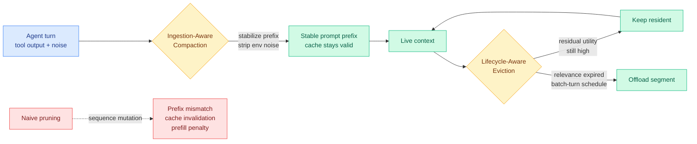

# TokenPilot: Cache-Efficient Context Management for LLM Agents

**TL;DR.** Long-running LLM agents pile up verbose execution traces, and every extra turn costs more to process. The standard fixes — prune text, evict old memory — mutate the prompt sequence, which breaks the *prompt prefix* the inference backend was caching and forces a full recompute (a prefill penalty) that can wipe out the savings. TokenPilot (arxiv 2606.17016, Zhejiang University et al.) reconciles text-reduction with prompt-cache continuity: it stabilizes prefixes at the ingestion gate and defers structural eviction until a context segment's task relevance actually expires. Result: 61% and 56% cost reduction in isolated mode, 61% and 87% in continuous mode, at competitive task performance. Integrated into LightMem2.

## What it is

A dual-granularity context-management framework for agents. Two levers:

- **Globally — Ingestion-Aware Compaction.** A framework harness that stabilizes prompt prefixes and strips open-world environmental noise *at the ingestion gate*, before noisy tool output enters the context and shifts the layout.
- **Locally — Lifecycle-Aware Eviction.** Monitors the ongoing *residual utility* of each context segment and offloads it on a conservative batch-turn schedule only when task relevance expires, instead of evicting aggressively on a fixed window.

The central insight (grounded in the alphaxiv overview): existing context managers optimize for token count alone, so they truncate or shift sequences freely. That constant mutation disrupts prompt-prefix continuity, triggering KV recomputation in the backend. The financial savings from fewer tokens get cancelled by repeated cache misses. TokenPilot's design principle is that effective context management must *safeguard physical prefix continuity* while deferring structural eviction. Evaluated on PinchBench and Claw-Eval under isolated and continuous modes: 61%/56% cost cut isolated, 61%/87% continuous, performance competitive with prior systems. Code in LightMem2 (https://github.com/zjunlp/LightMem2).

## How it relates to prior wiki knowledge

TokenPilot makes explicit a tension the [KV cache page](kv-cache.md) has circled but not named directly: the **economics of context management depend on prompt-cache hit rate**, not just token count. The SemiAnalysis 05-01 economic note on the KV page established that frontier-lab unit economics now hinge on >90% prompt-cache hit rates (Anthropic's blended Opus price collapses because cached input dominates). TokenPilot is the first agent-side method the wiki has tracked that treats *breaking the cache* as the cost to avoid, rather than treating token count as the only target.

It is the natural counterpart to [KV Packet](2026-04-17-kv-packet-recomputation-free-kv-cache.md) (04-17, wrap cached documents as immutable packets so reuse needs no recompute): KV Packet preserves cacheability for *retrieved documents*; TokenPilot preserves it for the *agent's own accumulating trajectory*. Both fight the same prefill penalty from opposite ends of the context.

On the agent-memory axis it joins the recent eviction-and-reconstruction cluster — [MRAgent](../agentic-systems/2026-06-15-mragent-graph-memory-reconstruction.md) (06-15, recall is reconstruction over a graph), [EvoMem](../agentic-systems/2026-06-14-evoarena-evomem-memory-evolution.md) (06-14, store memory as patch histories), [SAM](../agentic-systems/2026-05-27-sam-state-adaptive-memory.md) (05-27, state-adaptive recall) — but with a distinct claim: those change *what* is stored or *how* it is read; TokenPilot changes *when* you are allowed to mutate the sequence at all, so the hardware cache survives. It is the agent-context echo of the eviction-as-quality-intervention line ([Make Each Token Count](2026-05-12-make-each-token-count-kv-eviction.md), 05-12), but the optimized quantity is dollars-per-turn via cache continuity, not attention dilution.

## Gaps

PinchBench and Claw-Eval are agent-specific benchmarks; transfer to production agent stacks (and to backends with different prefix-caching implementations than the one assumed) is untested. "Residual utility" estimation is the hidden dependency — a wrong call evicts something the agent later needs, and the paper does not report task-failure attribution from premature eviction. The 87% continuous-mode figure is the best case.

## Industrial implication

This is directly actionable for anyone running long-horizon agents on metered token billing (the GitHub Copilot usage-based shift, the MiniMax/Kilo coding plans). The reframe — "don't break the prefix" — is a cheaper win than smarter eviction, because it costs nothing at the model and pays off entirely in backend cache hits. Expect prefix-preservation to become a standard requirement in agent-memory libraries, the way paged-KV became standard in serving.

**Source:** HuggingFace Daily Papers · [Paper](https://arxiv.org/abs/2606.17016) · [Raw](../../raw/huggingface/2026-06-16-tokenpilot-cache-efficient-context-management-for-llm-agents.md)
