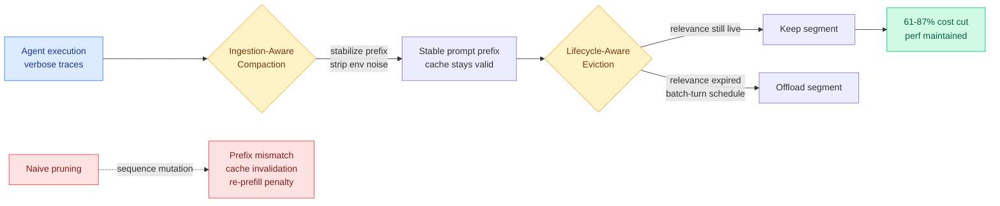

# TokenPilot: Context Management That Protects the Prompt Cache

**TL;DR.** LLM agents in long sessions accumulate verbose execution traces, so per-turn inference cost climbs. The standard fixes — text pruning, dynamic memory eviction, context folding — reduce token counts but mutate the input sequence layout, which breaks prompt-prefix continuity and invalidates the backend KV cache. The re-prefill penalty from those cache misses can erase the savings the pruning bought. TokenPilot (arxiv 2606.17016, Zhejiang University et al.) reconciles the trade-off with a dual-granularity design: globally, Ingestion-Aware Compaction stabilizes the prompt prefix at the ingestion gate; locally, Lifecycle-Aware Eviction defers offloading a context segment until its task relevance actually expires. Result: 61% and 56% cost reduction in isolated mode, 61% and 87% in continuous mode, with competitive task performance. Integrated into LightMem2.

## Key findings

- **The real trade-off is text sparsity vs prompt-cache continuity.** Prior context managers optimize the first and silently pay on the second. Truncating or shifting context changes the prefix, so the backend recomputes the whole prompt (the pre-fill penalty), and the financial savings from fewer tokens can be negated by the cache misses.
- **Two granularities.** Globally, Ingestion-Aware Compaction acts as a framework harness that stabilizes prefixes and removes open-world environmental noise *at the ingestion gate*, before it ever enters the cached prefix. Locally, Lifecycle-Aware Eviction monitors each segment's residual utility and offloads only when relevance expires, on a conservative batch-turn schedule.
- **Numbers.** On PinchBench and Claw-Eval: 61% / 56% cost reduction in isolated mode, 61% / 87% in continuous mode, performance competitive with prior systems.
- **Shipped.** Integrated into LightMem2 (https://github.com/zjunlp/LightMem2).

## How it relates to prior wiki pages

TokenPilot sits at the intersection of the [KV cache](kv-cache.md) thread and the agent-memory thread, and its central insight is a direct corrective to a blind spot in both. The KV page has tracked many eviction policies — [Make Each Token Count](2026-05-12-make-each-token-count-kv-eviction.md) (learned per-token retention), [Conf-KV](2026-05-30-conf-kv-confidence-aware-eviction.md) (per-step confidence budget), [VaSE](2026-06-03-vase-value-aware-stochastic-kv-eviction.md) (value-magnitude guard) — all of which evaluate eviction as an accuracy-vs-memory question and ignore what reshuffling the *sequence layout* does to prompt-cache reuse. The SemiAnalysis prompt-cache economics the KV page cites (frontier-lab unit economics now depend on >90% prompt-cache hit rates) is exactly the cost TokenPilot is protecting: an eviction that lowers token count but drops the cache hit rate is a net loss. This is the agent-side analogue of [KV Packet](2026-04-17-kv-packet-recomputation-free-kv-cache.md) (04-17, wrap cached documents as immutable packets so reuse needs zero recomputation) — both refuse to pay the re-prefill tax, KV Packet for shared documents, TokenPilot for evolving agent traces.

It also continues the agent-memory line: where [MRAgent](../agentic-systems/2026-06-15-mragent-graph-memory-reconstruction.md) (06-15) changed *how memory is read* (reconstruction not lookup) and EvoMem (06-14) changed *what is stored*, TokenPilot changes *when and where eviction happens relative to the cache boundary* — the systems constraint the memory-policy papers abstract away.

## Source

Raw: [raw/huggingface/2026-06-16-tokenpilot-cache-efficient-context-management-for-llm-agents.md](../../raw/huggingface/2026-06-16-tokenpilot-cache-efficient-context-management-for-llm-agents.md) · [arxiv 2606.17016](https://arxiv.org/abs/2606.17016)
